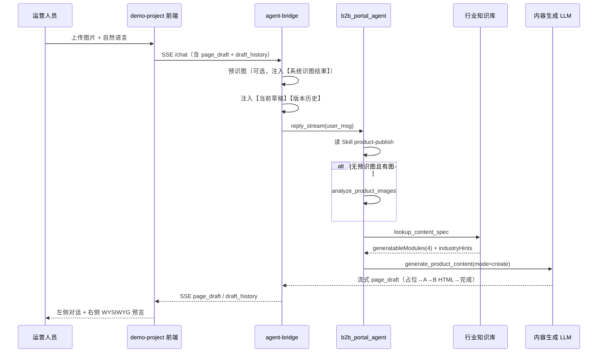
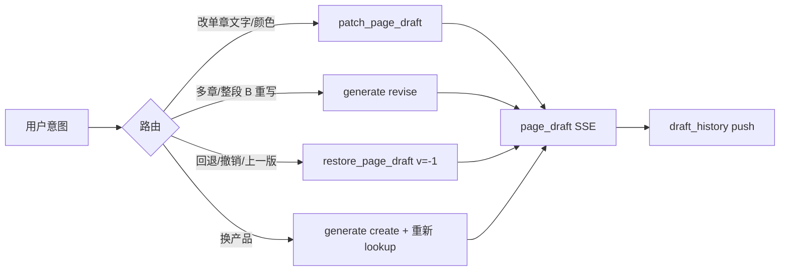

# B2B Portal Agent 架构说明

> **读者**：AI 产品经理、后端/Agent 研发、前端联调同学  
> **新会话请先读**：[`PROJECT_ONBOARDING.md`](./PROJECT_ONBOARDING.md)（仓库地图、工具路由、历史教训、改代码检查清单）  
> **代码位置**：`agents-workspace/b2b_portal_agent/`  
> **契约文档**：`agent-handoff/references/layer-abcd-contract-v2.md`  
> **最后更新**：2026-06-24（v2.2：patch 局部修订 + 版本栈 + restore + 单轮护栏）

---

## 1. 这个 Agent 是做什么的？

**b2b_portal_agent** 是 B2B 数字门户里的 **「AI 运营助手 · 产品详情页发布」**。

运营人员上传产品实拍图、用自然语言描述需求后，Agent 会：

1. **识图** — 判断行业/品类、读规格铭牌、区分无关图片
2. **查规范** — 从行业知识库取该品类应写什么、合规注意什么
3. **生成内容** — 产出可填入详情页模板的 **A 层 + B 层** 文案/HTML
4. **多轮修订** — 小改用 patch、大段用 revise、**回退用 restore**
5. **对话引导** — 摘要覆盖率、提示右侧预览审阅

**本期不做**：选站点、选分类、调用正式发布 API、改 C/D 层 CMS 数据。

---

## 2. 产品经理必读：详情页四层内容模型（v2）

门户详情页按 **A / B / C / D** 四层拆分。**运营助手只生成 A + B**；C、D 由页面模板预制。

| 层级 | 名称 | 谁生成 | 典型内容 | 运营助手 |
|------|------|--------|----------|----------|
| **A** | 产品基础信息 | Agent | 产品名称、产品概述、图片 alt/说明 | **生成** |
| **B** | 产品详情 | Agent | **一整段 HTML 富文本**（参数、特点、场景、FAQ 等由 AI 编排进 HTML） | **生成** |
| **C** | 独立应用 | 模板 + CMS | 面包屑、询价表单、企业概况 | **不生成** |
| **D** | 衍生推荐 | 模板 + 产品库 API | 同系列/配套推荐 | **不生成** |

### 2.1 A 层固定 3 项

| 槽位 | 含义 |
|------|------|
| `layerA.title` | 产品名称（SEO 标题） |
| `layerA.overview` | 产品概述（2～4 句） |
| `layerA.media` | **仅** alt/说明文案；图片像素来自用户上传，Agent 不选图、不排序 |

### 2.2 B 层固定 1 项

| 槽位 | 含义 |
|------|------|
| `layerB.body` | 单块 `html_richtext`；章节顺序由 AI 根据识图、用户描述、`industryHints` **实时编排**，知识库不预制 HTML 大纲 |

---

## 3. 端到端流程（产品视角）

### 3.1 首轮生成



### 3.2 多轮修改与回退



**体验要点**：

- 右侧预览随 `page_draft` 事件 **边生成边刷新**
- 聊天区只给 **摘要**（行业、覆盖率），不贴全文
- 用户可在右侧手改；下一轮对话会带上当前 `slots` + **版本历史**
- 说「回退」时 **一次 restore**，不要用 patch/revise 猜内容

---

## 4. 研发必读：代码结构

```
b2b_portal_agent/
├── agent.py              # Agent 组装入口 build_agent()
├── prompts.py            # 系统提示词 SYSTEM_PROMPT（含硬性工具路由）
├── config.py             # 模型、API、内容生成批次等环境配置
├── skills/
│   └── product-publish/
│       ├── SKILL.md      # 标准工作流（Agent 用 Skill 工具阅读）
│       └── references/   # 模块 Schema 等参考
├── knowledge/
│   ├── lookup.py         # 行业查表核心逻辑（v2 返回结构）
│   └── industry_specs/   # JSON 知识库文件
│       ├── module-catalog-v2.json
│       ├── template-catalog-cd.json
│       ├── industry-content-spec.json
│       └── industry-type-fallback.json
└── tools/
    ├── __init__.py           # 对外 7 个 FunctionTool
    ├── image_analysis.py     # 识图编排
    ├── image_vision.py       # 视觉 LLM 调用
    ├── image_context.py      # 会话附件像素绑定
    ├── knowledge.py          # lookup 工具薄封装
    ├── content_generator.py  # create/revise 两阶段生成 + 流式
    ├── content_llm.py        # A 字段 JSON + B HTML 的 LLM 提示
    ├── content_stream.py     # 工具流式 NDJSON 协议
    ├── page_draft.py         # 组装 ProductPageDraft v2
    ├── patch_page_draft.py   # 按 h2 章节 / A 槽位局部修订
    ├── restore_page_draft.py # 从版本栈恢复
    ├── draft_history.py      # 会话级草稿版本栈
    └── tool_guard.py         # 单轮 ReAct 护栏（防死循环）
```

**运行时依赖**：

- **AgentScope 2.x**（`agentscope/` 源码 + venv）
- **demo-project/server/agent-bridge/bridge.py** — Agent 事件 → 前端 SSE
- 平台部署见 **`agent-handoff/08-platform-integration.md`**
- 环境变量见 `demo-project/.env.server`

---

## 5. Agent 本体（`agent.py`）

| 项 | 说明 |
|----|------|
| 框架 | AgentScope `Agent` + `ReActConfig(max_iters=20)` |
| 名称 | `AI运营助手-产品详情页发布` |
| 系统提示 | `prompts.SYSTEM_PROMPT` — 职责、**工具路由**、禁止事项 |
| 工具箱 | `Toolkit` = **7** 个 `FunctionTool` + 1 个 Skill 目录 |
| 模型 | `build_model()` — DeepSeek / OpenAI 兼容网关；可流式 + thinking |
| 权限 | 默认 `PermissionMode.BYPASS`（本地 demo 免确认） |

```python
from b2b_portal_agent import AGENT_NAME, build_agent

agent = build_agent(model=...)  # 同一会话复用同一实例以保留多轮记忆
async for evt in agent.reply_stream(user_msg):
    ...
```

---

## 6. Tools（工具）说明

Agent **直接调用** 的 FunctionTool 共 **7** 个（`tools/__init__.py` + `agent.py` 注册）。

### 6.1 `analyze_product_images`

| | |
|---|---|
| **作用** | 分析用户上传图：行业/品类、每张图角色、可见规格 |
| **何时调** | 有图且 Bridge **未**注入【系统识图结果】时 |
| **入参** | `image_urls` 可选；附件场景可空或 `upload://文件名` |
| **出参** | `analysis`、`perImage[]`（imageRole）、`extractedSpecifications` |
| **实现** | `image_analysis.py` → `image_vision.py` + `image_context.py` |

**imageRole**：`product_photo` | `spec_sheet` | `irrelevant` | `unknown`

### 6.2 `lookup_content_spec`

| | |
|---|---|
| **作用** | 查询当前行业/品类的 **v2 内容规范** |
| **何时调** | 生成前**必调**（首发或换行业/品类） |
| **入参** | `industry`, `product_category`（可选） |
| **实现** | `knowledge.py` → `knowledge/lookup.py` |

**别名**：`query_industry_page_spec`

### 6.3 `search_agent_industries`

| | |
|---|---|
| **作用** | 在 ~200 条行业主库中搜索候选 |
| **何时调** | 识图不确定行业、或用户描述模糊时 |

### 6.4 `generate_product_content`（全量 / 大段修订）

| | |
|---|---|
| **作用** | 按规范生成或修订 **A 三字段 + B HTML**，组装 `pageDraft` |
| **何时调** | `mode=create` 首发；`mode=revise` 多章/整段 B 语义重写 |
| **入参** | `page_spec`、`image_analysis`、`user_message`、`mode`、`current_draft`（revise 必填） |
| **流式** | 占位 → A → B HTML → complete |

**不要用于**：单章改字/改色（应用 patch）、回退（应用 restore）。

实现链：`content_generator.py` → `content_llm.py` → `page_draft.py`

### 6.5 `patch_page_draft`（局部修订）

| | |
|---|---|
| **作用** | 按 `section_heading`（h2）或 A 槽位做**小范围**修改，不重写整页 |
| **何时调** | 改某一章节文字/颜色、改 A 层单字段 |
| **入参** | `current_draft`（完整 JSON）、`edits`（JSON 数组）、`page_spec`（可选） |

**edits 示例**：

```json
[
  {
    "target": "layerB.body",
    "section_heading": "产品介绍",
    "action": "replace_text",
    "text": "你好",
    "color": "#e53e3e"
  },
  {
    "target": "layerB.body",
    "section_heading": "技术参数",
    "action": "replace_section_html",
    "html": "<p>仅正文片段，不要含 h2</p><table>...</table>"
  },
  {
    "target": "layerA.title",
    "action": "set",
    "value": "新标题"
  }
]
```

**实现要点**（`patch_page_draft.py`）：

- `patch_h2_section` 只替换 h2 **之后**的正文
- `replace_section_html` 若含与 `section_heading` 同名的首部 `<h2>`，**自动 strip**
- 修改后 **校验重复 h2**；有重复 → `patch_failed`，不算成功
- `replace_text` 整节替换为单个 `<p>`，**会丢失该节内图片**（含图章节慎用）

**generationMode**：`patch` | `patch_partial` | `patch_failed`

### 6.6 `restore_page_draft`（版本恢复）

| | |
|---|---|
| **作用** | 从会话版本栈恢复历史草稿 |
| **何时调** | 用户说回退/撤销/上一版 |
| **入参** | `version`（默认 `-1` = 上一版）、`page_spec`（可选） |
| **出参** | `pageDraft` + `generationMode: restore` + `restoredFromVersion` |

**版本栈**（`draft_history.py`）：

- 按 `session_id` 保存最多 **15** 个快照
- Bridge 每轮入参草稿、工具成功写入后 `push`
- 前端 `draft_history` 请求体可 hydrate（刷新后恢复）
- 用户消息注入 **【草稿版本历史】** 列表

**禁止**：用 patch 或 `generate(revise)` 模拟撤销。

### 6.7 单轮护栏 `tool_guard.py`

| 规则 | 说明 |
|------|------|
| 回退意图 | 拒绝 patch、拒绝 revise；必须 restore |
| 重复 patch | 同轮相同 `section_heading + action` → 拒绝 |
| 重复 restore | 同轮第二次 restore → 拒绝 |

Bridge 每轮 `bind_turn_guard(message)`，finally `reset_turn_guard()`。

### 6.8 Skill 工具（框架自带）

Agent 通过 AgentScope **Skill 工具** 阅读 `skills/product-publish/SKILL.md`，在 `Toolkit(skills_or_loaders=[SKILL_DIR])` 注册。

---

## 7. Skill：`product-publish`

**路径**：`skills/product-publish/SKILL.md`（**v2.1+**）

| 步骤 | 内容 |
|------|------|
| 0 | 理解发布意图 |
| 1 | 图像分析（有【系统识图结果】则跳过重复调用） |
| 2 | `lookup_content_spec`（未拿到规范禁止生成） |
| 3 | `generate_product_content` |
| 4 | 摘要 + 引导右侧预览（读 `generationMode` / `coverage` 门控） |
| 5 | 多轮修改：**patch / revise / restore** 路由表 |
| 6 | 内容确认（本期不执行发布） |

**修改路由（硬性）**：

| 用户意图 | 工具 |
|----------|------|
| 回退/撤销/上一版 | `restore_page_draft(version=-1)` |
| 单章改字/改色 | `patch_page_draft` |
| 多章/整段 B 重写 | `generate(mode=revise)` |
| 换产品/首发 | `generate(mode=create)` + lookup |

**明确不做**：选站、正式发布、生成后再读 Skill。

---

## 8. Knowledge（知识库）

### 8.1 文件清单

| 文件 | 用途 |
|------|------|
| `module-catalog-v2.json` | 全库固定 4 项可生成模块 |
| `template-catalog-cd.json` | C/D 预制组件 |
| `industry-content-spec.json` | ~200 行业条目 + `industryHints` |
| `industry-type-fallback.json` | 7 大类母版回退 |
| `module-catalog.json` | **v1 遗留**，待废弃 |

### 8.2 `lookup_content_spec` 返回字段（v2）

见 `agent-handoff/examples/lookup-content-spec-v2.sample.json`。核心：`generatableModules`（4 项）、`industryHints`、`doNotGenerate`、`pageTemplateId`。

### 8.3 查表逻辑（`lookup.py`）

```
industry + category → _fuzzy_find_industry → type-fallback → 默认母版
→ 合并 module-catalog-v2 + industryHints → v2 结构
```

### 8.4 瘦身脚本

```bash
python agents-workspace/scripts/slim_industry_spec_v2.py
```

---

## 9. 内容生成管线（研发细节）

### 9.1 create / revise

```
generate_product_content
    └── generate_structured_content_stream()
            ├── check_generate_allowed()      # tool_guard
            ├── 占位 page_draft
            ├── generate_product_draft_with_llm()  # A + B
            └── build_page_draft() → ProductPageDraft v2
```

### 9.2 patch

```
patch_page_draft
    └── patch_page_draft_stream()
            ├── check_patch_allowed()
            ├── apply_edits_to_draft()      # h2 定位 + strip h2 + 结构校验
            └── build_page_draft()
```

### 9.3 restore

```
restore_page_draft
    └── restore_page_draft_stream()
            ├── check_restore_allowed()
            ├── resolve_restore_target(-1)
            └── push_draft_version(恢复后快照)
```

### 9.4 流式协议

`content_stream.py`：工具 `RUNNING` 阶段 NDJSON → Bridge → `tool_progress` / `page_draft`。

### 9.5 覆盖率 `coverage`

| 字段 | 含义 |
|------|------|
| `generatableTotal` | 固定 4 |
| `generatableFilled` | 已填项数 |
| `layerBHtmlPresent` | B HTML 非空且含 h2 |
| `missing` | 缺失模块名列表 |

---

## 10. 与前端 / Bridge 的衔接

| 组件 | 路径 | 职责 |
|------|------|------|
| Bridge | `server/agent-bridge/bridge.py` | 预识图、草稿/版本注入、Agent→SSE、`draft_history` 同步 |
| 工具摘要 | `tool_narration.py` | 工具卡 human-readable 摘要 |
| 聊天 UI | `src/App.jsx` | SSE 消费、`applyPageDraft`、`draftHistory` |
| 会话存储 | `src/sessionStore.js` | messages + pageDraft + draftHistory |
| 预览模板 | `src/templates/industrial-robot-v1/` | 读 `draft.slots`；C/D 读 layerC/layerD |
| HTML 消毒 | `sanitizeHtml.js` + policy JSON | B 层 DOMPurify |
| 草稿工具 | `pageDraftUtils.js` | slim 回传、tool_result 兜底解析 |

**ChatRequest 扩展字段**：

- `page_draft` — 当前右侧草稿（含用户手改）
- `draft_history` — 客户端版本栈（最多 10 条回传 hydrate）

**SSE 扩展事件**：`draft_history` — 工具成功后服务端栈同步。

**ProductPageDraft 示例**：`agent-handoff/examples/product-page-draft-v2.sample.json`

---

## 11. 配置与环境变量

| 变量 | 作用 |
|------|------|
| `OPENAI_API_KEY` / `VVEAI_API_KEY` | API 密钥 |
| `OPENAI_BASE_URL` | 兼容网关 |
| `OPENAI_MODEL` / `OPENAI_MODEL_OPTIONS` | 对话模型 |
| `CONTENT_GEN_MODEL` | 内容生成专用模型 |
| `AGENT_THINKING_ENABLE` | 主模型 thinking |
| `AGENT_BRIDGE_PORT` | Bridge 端口（默认 8790） |

本地一键：`cd demo-project && npm run dev:full`

---

## 12. 职责边界速查

| 能力 | 负责模块 |
|------|----------|
| 对话编排、工具顺序 | Agent + `prompts.py` + Skill |
| 识图 | `image_*.py` + Bridge 预识图 |
| 行业该写什么 | `knowledge/lookup.py` + JSON |
| 文案/HTML | `content_llm.py` + `industryHints` |
| 草稿 JSON | `page_draft.py` |
| 局部改 / 回退 | `patch_page_draft.py` / `restore_page_draft.py` / `draft_history.py` |
| 防死循环 | `tool_guard.py` |
| 页面渲染 | 前端 Template + manifest |
| C/D | 模板预制 + 未来 CMS/API |

---

## 13. 扩展与改造指南

### 产品经理常改

- 行业话术/合规 → `industry-content-spec.json` 的 `industryHints`
- 全库模块 → `module-catalog-v2.json`（慎改）
- Agent 话术/路由 → `prompts.py` + `SKILL.md`

### 研发常改

- **新增工具** → `tools/` → `__init__.py` → `agent.py` → `bridge.py` → `tool_narration.py` → prompts/SKILL
- 生成策略 → `content_llm.py`、`content_generator.py`
- patch 行为 → `patch_page_draft.py`（注意 h2 契约）
- 版本/回退 → `draft_history.py`、`restore_page_draft.py`、前端 `sessionStore.js`

### 不建议做的

- 用 patch/revise 代替 restore
- 在 `replace_section_html` 里再写 `<h2>`
- 生成或修改 C/D
- 聊天贴 B 层 HTML 全文
- 截断 `page_spec`
- 编造认证号、检测数据

---

## 14. 相关文档索引

| 文档 | 路径 |
|------|------|
| **新会话全貌** | `demo-project/PROJECT_ONBOARDING.md` |
| 四层契约 v2 | `agent-handoff/references/layer-abcd-contract-v2.md` |
| 草稿 Schema | `agent-handoff/references/product-page-draft-v2.schema.json` |
| IO / SSE | `agent-handoff/03-io-contract.md` |
| 平台对接 | `agent-handoff/08-platform-integration.md` |
| 本地联调 | `agents-workspace/README.md` |
| 会话日志 | `demo-project/logs/chat-sessions/` |

---

## 15. 术语表

| 术语 | 解释 |
|------|------|
| `fieldTarget` | 槽位键，如 `layerA.title`、`layerB.body` |
| `generatableModules` | lookup 返回的 4 项可生成模块 |
| `page_spec` | 传入 generate 的 lookup 完整 JSON |
| `page_draft` / `pageDraft` | 右侧预览草稿 |
| `current_draft` | 修订类工具入参 |
| `section_heading` | patch 时与 B 层 h2 对齐的章节名 |
| `draft_history` | 会话版本栈 |
| `generationMode` | llm / revise / patch / restore / patch_failed / … |
| ReAct | 思考 → 调工具 → 观察 → 再思考（max_iters=20） |

---

*如有契约与代码不一致，以 `layer-abcd-contract-v2.md` 与 `lookup.py` / `page_draft.py` 源码为准；行为问题先查 `PROJECT_ONBOARDING.md` 第 8 节历史教训。*
