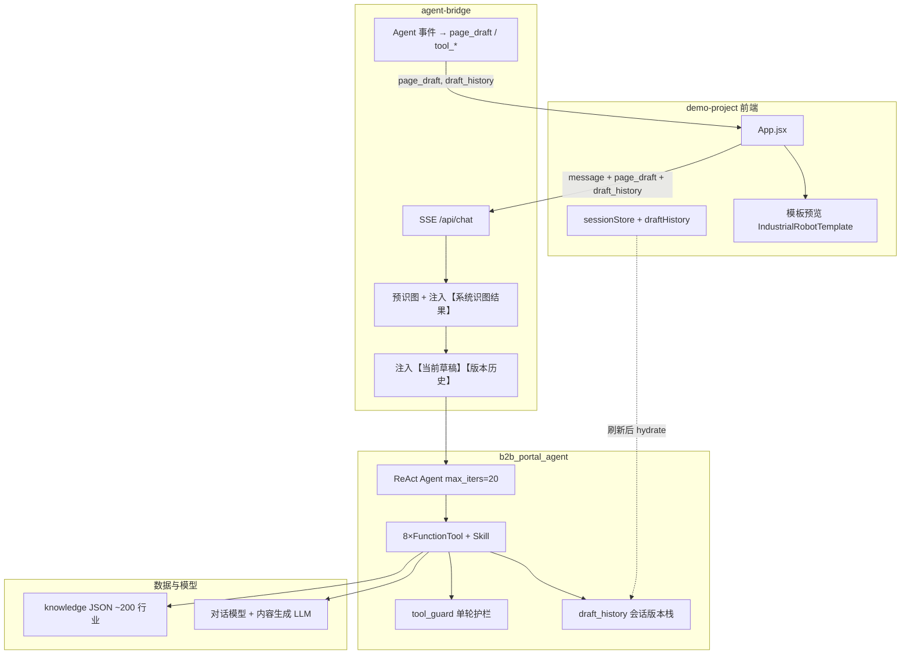

# 项目全貌 · 新会话必读

> **用途**：新开 Cursor 窗口 / 新同事 / 新 Agent 会话时，**先读本文**，再动代码。  
> **目标**：弄清仓库结构、Agent 逻辑、数据契约与历史教训，避免「改错文件、改错层、改错工具路径」。  
> **配套**：Agent 细节见 [`B2B_PORTAL_AGENT_GUIDE.md`](./B2B_PORTAL_AGENT_GUIDE.md)；契约见 `../agent-handoff/references/layer-abcd-contract-v2.md`。  
> **最后更新**：2026-06-24（v2.2：局部修订 + 版本栈 + 回退护栏）

---

## 0. 30 秒结论

| 问题 | 答案 |
|------|------|
| 这是什么？ | B2B 门户 **AI 运营助手**（多 Agent Demo）：主 Agent 路由委托 → 产品详情页子 Agent 生成/修改 A+B 草稿 → 右侧预览 |
| 本期做什么？ | **方案 B**：主 Agent + 产品详情页 Agent（Skill：`product-generate` / `product-edit`）；其他子 Agent 占位 |
| 本期不做什么？ | 选站、正式发布 API、业务指标/营销页/站点内容真实实现、C/D 层生成 |
| 主 Agent 在哪？ | `../agents-workspace/ai_ops_assistant/` |
| 产品详情页 Agent？ | `../agents-workspace/b2b_portal_agent/` |
| 前端 Demo 在哪？ | 本目录 `demo-project/` |
| 怎么连起来？ | `server/agent-bridge/bridge.py`（Python FastAPI + SSE） |
| 怎么跑？ | `npm run dev:full`（需 `.env.server`，`PYTHON_AGENT_MODULE=ai_ops_assistant`） |
| 设计说明？ | `docs/multi-agent-scheme-b-design.md` |
| 最容易改错什么？ | 把「小改」走全量 LLM、把「回退」走 patch/revise、只改前端不改 Bridge/工具注册、把子 Agent 工具直接塞进主 Agent |

---

## 1. 仓库地图（`outputs/`  monorepo）

```
outputs/
├── demo-project/                 ← 前端 Demo + Bridge + 本 onboarding 文档
│   ├── src/App.jsx               ← 聊天 UI、预览分栏、草稿状态、SSE 消费
│   ├── src/sessionStore.js       ← 会话持久化 + draftHistory 版本栈
│   ├── src/chatClient.js         ← POST /api/chat SSE 客户端
│   ├── src/templates/            ← 预览模板、pageDraft 工具、HTML 消毒
│   ├── server/agent-bridge/      ← bridge.py：主 Agent ↔ 前端 SSE 适配层
│   ├── docs/multi-agent-scheme-b-design.md  ← 方案 B 设计说明
│   ├── logs/chat-sessions/       ← 每轮对话 JSONL 日志（排障用）
│   └── B2B_PORTAL_AGENT_GUIDE.md ← 产品详情页 Agent 专题（历史文档名保留）
│
├── agents-workspace/
│   ├── ai_ops_assistant/         ← ★ 主 Agent（Supervisor · 路由委托）
│   └── b2b_portal_agent/         ← ★ 产品详情页 Agent（Specialist）
│       ├── agent.py、prompts.py
│       ├── skills/product-generate/   ← 首发生成 Skill
│       ├── skills/product-edit/       ← 修改/回退 Skill
│       ├── knowledge/            ← 行业查表 + JSON 知识库
│       └── tools/                ← 识图、lookup、生成、patch、restore…
│
├── agent-handoff/                ← 产品/平台交接契约（v2 为当前真相）
│   ├── references/layer-abcd-contract-v2.md
│   ├── examples/product-page-draft-v2.sample.json
│   └── 03-io-contract.md、08-platform-integration.md …
│
└── agentscope/                   ← AgentScope 2.x 源码 + venv（dev:full 会用）
```

**Git 注意**：`outputs/` 与 `demo-project/` 可能是**两个独立 git 仓库**；改 Agent 与改前端可能需分别提交。

---

## 2. 系统架构（一图读懂）



---

## 3. 四层内容模型（改代码前必须对齐）

| 层级 | 槽位 | Agent 是否生成 | 说明 |
|------|------|----------------|------|
| **A** | `layerA.title` / `overview` / `media` | ✅ | media 只写 alt/说明，**不选图、不造 URL** |
| **B** | `layerB.body`（单块 HTML） | ✅ | 章节由 AI 用 `<h2>` 编排，**知识库不预制大纲** |
| **C** | 模板 `layerC` | ❌ | 面包屑、询价等 |
| **D** | 模板 `layerD` | ❌ | 关联推荐 |

**固定 4 个可生成项** → `generatableModules` / `coverage.generatableTotal = 4`。

**ProductPageDraft v2** 是右侧预览的**唯一数据源**：`pageDraft.slots` 四个键。完整示例见 `agent-handoff/examples/product-page-draft-v2.sample.json`。

---

## 4. 端到端时序（首轮生成）

1. 用户在前端发消息（可带图片 Data URL）
2. `chatClient.js` → `POST /api/chat`，body 含 `session_id`、`page_draft`、`draft_history`
3. Bridge：`bind_draft_session` → 预识图（可选）→ `build_user_msg` 注入识图块 + 草稿块 + **版本历史块**
4. Agent：首轮读 `Skill(product-publish)` → `lookup_content_spec` → `build_generation_brief` →（澄清/摘要确认）→ `generate_product_content(mode=create)`
5. 工具流式输出 NDJSON → Bridge 转 `tool_progress` + `page_draft` SSE
6. 前端 `applyPageDraft` 更新右侧预览；成功则 `pushDraftHistory`
7. Agent 文本回复：仅**摘要**（行业、覆盖率），引导看右侧预览

---

## 5. Agent 工具路由（★ 最容易改错）

**三层都要一致**：`prompts.py` → `SKILL.md` → 工具实现。只改一处会导致 Agent 行为漂移。

| 用户意图 | 必须用的工具 | 禁止 |
|----------|--------------|------|
| 首发 / 换产品 | `lookup` → `build_generation_brief` → 用户确认 → `generate(mode=create)` | 跳过 brief 直接 generate |
| 改某一 h2 章节文字/颜色 | `patch_page_draft` | `generate` 全量覆盖 |
| 多章节 / 整段 B 语义重写 | `generate(mode=revise, current_draft=…)` | 用 patch 拼大段 |
| **回退 / 撤销 / 上一版** | `restore_page_draft(version=-1)` | patch 或 revise 模拟撤销 |
| 改 A 层单字段 | `patch_page_draft`（target=layerA.*） | — |

### 5.1 `patch_page_draft` 要点

- B 层 edit 必须带 `section_heading`（与 HTML 里 `<h2>` 文本一致）
- `replace_section_html` 的 `html` 应是**章节正文片段**，**不要再写同名 `<h2>`**（工具会 strip，叠标题会结构校验失败）
- `replace_text` 会替换整节正文为单个 `<p>`，**会丢掉该节内图片**（历史已知问题，大改请用 revise）

### 5.2 版本栈 `draft_history`

- **服务端**：`tools/draft_history.py`，按 `session_id` 存最多 15 版
- **客户端**：`sessionStore.pushDraftHistory`，请求时 `draft_history` 回传（刷新后可 hydrate）
- Bridge 每轮入参草稿、工具成功写入后都会 `push`
- `restore_page_draft(-1)` = 恢复到**当前版的前一快照**

### 5.3 单轮护栏 `tool_guard`

| 规则 | 行为 |
|------|------|
| 用户消息含「回退/撤销/上一版」 | 拒绝 `patch`、拒绝 `generate(revise)`，必须用 `restore` |
| 同轮重复相同 `section_heading + action` 的 patch | 拒绝，防 ReAct 死循环 |
| 同轮多次 `restore_page_draft` | 第二次拒绝 |

---

## 6. 已注册工具清单（2026-06-24）

| 工具 | 文件 | 说明 |
|------|------|------|
| `analyze_product_images` | `image_analysis.py` | 有图且无 Bridge 预识图时 |
| `lookup_content_spec` | `knowledge.py` | 生成前必调 |
| `build_generation_brief` | `build_generation_brief.py` | 生成前摘要 + 四维度澄清 |
| `query_industry_page_spec` | 同上别名 | 兼容旧名 |
| `search_agent_industries` | `knowledge.py` | 行业不确定时 |
| `generate_product_content` | `content_generator.py` | create / revise，流式 A+B |
| `patch_page_draft` | `patch_page_draft.py` | 局部修订 |
| `restore_page_draft` | `restore_page_draft.py` | 版本恢复 |
| `Skill(product-publish)` | `skills/.../SKILL.md` | 框架 Skill 工具，非 FunctionTool |

**新增工具检查清单**：

1. `tools/` 实现  
2. `tools/__init__.py` 导出  
3. `agent.py` → `FunctionTool(...)` 注册  
4. `bridge.py` → `TOOL_TITLES` + `page_draft` 解析分支  
5. `tool_narration.py` → 摘要文案  
6. `prompts.py` + `SKILL.md` 路由表  
7. 前端 `App.jsx` / `agentFlowUtils.js` 如需展示

---

## 7. Bridge 与前端契约（改 IO 必看）

### 7.1 ChatRequest（Bridge）

```json
{
  "message": "用户文字",
  "session_id": "session-…",
  "model": "可选模型名",
  "page_draft": { "slots": { … } },
  "draft_history": [{ "version": 1, "label": "…", "draft": { … } }],
  "images": [{ "name": "a.jpg", "data": "base64…", "media_type": "image/jpeg" }]
}
```

### 7.2 关键 SSE 事件

| type | 用途 |
|------|------|
| `text` / `thinking_delta` | 助手回复与推理展示 |
| `tool_call` / `tool_result` / `tool_progress` | 工具卡 |
| `page_draft` | 右侧预览增量/终稿 |
| `generation_brief` | 生成前摘要卡（澄清/确认） |
| `draft_history` | 服务端版本栈同步到前端 |
| `done` / `error` | 结束 |

### 7.3 前端关键状态

| 状态 | 位置 | 说明 |
|------|------|------|
| `pageDraft` / `pageDraftRef` | `App.jsx` | 当前预览草稿；请求时 `slimPageDraftForRequest` |
| `draftHistory` | `App.jsx` + `sessionStore` | 版本栈，localStorage 持久化 |
| 预览分栏 | `react-resizable-panels` | localStorage 键 `ai-ops-chat-preview-split` |
| 智能滚动 | `App.jsx` | 仅用户在底部附近时自动滚到底 |

**原则**：聊天区不贴 B 层 HTML 全文；正文以右侧预览为准。用户手改 `slots` 后，下一轮 Bridge 会注入【当前详情页草稿】。

---

## 8. 历史教训 · 禁止重蹈（排障索引）

| 现象 | 根因 | 正确做法 |
|------|------|----------|
| 用户说「回退」Agent patch/revise 死循环 18 分钟 | 无版本栈 + ReAct 反复试 | 用 `restore_page_draft(-1)`；已加 tool_guard |
| 章节标题出现两次 | `replace_section_html` 含 `<h2>` | 只传正文；工具已 strip + 重复 h2 校验 |
| 改几个字后章节图片没了 | `replace_text` 整节替换为单 `<p>` | 小改文字可用；含图章节用 `replace_section_html` 或 revise |
| Agent 又读一遍 Skill | 生成完成后再次 `Skill()` | prompt/SKILL 已禁止；检查是否新会话误触发首轮逻辑 |
| 改了工具但前端没效果 | 未重启 Bridge | `dev:full` 重启；Python 模块热加载不可靠 |
| 覆盖率误报成功 | 未读 `generationMode` | 仅 `llm`/`revise`/`patch` 且无 `missing` 才算成功 |
| 识图重复调用 | Bridge 已注入【系统识图结果】 | 禁止再调 `analyze_product_images` |

**日志位置**：`demo-project/logs/chat-sessions/YYYY-MM-DD/session-*.jsonl` — 复现用户路径时先搜 `tool_call` / `patch_page_draft` / `restore_page_draft`。

---

## 9. 「改一处牵全身」矩阵

| 你要改… | 通常还要改… |
|---------|-------------|
| 工具行为/签名 | `__init__.py`、`agent.py`、`bridge.py`、`tool_narration.py`、prompts、SKILL |
| 生成提示词 | `content_llm.py`；若影响覆盖率则看 `content_generator.py` |
| 草稿 JSON 形状 | `page_draft.py`、前端 `pageDraftUtils.js`、契约 schema |
| 行业话术/合规 | `knowledge/industry_specs/industry-content-spec.json` |
| 全库模块定义 | `module-catalog-v2.json`（影响所有行业，慎改） |
| 预览 UI / 新模板 | `src/templates/`、`templateRegistry.js`、`resolve_page_template_id` |
| SSE 新事件 | `bridge.py` `map_event` + `App.jsx` 事件循环 |
| 回退/版本逻辑 | `draft_history.py`、`restore_page_draft.py`、`sessionStore.js`、Bridge 注入 |

---

## 10. 本地运行与调试

```bash
# 在 demo-project 目录
cp .env.server.example .env.server   # 若无则自建
# 必填：OPENAI_API_KEY 或 VVEAI_API_KEY；OPENAI_BASE_URL；OPENAI_MODEL

npm install
npm run dev:full
# 默认：Vite 前端 + Python Bridge（端口见 .env.server / dev-full.js）
```

| 变量 | 作用 |
|------|------|
| `OPENAI_API_KEY` / `VVEAI_API_KEY` | API |
| `OPENAI_MODEL` / `OPENAI_MODEL_OPTIONS` | 对话模型 |
| `CONTENT_GEN_MODEL` | 内容生成可单独指定 |
| `AGENT_BRIDGE_PORT` | Bridge 端口（默认 8790） |
| `VITE_CHAT_API_URL` | 前端指向 Bridge |

**最小验证路径**：

1. 上传产品图 → 生成草稿 → 右侧 4/4 覆盖  
2. 「把产品介绍改成红色」→ 应走 `patch_page_draft` 一次成功  
3. 「回退到上一版本」→ 应走 `restore_page_draft` 一次，**不应**长时间 patch/revise

---

## 11. 职责边界（谁负责什么）

| 能力 | 模块 |
|------|------|
| 对话编排、工具顺序 | `prompts.py` + `SKILL.md` + ReAct |
| 识图 | `image_analysis.py` / `image_vision.py` / Bridge 预识图 |
| 行业写什么 | `knowledge/lookup.py` + JSON 库 |
| 文案怎么写 | `content_llm.py` + `industryHints` |
| 草稿 JSON | `page_draft.py` |
| 局部改 / 回退 | `patch_page_draft.py` / `restore_page_draft.py` / `draft_history.py` |
| 页面长什么样 | `src/templates/*Template*.jsx` |
| C/D 数据 | 模板预制，未来 CMS/API |

---

## 12. 扩展功能前自检（给 AI 的 checklist）

- [ ] 是否仍在 **A+B only** 范围？有没有误碰 C/D？  
- [ ] 新能力应走 **create / revise / patch / restore** 哪条路径？  
- [ ] 是否同步了 **prompts + SKILL + 工具 docstring**？  
- [ ] Bridge 是否会转发 `page_draft`？前端是否会 `applyPageDraft`？  
- [ ] 会不会破坏 **draftId** 稳定或多轮 **slots 手改**？  
- [ ] 失败时 `generationMode` 是否正确（`patch_failed` / `restore_failed`）？  
- [ ] 是否需要写入 **版本栈**？  
- [ ] 有没有单轮死循环风险（需不需要 `tool_guard` 规则）？

---

## 13. 文档索引（按阅读顺序）

| 顺序 | 文档 | 路径 |
|------|------|------|
| 1 | **本文** | `demo-project/PROJECT_ONBOARDING.md` |
| 2 | Agent 架构详解 | `demo-project/B2B_PORTAL_AGENT_GUIDE.md` |
| 3 | 四层契约 v2 | `agent-handoff/references/layer-abcd-contract-v2.md` |
| 4 | IO / SSE | `agent-handoff/03-io-contract.md` |
| 5 | 平台流式对接 | `agent-handoff/08-platform-integration.md` |
| 6 | Agent SOP | `agents-workspace/.../skills/product-publish/SKILL.md` |
| 7 | 会话日志 | `demo-project/logs/chat-sessions/` |

---

## 14. 术语速查

| 术语 | 含义 |
|------|------|
| `page_spec` | `lookup_content_spec` 返回的完整 JSON，传给 generate |
| `page_draft` / `pageDraft` | 右侧预览草稿，含 `slots` |
| `current_draft` | 修订类工具入参，= 用户消息中【当前详情页草稿】 |
| `generationMode` | `llm` / `revise` / `patch` / `restore` / `patch_failed` / … |
| `section_heading` | B 层 patch 时与 `<h2>` 文本对齐的章节名 |
| `draft_history` | 会话版本栈，支撑 restore |

---

*契约与代码冲突时，以 `layer-abcd-contract-v2.md`、`lookup.py`、`page_draft.py` 源码为准；行为与 prompt 冲突时，以 **`prompts.py` + `SKILL.md` + 工具护栏** 为准。*
