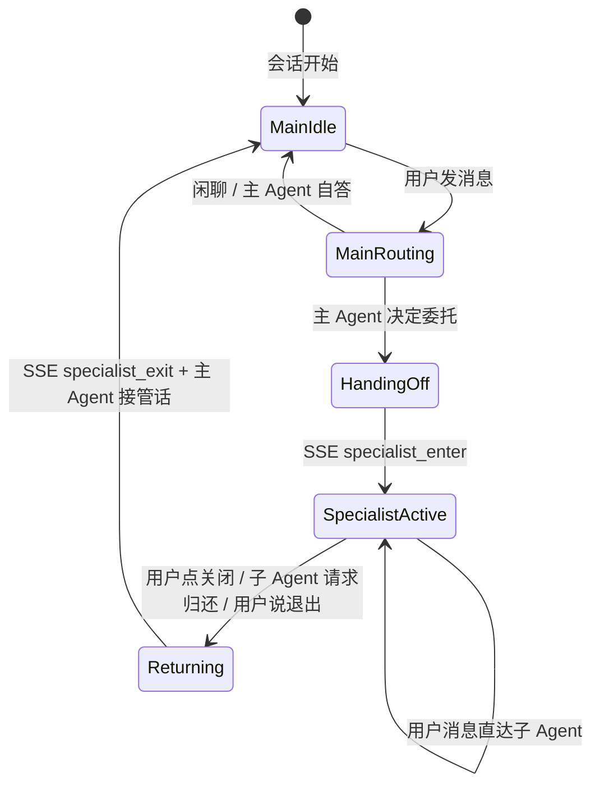

# 交互说明 · 子 Agent 会话托管（Handoff）

> Demo 方案 B 下一形态 · 一页说明（评审稿）  
> 相对现状：从「主 Agent 调工具并转述」→「子 Agent 托管对话窗口」  
> 首期可落地对象：业务指标归因 Agent；产品详情页 Agent 复用同一壳

---

## 1. 用户看到什么

```text
┌─ 整块对话框（托管中：外边框描边）─────────────────────┐
│  [子 Agent 名 / 任务]                    [关闭]      │  ← 右上角退出
│                                                     │
│  用户 / 助手消息正常流式排列（不按消息再套小框）         │
│  …                                                  │
│  [输入框]                                           │
└─────────────────────────────────────────────────────┘
```

- **框**：托管中给**整个聊天面板**加边线描边（含顶栏、消息区、输入区），不是框单条对话。
- **右上角**：顶栏显示当前子 Agent 名 + **关闭**；退出后恢复「AI 运营助手 / ● 在线」。
- **历史**：退出后**不**保留「某某子 Agent 托管会话」分段标记；消息按普通对话展示。
- **输入框**：托管中 placeholder 可提示向子 Agent 提问。

---

## 2. 状态机（进 / 出）



| 状态 | 谁收用户消息 | UI |
|------|--------------|-----|
| `MainIdle` / `MainRouting` | 主 Agent | 无托管条 |
| `HandingOff` | （短暂，可禁用输入） | 可显示「正在转交…」 |
| `SpecialistActive` | **仅**当前子 Agent | 整对话框描边 + 顶栏关闭 |
| `Returning` | （短暂） | 关闭中… → 去掉框 |

**进入触发（服务端为准）**

1. 主 Agent 调用 `handoff_to_*`（或现有 `delegate_*` 升级为 handoff，不再嵌套整轮当工具跑完就退）。
2. Bridge 写入会话态：`active_specialist = { id, name, task_label, entered_at }`。
3. SSE：`specialist_enter` → 前端立刻出框；主 Agent 发一句进态话（可与 SSE 同帧）。

**退出触发（任一）**

| 方式 | 行为 |
|------|------|
| 用户点 **关闭** | `POST/SSE action=specialist_exit`，reason=`user_close` |
| 用户说「退出 / 回主助手」 | 子 Agent 或 Bridge 识别后 exit，reason=`user_say_exit` |
| 子 Agent 任务完成并调用 `return_to_supervisor` | reason=`specialist_done` |
| 异常 / 超时 | reason=`error`，仍走归还，主 Agent 说明失败 |

**退出后主 Agent 必须主动发一句**（模板）：

> 已退出「{子 Agent 名}」，停止「{task_label}」。我已接管，可继续问我或交代下一步。

---

## 3. 消息归属

每条消息带 `speaker`（持久化进会话）：

| `speaker` | 含义 | 托管框内？ |
|-----------|------|------------|
| `user` | 用户 | 是（托管段内） |
| `supervisor` | 主 Agent（含进态/出态话） | 进/出态话可在框边界或框内第一条/末条 |
| `specialist:{id}` | 子 Agent | 是 |
| `system` | 纯 UI 提示（可选，少用） | 可选 |

**规则**

1. **托管中**：用户新消息 **只**路由到 `active_specialist`，主 Agent **不插嘴**（除系统级错误条）。
2. **进态话**归 `supervisor`，文案短：转交谁、做什么、如何退出（点关闭即可）。
3. **出态话**归 `supervisor`，且必须出现在去掉托管框之后（或框消失的同时）。
4. 托管段消息打标：`handoff_id`（一次进入一个 UUID），便于整段回写与折叠展示。
5. 右侧产物（详情草稿 / 归因结构卡）仍可更新；归属记在产生它的 `specialist` 上。

**消息时间线示例**

```text
[supervisor] 已转交「业务指标归因 Agent」，本轮做增长诊断。点右上角可随时退出。
── handoff_id=H1 enter ──
[user]           留资率为什么跌了
[specialist:metrics]  （六节长文…）
[user]           任务 1 确认交接
[specialist:metrics]  已记录 pending_confirm…
── handoff_id=H1 exit reason=user_close ──
[supervisor] 已退出「业务指标归因 Agent」，停止「增长诊断」。我已接管。
```

---

## 4. 历史回写（退出后主 Agent 看得见）

退出瞬间 Bridge 组装 **`handoff_transcript`**，注入主 Agent 下一轮（及可选立刻生成出态话时的上下文）：

```json
{
  "handoff_id": "H1",
  "specialist": { "id": "metrics", "name": "业务指标归因 Agent" },
  "task_label": "增长诊断",
  "exit_reason": "user_close",
  "messages": [
    { "role": "user", "text": "…" },
    { "role": "specialist", "text": "…" }
  ],
  "artifacts": {
    "attribution": { },
    "pageDraft": null
  },
  "summary_for_supervisor": "可选：子 Agent 或规则生成的 5 行结论"
}
```

| 回写项 | 用途 |
|--------|------|
| `messages[]` | 主 Agent **全文可见**用户↔子 Agent 对话（可截断超长工具噪声，正文必留） |
| `artifacts` | 结构化结果优先于纯文本，供主 Agent 二次路由 / 确认交接 |
| `summary_for_supervisor` | 出态话与后续路由用，避免每次塞超长全文进 prompt；全文仍落会话存储可查 |

**原则**：退出后主 Agent「看得到历史」= 会话存储保留整段 + 注入 transcript；不是靠模型记忆碰运气。

---

## 5. 与现状委托的差异（实现时对齐）

| | 现状 `delegate_*` | 本交互 Handoff |
|--|-------------------|----------------|
| 控制权 | 主 Agent 一直握着 | 托管段内子 Agent 握着 |
| 用户多轮追问 | 每轮再 delegate / 转述 | 框内连续聊 |
| 嵌套 `reply_stream` | 有，易卡 | **改为会话切换**，不嵌套跑完 |
| 前端 | 工具卡片 + 转述 | 托管条 + 框 + 关闭 |

首期建议：**归因走 Handoff**；产品详情可第二期复用（多轮改稿更需要托管）。

---

## 6. 已拍板（按推荐落地）

1. 进态后 **第一句用户原话自动转发**给子 Agent。  
2. 出态话用 **固定模板** + 可选 `summary_for_supervisor` 一句。  
3. 托管中 **整块对话框描边**；退出后不保留子 Agent 分段历史标记。

## 7. 实现落点（Demo）

- Bridge：`specialist_session.py` + `stream_agent_events` 分流；`delegate_metrics_agent` 仅发 handoff 信号  
- Node：`chat-server.js` 透传 `client_action`  
- 前端：`App.jsx` 托管条 / 关闭 / `specialist_enter|exit` / 框选 `handoff_id` 段  

---

*文档位置：`demo-project/docs/handoff-session-ux.md`*
