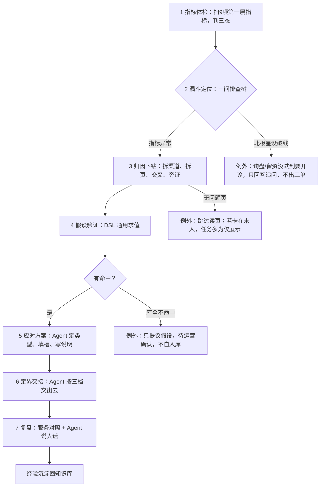
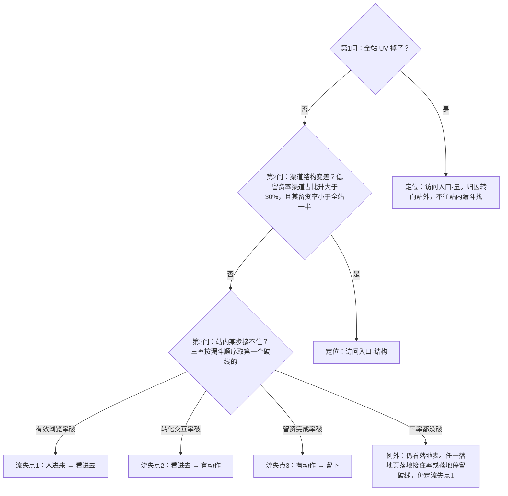
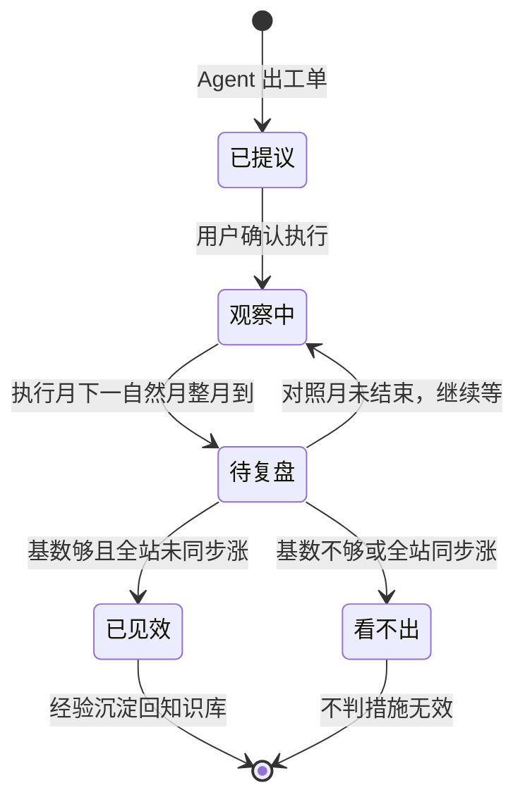
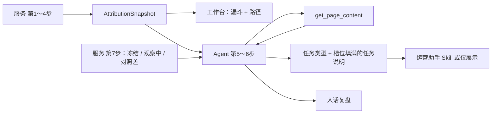
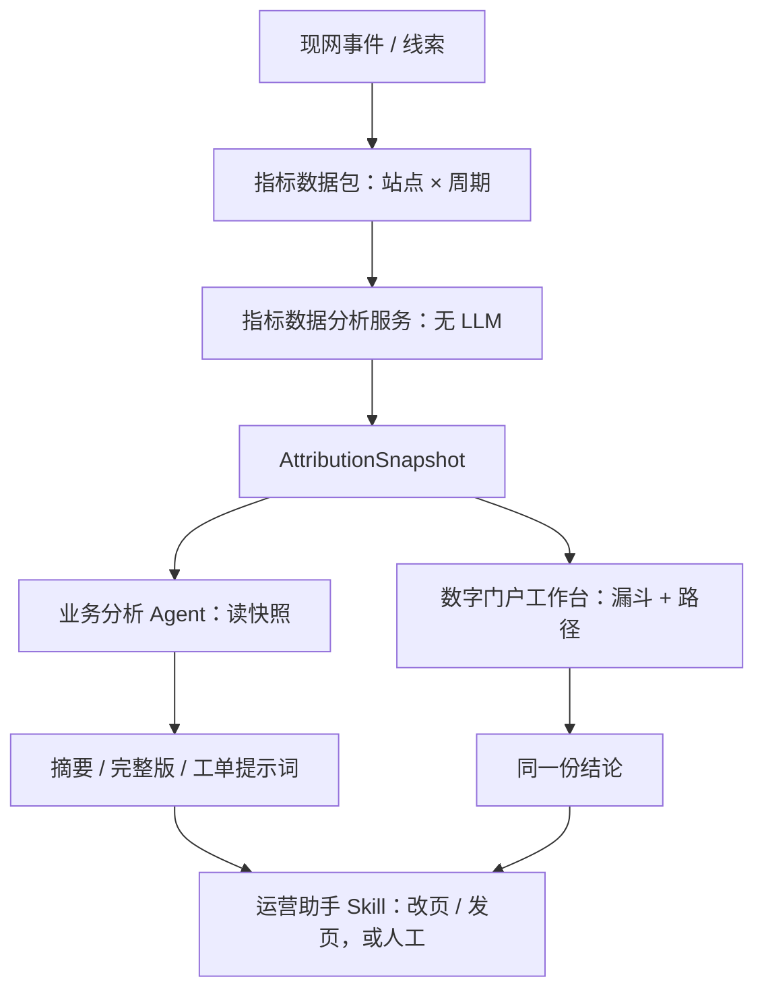
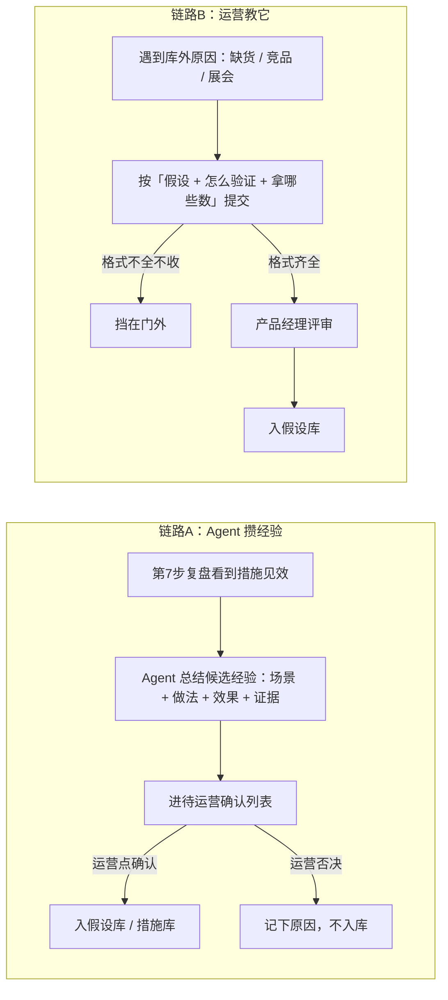

# AI 访客行为分析 Agent · PRD

- 版本：v0.5（评审稿 · 服务与 Agent 边界）
- 日期：2026-09-16
- 状态：把已拍板策略、口径表和评审原型收敛成研发可评审的正向需求
- 作者：范勇健
- 产品对外名：**访客行为分析**
- 对内实现名：业务分析 Agent（growth_attribution_agent）+ 指标数据分析服务（growth_metrics_service）
- 产品范围：数字门户诊断层；不替代 AI 运营助手做页

**变更日志**

| 版本   | 日期         | 变更                                                                                                     |
| ---- | ---------- | ------------------------------------------------------------------------------------------------------ |
| v0.5 | 2026-09-16 | 第 6 章补数据分析服务与 Agent 边界：服务做第 1～4 步，Agent 从第 5 步介入；工单要写到 Skill 入参（含营销页参数）。Demo `bind_tasks` 预写提示词不算产品契约。 |
| v0.4 | 2026-09-16 | 路径意图改为一人一天可多个：来路词/广告词/站内搜按词可中多类，页停留 ≥15s 按页类补；最多 3 个；意图不明不与其他类并存。不拿到达层反推。                              |
| v0.3 | 2026-09-16 | 路径工作台补一期意图：6 类标签与当天到达正交；有来路词/广告词先按词，没有词按当天停最久的页类；不拿到达层反推。评审原型（demo-project 数据分析 → 访客路径）已同步。            |
| v0.2 | 2026-09-14 | 按正向产品需求重写：补用户故事、信息架构、方法论流程图、埋点需求、接口契约、权限矩阵、运营机制、非功能需求；A-S 全模块 + 5 张 Mermaid 流程图就位。                     |
| v0.1 | 2026-09-14 | 初稿，决策纪要 + 口径备忘形态。                                                                                      |

**口径事实源**

| 材料                             | 用途                   |
| ------------------------------ | -------------------- |
| AI访客行为分析Agent-策略说明-汇报稿.md      | 对外怎么讲、产品长什么样         |
| 指标字典与假设方案库.xlsx                | 111 条指标、口径原子、假设方案    |
| demo-project 漏斗评审原型            | 漏斗体检 + 访客路径（含意图列与筛选） |
| growth_metrics_service/SPEC.md | 引擎怎么算、快照契约           |
| 漏斗四层-方法论环绕.drawio              | 四层漏斗·三流失点·七步分析·全量假设  |

---

## 1. 一页摘要

**产品是什么**：访客行为分析放在数字门户诊断层，由一个业务分析 Agent 和一个指标数据分析服务组成，向运营交付「询盘为什么少、卡在漏斗哪一层、钉在哪一页、为什么、下一步谁来干」的结论与可执行工单。

**解决什么**：客户把人招到官网，要的是询盘。人到了看几秒就走，运营只能凭感觉改一版详情，再等两周看询盘有没有回来。运营助手已经能改页、发页，缺的是告诉它改哪一页、改什么、不要编造参数。

**怎么做**：指标数据分析服务做第 1～4 步（体检、定位、下钻、假设核对），产出 AttributionSnapshot；业务分析 Agent 从第 5 步介入：读快照、读问题页正文，选定任务类型并填到运营助手 Skill 入参。Agent 不算数、不判三态、不发明做不到的动作。边界见第 6 章。

**一期交付**：28 天窗口、四层人数漏斗、四渠道、钉层钉页、抽样访客路径（含一人一天可多个意图标签）、假设核对、运营助手交接、观察中与复盘窗口、Demo 贯穿案例。

**成功长什么样**：贯穿案例——UV 持平 → 有效浏览率异常 → 落点流失点 1 → 只钉主力型号详情页 → 根因是第一屏没接住 → 出「改产品详情·首屏前移」交接提示词；对外一句话能说清「询盘少了 11 条，是主力铝支架详情页第一屏没接住客户，看了上半屏就走了」。

---

## 2. 背景与问题

### 2.1 现状

- 数字门户已有站点、产品和内容能力；AI 运营助手能修改产品、发布内容、做营销页。
- 官网有浏览、表单、智能客服等行为事件，但运营看不到「人卡在哪一步」。
- 没有把漏斗人数、页面承接、抽样路径和可执行工单放在同一份诊断里。

### 2.2 痛点

1. 询盘少了，运营不知道是来的人少了，还是进来没看进去、看了没动手、动手没留下。
2. 改详情全凭感觉，改完要等两周才知道有没有用，也说不清对照哪一段日子。
3. 运营助手能改页，但没有「改哪一页、改什么、不要编造参数」的交接。
4. 渠道、词、页混在一起讲，容易把投放问题和页本身问题当成一回事。

### 2.3 产品定位与范围

**是**：数字门户的诊断层。它回答「卡在哪、钉哪页、为什么、谁来干」，并把能做的活交接给运营助手。

**不是**：

- 不是数据看板：它出结论和工单，不替 BI。
- 不是归因模型：它按确定性规则定位，不跑概率归因。
- 不替代运营助手做页：Agent 读结论、读页、写到参数级的工单，改页由运营助手现网 Skill 执行。
- 不做投放 / SEO / 外链 / 客服话术 / 导航筛选的执行：这些只出「仅展示」建议。

**在产品矩阵中的位置**：指标数据分析服务（算数）→ **访客行为分析（诊断）** → AI 运营助手（执行）。诊断层把「改哪页、改什么」说清楚，执行层才有地方下手。

### 2.4 目标与非目标

**目标**

1. 给获客型官网一张人数漏斗：来了 → 看进去 → 动手 → 留下；询盘条数旁注，层高按留下的人数。
2. 全站三个通过率谁先掉，结论就写卡在哪一层；再拆渠道、拆页面，一页自己掉了就钉这一页。
3. 用抽样访客的当天路径核对漏斗，不另做一套「按人算的率」。路径上一人一天可打多个意图标签，用来对照「来干什么」，不拿来重算漏斗。
4. 命中假设后，交给运营助手的活带完整 URL 和可复制提示词；做不了的明确写「要人来处理」。
5. 运营助手里问「询盘少了」，先听到同一份结论，再进同一页诊断。

**非目标（一期）**

- 不拆成两个 Agent（漏斗一个、路径一个）。
- 不做采购阶段识别。意图最多 3 个，意图不明不与其他类并存；意图不进漏斗钉层、不算通过率。自然搜索词对不上人时，来路词为空是正常的。
- 不出「日结论」；数可每天重算，判断始终针对近 28 天 vs 过去 4 周同期平均；自然月月报另做。
- 不在本产品里改投放、SEO、外链、设计回滚、导航筛选、客服话术、站内同义词；这些只展示建议。
- 不让 Agent 自己算通过率、数破线条数、缺数填 0。
- 不把 Demo 的 mock 包当现网数仓。

### 2.5 成功标准

贯穿案例的可验收要点（完整清单见第 13 章）：

- UV 持平 → 有效浏览率异常 → 落点流失点 1 → 仅主力型号详情页落地接住破线 → 四渠交叉同步变差 → 命中「第一屏没接住」→ 出「改产品详情·首屏前移」提示词。
- 转化交互率、留资完成率没掉时，结论不得写成卡在动手或留下。
- 询盘少了 11 条必须能直接说出来；不得因留资数落在死档而对外说「询盘持平」。
- 缺数进数据缺口，不静默当 0。

---

## 3. 用户与场景

### 3.1 角色职责矩阵

| 角色           | 用本产品做什么                 | 关心什么                |
| ------------ | ----------------------- | ------------------- |
| 站点老板 / 运营负责人 | 看摘要                     | 询盘少几条、卡在哪、钉哪页、下一步谁干 |
| 内容运营         | 从工单回诊断页看依据，复制提示词给运营助手改页 | 改哪页、改什么、依据是什么       |
| 投放 / 客服 / 研发 | 接收「仅展示」建议               | 我这边要处理什么            |
| 产品经理         | 管结构与口径、评审新假设入库          | 口径不被改乱              |
| 运营           | 管场景与阈值、确认/否决候选经验、提新假设   | 越用越准                |

### 3.2 核心用户故事

**故事 1 · 老板问「询盘少了」**：老板在数字门户打开「访客行为分析」，页头第一句告诉他这个月询盘少了 11 条，人没少，是主力铝支架详情页第一屏没接住客户，看了上半屏就走了。下面漏斗四段都是人数，点卡住的那一层，右边把页面拆开。老板看完知道卡在哪、谁去干，不用自己拼。

**故事 2 · 运营查依据**：内容运营从工单回到诊断页，看异常点落在哪一页、交叉是五渠同步变差还是单渠、根因命中哪条假设、排除了流失点 2 和 3 的证据。确认无误后，复制「帮我修改产品 + 完整 URL + 首屏前移」提示词，发给运营助手改页。

**故事 3 · 运营助手入口**：运营在运营助手里说「询盘少了」，先听到同一份摘要结论，再点入口卡进同一页诊断，不用重新描述问题。

**故事 4 · 运营复盘**：上月改了主力详情首屏，这个月窗口重算。系统把那张工单放进「观察中」，等执行月的下一个完整自然月对照。对照月到了，系统比对照月与冻结月，绝对数按日均并减掉全站同期变化：基数够且全站没同步涨，说「修好拿回 11 条」；基数不够或全站也涨了同样多，说「看不出」，不硬说措施无效。

### 3.3 用户旅程

触发（窗口重算完成 / 老板询问 / 运营助手提问）→ 打开诊断页 → 读页头结论 → 下钻漏斗与路径 → 确认根因 → 复制工单交运营助手 → 运营助手改页 → 工单进观察中 → 对照月复盘 → 经验沉淀回知识库。

---

## 4. 核心概念与术语

> 全量时补完整术语表、计数单位、统计窗口。此处先列要点确认风格。

| 术语   | 含义                                                                         |
| ---- | -------------------------------------------------------------------------- |
| 漏斗四层 | 访问入口 → 有效浏览 → 转化交互 → 成功留资，按人数                                              |
| 流失点  | 层间通过率掉的那一段，共 3 个                                                           |
| 通过率  | 有效浏览率 / 转化交互率 / 留资完成率                                                      |
| 三态   | 异常 / 提升 / 持平                                                               |
| 北极星  | 留资率（去重留资条数 ÷ 全站 UV），年度目标 3%                                                |
| 计数单位 | cookie × 当天（UV 访客·日）                                                       |
| 会话   | 挂在 cookie 下的一次访问，无操作 30 分钟或过 0 点新开                                         |
| 秒退   | 当天只看 1 页且停留不足 15s 又无转化交互；≠ 业界跳出率                                           |
| 落地接住 | 只衡量进站第一页；后面某页停满 15s 不算这一页接住                                                |
| 合格浏览 | 打开过这一页的人里，这一页自己看进去的比例；各页加总 ≠ 全站有效浏览                                        |
| 当天到达 | 漏斗四层里，这个人当天最远走到的那一层                                                        |
| 意图   | 这个人当天来干什么；与当天到达正交。一人一天可以多个。来路词/广告词/站内搜先按词（一条词可中多类），页停留 ≥15s 再按页类补；不要用到达层反推 |

---

## 5. 方法论与判定规则（产品大脑）

七步里，指标数据分析服务确定性执行第 1～4 步，产出 AttributionSnapshot；业务分析 Agent 从第 5 步介入，读快照和页面正文，写成任务说明并定界交接。第 7 步对照计算在服务，对外怎么说在 Agent。谁做哪一步见第 6 章。

### 5.1 七步分析总览

第 1～4 步在服务里执行，快照不含成稿提示词。Agent 不重算、不判三态。三个例外分支（北极星没破线 / 库全不命中 / 无问题页）分别走「只回答追问」「提议候选假设」「跳过读页」，不强行出工单。

### 5.2 第 1 步 · 指标体检与三态判定

引擎扫描 9 项第一层指标，对比过去 4 周同期平均，判异常 / 提升 / 持平。判定顺序：异常 → 提升 → 持平，同一指标同时命中异常与提升时以异常为准。

三个通过率的双条件：环比跌大于 10% **且** 绝对跌大于 2 个百分点才异常（两个条件须同时满足，避免小基数误报和 pp 掩盖）。复合校验：三率单项都没触发时，再算三率乘积，乘积环比跌大于 10% 仍报异常，落点定到贡献最大的那一步。

健康度待处理问题数只报异常，不进漏斗、不占落点，走技术侧单独修。

### 5.3 第 2 步 · 漏斗定位（三问排查树）

留资数或留资率异常才开诊。引擎按三问顺序定位，不许跳步：

**为什么第 2 问不能跳**：留资率低的渠道占比一抬升，全站秒退率、停留、人均页数都会跟着变差，但页面本身没变。这时去改页面不会有效果。必须先确认「来的人没变」，才能把账算到站内。

没掉的层必须写进 locate.excluded，供「逐条核对」。

### 5.4 第 3 步 · 归因下钻

按步骤：对照 → 拆渠道 → 拆页面（含交叉）→ 页内旁证。**只出异常点，不写根因**。

**第 0 步 · 对照（不钉点）**：该层主指标跟上期全站比，第 1 步已判定结果。本条未突破 → 下面整块不判波动。

**第 1 步 · 拆渠道**：谁跟上期比更差？几个渠一起差？还是只有一个渠道变差？

- 渠道该层主指标，最低基数该渠道 UV < 30 不算，变化阈值环比跌 >10% 且绝对跌 >2pp。
- 0 个突破 → 不是渠的问题，全站拆页；1 个突破 → 锁这个渠，只在这渠拆页；2 个突破 → 写这两渠，只在这两渠拆页；≥3 个突破 → 不钉某渠，全站拆页。

**第 2 步 · 拆页面**：第 1 步锁了渠道 → 只算这些渠访客；没锁 → 按全站。

- 页面落地接住率（只衡量进站第一页，分子不跟全站有效浏览走）、各页合格浏览率（打开过这页的人里这页自己看进去的比例，各页加总 ≠ 全站有效浏览）。
- 最低基数该页 UV < 10 不算，变化阈值环比跌 >10% 且绝对跌 >2pp。
- 只有 1 页突破 → 钉这页；多页一起突破 → 不钉成一页，写成同步变差。两步钉到不同页允许并列，第 4 步再判共因。

**交叉**：拿着钉到的页，看这些页不同渠道情况，是所有人到这页都差，还是只有某一路来的人差。第 1 步就算只锁了一个渠，交叉也要把这页上各渠都看完。

- 该渠该页主指标，最低基数该格访客 < 10 不算，变化阈值环比跌 >10% 且绝对跌 >2pp。
- 该页只有 1 个渠道突破 → 异常点写成该渠 × 该页（可能来路不对，先别整页改）；多个渠道一起突破 → 异常点仍是该页，页面本身坏了。

**第 3 步 · 页内旁证**：钉完对象才拉，**不单独定异常点**。

- 落地停留均值（单次封顶 30 分钟后加总 ÷ 该页落地访客），跌 >20% 标「停留明显变短」。
- 滚动深度 P75，跌 >15 个点，或本期 P75 < 40% 标「多数人还在首屏附近」。

**贯穿案例**：有效浏览率 40%→30%；五渠秒退全升 → 全站拆页；产品详情页·主力型号落地接住率 53.8%→14.5%（−39.3pp），其余页 ±0.0pp → 钉这页；该页五渠同步腰斩 → 页面本身坏了；落地停留 84s→26s，滚动 P75 72%→33% → 印证首屏没接住。

### 5.5 第 4 步 · 假设验证

假设在知识库 hypothesis_lib.json，用指标组合声明 when，引擎 evaluator.py 通用求值，返回 pass / fail / insufficient。引擎里不允许 if 假设N。

- 本层通过的假设才是根因；他层即使通过，只作并列因素。
- 库内全不命中：Agent 可用 propose_hypothesis 提候选，落 pending/，只有提议权，不能自入库。
- 措施分三档：直接修复 / 确认后交接 / 仅展示。一期可执行的只有运营助手现网已激活 Skill。

### 5.6 第 5 步 · 应对方案

**由 Agent 做**（规则与参数粒度见第 6 章）。服务只把命中的假设和候选措施 id 放进快照，不写成稿。

按根因出任务说明（要做什么，**不指定调哪个智能体**）。任务类型只用一期 8 种：修改已有产品详情 / 修改已有页面文案 / 生成产品详情页 / 生成或重做营销落地页 / 建立持续内容发布计划 / 帮我查找并替换内容 / 站外或人工处理建议 / 健康度修复。每条写清：类型 + 对象（页面地址写全）+ 说明（改哪几段、改成什么、缺的数字写「待填写」别编）。生成营销页还要写到现网 Skill 入参：网站、页面类型、词、产品、卖点、买家、联系方式。

### 5.7 第 6 步 · 定界交接

**由 Agent 按第 6 章定界。** 三档不越权：

| execution.kind | 交接方式                                                        |
| -------------- | ----------------------------------------------------------- |
| skill          | 内容类（改文案、改详情、生成详情）→ 客户确认后交内容运营；handoff_prompt 以欢迎语开头、带完整 URL |
| display_only   | 站外类（投放、SEO、外链、表单字段、客服话术、导航筛选、系统挂表单）→ 仅展示建议，不执行、不贴提示词        |
| system         | 健康度类 → Agent 直接修，运营知悉即可；或只改本期分析口径                           |

### 5.8 第 7 步 · 复盘

对照计算、冻结指标、观察中挡住同一页同一改法，由服务做。对外怎么说由 Agent 做。

执行月的下一个完整自然月整月对照工单冻结的那个月；绝对数按日均，并减掉全站同期变化。

- 基数够且全站没同步涨 → 说效果（如「修好拿回 11 条」）。
- 基数不够或全站也涨了同样多 → 结论写「看不出」，**不写措施无效**。
- 观察月未结束 → 不下结论；已对同一页、同一改法出过工单且还在等 → 本期不出同一张，只出现在「观察中」。
- 成功 / 失败 / 看不出都沉淀回知识库（见第 9 章运营机制）。

工单从被 Agent 写出、用户确认执行、进入观察、到对照月复盘，状态流转如下：

---

## 6. 数据分析服务与 Agent 的边界

对外产品名是「访客行为分析」，对内是两件事：指标数据分析服务算完第 1～4 步，业务分析 Agent 从第 5 步介入，读快照、读页，写成能交给运营助手执行的工单。漏斗工作台也读同一份快照，不经过大模型。字段级契约见第 7 章。

### 6.1 拆开的原因

第 5 章的七步是「怎么判」，不是「谁来判」。不先钉死边界，评审会默认七步都是 Agent 在做；原型里一画漏斗，又会默认页上的数和工单都是模型算的。老板原型里的实时意图、自动派单，更容易把诊断层写成一个什么都自己判、自己派的智能体。

必须挡住三件事：

1. 三态、落点、假设是否成立进 Prompt。口径一变，模型每次说法不一样。
2. 工作台为了画漏斗去问 Agent。页头结论和漏斗人数必须来自快照，刷新页面不能换一套数。
3. 工单只写到「建议生成营销页 / 请改首屏」。运营助手现网 Skill 要的是参数；参数空，等于没交。

### 6.2 七步谁做

| 步   | 名称   | 谁做              | 交出什么                                                                            | 不准交出什么                |
| --- | ---- | --------------- | ------------------------------------------------------------------------------- | --------------------- |
| 1   | 指标体检 | 服务              | 9 项第一层指标的本期 / 基线 / 三态 / 死档 / 缺口                                                 | 不解释「这意味着什么」           |
| 2   | 漏斗定位 | 服务              | 卡在哪一层、`excluded` 里排除了哪几层                                                        | 不写对外那句人话              |
| 3   | 归因下钻 | 服务              | 钉哪一页 / 哪条渠、交叉是同步变差还是单渠、停留与滚动旁证                                                  | 不写根因文案                |
| 4   | 假设验证 | 服务              | 哪条假设 pass / fail / insufficient、证据、本层根因 vs 并列因素；可带候选措施 id                       | 不定最终任务类型，不写交接提示词      |
| 5   | 应对方案 | **Agent**       | 在一期 8 种任务类型里选定，填槽位，写成任务说明                                                       | 不重算三态，不指定「去调哪个智能体」    |
| 6   | 定界交接 | **Agent**       | skill / display_only / system；skill 写成欢迎语开头的 `handoff_prompt`                   | 不把站外事项写成可点击执行         |
| 7   | 复盘   | 服务做对照，Agent 说人话 | 服务：冻结数、观察中挡住同一页同一改法、对照月到了给出可判定的差。Agent：基数够且全站没同步涨才说效果；不够或全站也涨了同样多，说「看不出」，不写措施无效 | 服务不下「修好了 / 措施无效」的对外结论 |

第 1～4 步走完，快照里已经有「卡在哪、钉哪页、为什么」。Agent 禁止重算、禁止改三态、禁止自己数破线条数。它要做的是把这三句话变成一张能执行的工单。

例外仍按第 5.1 节：北极星没破线 → 只回答追问、不出工单；库全不命中 → 只提议假设、不自入库；无问题页 → 跳过读页，任务多为仅展示。

### 6.3 Agent 从快照里读什么

一次 `get_snapshot`。摘要版先读 `headline`，完整版再往下拆。不要把 `scan` 整表念给老板。

| 要回答的问题       | 读哪里                                                                               | 用途                      |
| ------------ | --------------------------------------------------------------------------------- | ----------------------- |
| 询盘少了几条、来了多少人 | `headline.询盘条数`、`headline.访客人数`                                                   | 对外第一句。死档只作口径提醒，不说「询盘持平」 |
| 卡在哪一层        | `headline.卡在哪一步`、`locate.reason`、`locate.excluded`                                | 完整版要能写出排除了哪几层           |
| 钉哪一页         | `headline.问题页`（路径、名称、完整 URL、最近改版、当前首屏）                                            | 有路径才去读页                 |
| 异常点与交叉       | `drill.anomaly_points`、`cross_check`                                              | 是这一页本身坏了，还是某一渠来路不对      |
| 根因           | `hypotheses` 里 `result=pass` 且 `in_scope` 的 `name` 与 `evidence`；顺序跟 `headline.根因` | 只采用命中的假设，不合成一条新原因       |
| 并列因素         | `headline.并列因素`                                                                   | 他层也成立的，放后面补一句           |
| 候选措施         | 命中假设上的 `measures[]`（措施 id）+ 措施库该条的 `type` / `slots` / `must_not` / `execution`    | 这是菜单，不是成稿。Agent 选定并填槽   |
| 观察中 / 复盘     | `headline.观察中一句话`、`observing[]`、`review_due[]`、`skipped_repeats`                  | 同一页同一改法还在观察中，本期不再出执行    |
| 数看不到         | `headline.数据缺口一句话`、`data_gaps`                                                    | 照抄。看不到就说看不到             |

追问某条指标才调 `get_metric_detail`。返回 `ok=false` 时用 `candidates` 的 `ref` 再查，不自己拼名字。

快照里可以带空槽位和已知字段（页路径、产品 URL、本期 UV）。**不成稿提示词。** 成稿是 Agent 读页之后写的。

### 6.4 Agent 从第 5 步介入：三件事连着做

1. **读分析结果。** 人有没有少、卡在哪一层、钉哪一页、哪条假设成立、观察中有没有挡住。
2. **读具体页面。** `headline.问题页.路径` 非空才调 `get_page_content`。核对：现在首屏写的是什么、参数在不在第一屏、有没有询价入口、规格 / 认证 / 报价方式缺哪块。页上没有的数字写「待填写」，没有的证书标「待客户确认」，不许编。
3. **定任务类型，写任务说明。** 在一期 8 种里选出一种，按该类型把槽位填到下游 Skill 真正要的参数。类型对了但参数空，不算交过。

调用顺序：`get_snapshot` → 仅当问题页路径非空时 `get_page_content` → 选定类型并填槽 → skill 的写成 `handoff_prompt`，display_only 的只出口头建议。禁止改阈值、禁止连打十余次取数、禁止跳过读页直接套模板。

缺产品 URL、缺营销页必填项（网站、页面类型、要对上的词）时停下来问，不拿猜测补上。

### 6.5 一期 8 种任务类型

任务说明写「要做什么」，**不写去调哪个智能体**。执行仍交运营助手现网 Skill，或仅展示给人。

| 任务类型       | 典型何时选                               | 欢迎语（skill）            | 说明必须写到的参数                                   |
| ---------- | ----------------------------------- | --------------------- | ------------------------------------------- |
| 修改已有产品详情   | 钉在产品详情，根因是首屏 / 询价入口 / 缺规格认证         | 帮我修改产品                | 完整产品 URL；局部还是整页；改哪几段；现在原文是什么；改成什么；缺的数字「待填写」 |
| 修改已有页面文案   | 钉在文章等非产品页，或详情页只改开头对齐来意              | 帮我修改内容（产品页仍走「帮我修改产品」） | 完整页面 URL；改开头还是哪一段；对齐哪条来路 / 哪个搜索词            |
| 生成产品详情页    | 站里缺这个型号的详情                          | 帮我发布产品                | 型号 / 品类描述；已有图或文字；没有的规格「待填写」                 |
| 生成或重做营销落地页 | 广告或搜索来意在现有页上对不上，要按这条意图另做一页          | 帮我生成智能营销页             | 见 6.6，必须写到 Skill 入参，不能停在「生成营销页」             |
| 建立持续内容发布计划 | 要靠持续内容承接一批词，而不是改一页                  | 帮我创建发布内容计划            | 主题、关键词清单、多少天一次、发到哪个网站                       |
| 帮我查找并替换内容  | 全站同一叫法要统一换                          | 帮我查找并替换内容             | 查找词、替换成什么、哪个网站；不能拿来做首屏结构改写                  |
| 站外或人工处理建议  | 投放、SEO、外链、表单字段、客服话术、导航筛选、系统挂表单、版式回滚 | 无（display_only）       | 问题对象 + 建议 + 原因；不贴提示词                        |
|            |                                     |                       |                                             |

选类型时以命中假设上的候选措施 id 为菜单，允许 Agent 根据读页结果改选（例如页上已有询价入口就不要再出「补询价入口」；现有页根本接不住该词，才改走生成营销页）。不准发明第 9 种可执行类型。

### 6.6 写到什么粒度

检查标准：运营助手拿到这一段，不需要再猜「改哪、做成什么样」。

**改已有产品详情（贯穿案例）**

不是「请改首屏」。要写成：

- 欢迎语：帮我修改产品
- 产品详情页：完整 URL（如 `https://www.example.com/products/aluminum-bracket`）
- 局部修改，不要整页按行业规范重写，不要改标题
- 现在第一屏写的是「……」（从 `get_page_content` 抄原文），这是公司介绍不是产品
- 第一屏改成让人立刻看出这是哪款主力型号、给谁用
- 把哪些关键参数挪到首屏可见区域；现在参数在首屏以下还是已可见
- 没有确切数字的项写「待填写」，不要编造
- 保留正文原有配图
- 先出方案确认，再覆盖上线

**生成或重做营销落地页**

不是「建议生成营销页」。现网 `smart_landing_page` 要的入参必须写进任务说明：

| 入参               | 从哪来                                                | 写不清时                      |
| ---------------- | -------------------------------------------------- | ------------------------- |
| 目标网站             | 当前站点                                               | 停下来问                      |
| 页面类型（1～5）        | Agent 根据来意和缺页判断：产品型 / 询价型 / 选型指南 / 厂家资质 / 其他现网已有类型 | 吃不准列出候选，让人挑，不默默定一个        |
| 要对上的词            | 下钻到的搜索词或广告词；没有词就写清「按哪类来意」                          | 对不上人的自然搜索词留空，不用 GSC 展现词冒充 |
| 关联产品             | 钉到的型号或品类；读页或站点产品信息                                 | 没有就「待填写」，不编型号             |
| 卖点               | 读页 / 知识库已有的对象、材质、交期、认证                             | 页上没有的不编                   |
| 买家是谁             | 来意（OEM / 经销 / 终端厂家等），能从词或页上读出的才写                   | 写不出就「待填写」                 |
| 公司 / 行业 / 联系方式   | 网站档案或页上已有                                          | 没有的不编电话和认证号               |
| 阶段（了解 / 对比 / 决策） | 能从词判断再写；它会约束 CTA 和表单长短                             | 吃不准标待确认，不把秒退写成「低意向」再拿去出页  |

还要写清：为什么现有页接不住（首屏在讲品牌、词是询价、页上没有对应模块）；这一页是新做、不是按 URL 改已有营销页（现网 Skill 不能按 URL 改落地页）。缺必填项停下来问。

**其他类型同理。** 发布计划要有主题、词、节奏、网站；查找替换要有词和站；仅展示要有对象和原因。措施库里的 `slots` 是检查清单，不是填空游戏——槽位值必须来自快照已知字段或读页结果。

### 6.7 四条铁律

1. Agent 不算数、不判三态、不数破线条数。数字只来自快照和 `get_metric_detail`。
2. 工作台直读快照画漏斗和路径，不经过大模型。Agent 默认出摘要，不把漏斗表整页念出来。
3. 缺数进 `data_gaps`，不静默当 0；页上没有的参数不写进提示词。
4. 任务说明必须填到 Skill 入参。写「生成营销页」「请优化详情」不合格。

### 6.8 和本地 Demo 代码的差别

`growth_metrics_service/engine/snapshot.py` 里的 `bind_tasks` 会按模板填槽并写好 `handoff_prompt`。这是原型为了联调预览偷的懒，**不是产品契约**。

产品上：服务交到第 4 步（假设命中 + 候选措施 id + 空槽 / 已知字段）；Agent 读页后选定类型、填槽、写成说明。联调要把 `bind_tasks` 收成候选措施，或在评审时标明 Demo 仍预写提示词、不以它验收「Agent 会填参数」。

---

## 7. 数据流与系统架构

### 7.1 系统边界

数字门户工作台可直读快照画漏斗，不必每次经过大模型。Agent 负责读快照、读页、写到参数级的工单，不负责当唯一数据 API，也不负责算三态。

### 7.2 三层分工

| 层            | 内容                   | 谁改         | 变更方式           |
| ------------ | -------------------- | ---------- | -------------- |
| 数据层          | 指标分子分母、最低基数、本期/基线值   | 产品经理（口径）   | 改代码 + 重采 4 周基线 |
| 知识层 config/  | 假设库、措施库、阈值配置表        | 运营提 / PM 批 | 改 JSON 行，不发版   |
| 判断表达层（Agent） | 实例化、写任务说明、提候选假设、叙述答疑 | 模型         | 每轮生成           |

铁律：引擎里不允许 if 假设N；模型不判三态、不数破线条数；缺数显式暴露为 data_gaps，不静默填 0。

### 7.3 AttributionSnapshot 契约（关键字段）

- **headline**：询盘条数（本期/基线/少了几条/口径提醒）、访客人数、卡在哪一步、问题页（路径/名称/完整URL/最近改版/当前首屏）、根因[]、并列因素[]、可交接任务数、只能人工事项数、数据缺口条数、数据缺口一句话。
- **scan**：每条 ref / plain / value / baseline / change / state / data_status。
- **locate**：loss_point、reason、excluded[]。
- **drill**：anomaly_points[]、cross_check（同步变差、note）。
- **hypotheses[]**：id / name / result / evidence[] / failed_on。
- **tasks[] / 候选措施**：产品契约上，服务可在命中的 `hypotheses[].measures[]` 带措施 id，槽位先空或只填快照已知字段（路径、URL、本期值）。`handoff_prompt` 由 Agent 读页后写，不在服务里渲染成稿。Demo `bind_tasks` 预写提示词见第 6.8 节。
- **observing[]、review_due[]、data_gaps[]**。
- 路径抽样对象（工作台直读）每人带 `intents[]`（上表六类 id，可多个）与 `arrived_layer`（漏斗四层 id）。一期意图可以只挂在抽样包上，不进 locate / drill，不参与七步钉层。

headline 只做挑选不做判断，所以不违反「引擎不判、模型不算」；它同时是防截断措施——快照很长时模型曾把 data_gaps 当空的，headline.数据缺口一句话压在开头能挡住这类瞎猜。

---

## 8. 交接与权限边界

### 8.1 三档交接

| execution.kind | 怎么说                                                                         |
| -------------- | --------------------------------------------------------------------------- |
| skill          | 一句这条要解决什么，原样贴 handoff_prompt（以欢迎语开头、带完整 URL），说明复制给运营助手；补一句 execution.cannot |
| display_only   | 写成「这条运营助手做不了，要人来处理」，给建议和原因；不贴提示词、不写成可点击执行                                   |
| system         | 只说本期分析口径已标记                                                                 |

### 8.2 运营助手欢迎语白名单

只能是：帮我修改产品 / 帮我发布产品 / 帮我修改内容 / 帮我发布内容 / 帮我创建发布内容计划 / 帮我生成智能营销页 / 帮我查找并替换内容。改已有产品必须走「帮我修改产品」+ 产品 URL。

### 8.3 知识库三张表读写权限

- **假设库 hypothesis_lib.json**：运营提新假设 → PM 评审入库；Agent 只提议不入库。
- **措施库 measure_lib.json**：运营提 / PM 批；Agent 复盘后提候选措施，运营确认才入库。
- **配置表 thresholds.json**：运营提阈值建议；全局默认档 + 单站覆盖，单站不污染默认。

### 8.4 角色 × 动作权限矩阵

| 动作            | 产品经理        | 运营      | Agent | 老板/内容运营  |
| ------------- | ----------- | ------- | ----- | -------- |
| 改口径/漏斗结构      | 可（走评估+重采基线） | 不可      | 不可    | 不可       |
| 提新假设/措施       | 可           | 可       | 只提议   | 不可       |
| 确认/否决候选经验     | 不可          | 可       | 不可    | 不可       |
| 改阈值           | 可（默认档）      | 可（单站覆盖） | 不可    | 不可       |
| 标注归因对错/补业务上下文 | 不可          | 可       | 不可    | 不可       |
| 执行改页          | 不可          | 不可      | 不可    | 内容运营经确认后 |

## 9. 运营机制

### 9.1 知识库沉淀闭环

两条链路，都必须人点头才入库：

- **为什么不让 Agent 自己入库**：它看不到旺季、缺货、竞品动作这些站外因素，容易把巧合当因果，越攒越偏。
- **格式门槛的作用**：说不出「拿什么数能验证」的就是猜测，直接挡在门外，比靠人审更硬。

### 9.2 阈值校准

- 新口径（如秒退率）没有历史基线：一期只判环比方向，绝对值线连采 4 周后再定。业界跳出率的 75/95/45% 线一概不可照搬给秒退率。
- 每季度拉一次误报/漏报台账：误报多收紧阈值，漏报多放宽；数据来自复盘反馈，不用另采。

### 9.3 复盘反馈回流

复盘结论（成功/失败/看不出）都沉淀回知识库；某条规则导致误报变多，删掉那一行就退回——模型权重做不到这一点。所谓「AI 越用越准」，不是模型自己在学，是三张表变厚、它每次读到的东西变多。

## 10. 非功能需求

### 10.1 性能

- 窗口重算：28 天日序列扫描 + 三态 + 定位 + 下钻 + 假设求值，目标在分钟级完成（待真数据接入后定 SLA）。
- 工作台直读快照画漏斗，不经过大模型，响应秒级。

### 10.2 模型上下文与截断防护

- 快照 JSON 很长，模型上下文被截断时曾把 data_gaps 当空的。headline 压在开头，摘要只读 headline 关键字段，作为防截断措施。
- Agent 不重算、不连打十余次取数、不把失败假设编成工单。

### 10.3 可用性

- 窗口可日更重算，判断始终针对近 28 天 vs 过去 4 周同期平均。
- 重算完成可推通知，点开仍是同一页。
- 观察月未结束不下结论；对照月到了才说效果。

### 10.4 数据安全与隐私

- 访客路径抽样展示真实访客行为，需评估脱敏（cookie 哈希化、不展示可识别个人信息）。
- 留资条数只展示聚合绝对数，不展示单条线索内容。

---

## 11. 分期与里程碑

| 期         | 做完算什么                                                                 |
| --------- | --------------------------------------------------------------------- |
| 一期（本 PRD） | 28 天窗口、四层人数漏斗、四渠、钉层钉页、抽样路径（含可多个意图标签与筛选）、假设核对、运营助手交接、观察中/复盘窗、Demo 贯穿案例 |
| 一期收口      | 指标字典与 Excel 111 条对齐；假设库与口径表对齐；真数据接入替换 mock                            |
| 二期        | 意图词表可运营维护、广告词稳定回接到人；表单曝光、页面留资、高价值线索若现网有数再进层；按字段放弃率                    |
| 另册        | 自然月月报                                                                 |

---

## 12. 风险与依赖

| 风险                | 处理                          |
| ----------------- | --------------------------- |
| Excel 口径与引擎字典两套名字 | 上线前对齐；过渡双写不能当长期方案           |
| 自然搜索词对不上人         | 档案里空着；不要用词表冒充               |
| 快照太大模型截断          | 摘要只读 headline               |
| 把 Demo 当现网        | 真数据只替换取数层；Skill 以测试/生产落库稿为准 |
| 死档对外失语            | 对外用「少了几条」，对内才是持平            |
| 现网埋点缺口（7 条）阻塞真数据  | 一期用 mock 贯穿案例；真数据接入前埋点须补齐   |

## 13. 验收清单

**漏斗 / 引擎**

- [ ] Demo 站：UV 持平，有效浏览率异常，转化交互率与留资完成率持平，落点 = 流失点 1
- [ ] 仅主力型号详情页落地接住破线
- [ ] 该页四渠交叉为同步变差，排除「单渠创意对不上」
- [ ] 命中「第一屏没接住」，绑到该页
- [ ] 询盘 headline 少了 11 条；死档只作口径提醒，不对外说持平
- [ ] 表单曝光、页面留资、高价值线索进缺口

**路径**

- [ ] 一人一天一行；页序按时间，重复页仍在
- [ ] 当天到达为漏斗四层名称
- [ ] 列表仍有页序、来路词；自然搜索来路词可空
- [ ] 不出现按会话拆开的第二张卡
- [ ] 列表有意图列，可并列多个；筛某一类时包含该类即入列；筛选项为产品意向 / 技术评估 / 供应商评估 / 询价意向 / 资讯浏览 / 意图不明
- [ ] Demo：V01/V06 产品+询价，V02/V05 产品+供应商，V03 仅询价，V04 产品+技术，V07 仅产品，V08 意图不明，V09/V10 询价+产品；资讯浏览可空
- [ ] 不拿当天到达反推意图（V07 留下了仍是产品意向；V03 秒退仍是询价意向）
- [ ] 站内搜参与加意图（V04 的图纸搜索计入技术评估）
- [ ] 页停留不足 15s 不靠页类加意图（V08 详情 7s 仍为意图不明）

**Agent**

- [ ] 默认摘要含询盘条数、页、根因人话、可复制「帮我修改产品」提示词（含完整 URL 与当前首屏原文）
- [ ] 完整版能写出排除了流失点 2/3
- [ ] 不发明投放/回滚类可点击执行
- [ ] 提议假设不自动入库
- [ ] 任务说明填到 Skill 入参：改详情含 URL / 原文 / 改法；生成营销页含网站、页面类型、词、产品、卖点、买家，不是只写「生成营销页」
- [ ] 产品契约上成稿提示词由 Agent 读页后写；不以 Demo `bind_tasks` 预写稿验收这一条

**门户**

- [ ] 导航主入口打开即诊断
- [ ] 漏斗体检与访客路径同一站点、同一窗口
- [ ] 访客路径可按意图筛选，与当天到达交叉
- [ ] 运营助手入口卡点进同一页

---

## 14. 待确认事项

不阻塞一期主路径，但要标在缺口里：

1. 广告关键词按人回接：落地是否强制带词包、要不要点击标识回接。
2. 留资访客与访问事件如何用 distinct_id 对齐；出口页是否与「未转化页出口」同一套。
3. 页面停留是否只统计 ≥15s 的记录。
4. 留资数死档 20%～30% 长期并进持平还是改成异常。
5. 一天多会话、多渠时，列表「渠道」列展示首渠还是「主渠 · 另有一次」——漏斗人数仍是人天、四渠加总等于 UV，不得双计。
6. 一期意图六类写死；品类/规格/厂家/报价等词包是否二期交给运营维护。

---

## 15. 相关文档

- 策略说明：AI访客行为分析Agent-策略说明-汇报稿.md
- 引擎规格：agents-workspace/growth_metrics_service/SPEC.md
- Agent Skill：agents-workspace/growth_attribution_agent/skills/growth-diagnosis/SKILL.md
- 评审原型：demo-project 顶栏「数据分析」（漏斗体检 + 访客路径）；独立页 /funnel-review.html
- 口径表：指标字典与假设方案库.xlsx
- 方法论图：growth-engine/与本项目原型代码无关/outputs/attribution-flow/漏斗四层-方法论环绕.drawio
- 本 PRD 不是「批量生成与修改迭代/AI产品内容运营_PRD.md」（那是详情页批量生成/修改）

