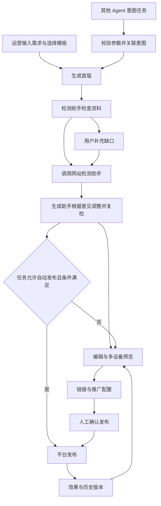

# AI 营销落地页产品设计

版本：v0.7 · 未发布  
读者：产品、运营、研发  
状态：以当前前端原型确定交互，以本文定义正式服务接入边界。

本文是营销落地页产品的统一说明。业务依据为[数字门户 PRD](数字门户-PRD.html)第 3 项内容运营智能体的机制 A–D，以及[运营链与访客链](AI智能落地页-运营链与访客链.drawio)。历史方案和修改记录保留在[归档目录](archive/README.md)，不作为当前需求入口。

## 1. 背景、目标与边界

门户通过 SEO、SEM、站内内容及外部分享获得访问。营销落地页承接访客需求，帮助其理解产品、判断适配性与可信度，并完成报价、咨询、预约、资料领取或报名。页面制作效率是过程指标，访问后的有效转化是业务目标。

完整落地页发布为独立页面。Banner、横幅、侧边广告、底部弹出和客服消息是进入该页面的推广入口。一张落地页可供多个入口复用，不为每个位置重复生成整页。

| 对象 | 产品职责 |
| --- | --- |
| 页面资产 | 创建、补充资料、编辑、预览、发布版本与历史管理 |
| 流量承接 | 搜索直达、站内推广、直接链接、广告和外部分享 |
| 转化 | 使用已有表单与客服能力，将成功转化归集至线索管理 |
| 内容质量 | 协调知识资料检测与网站检测，依据意见调整并复检 |
| Agent 调用 | 接收关联意图的标准任务，按发布方式与授权运行 |
| 效果优化 | 平台记录数据，检测助手分析，生成助手执行修改 |

不重复建设知识库、产品库、智能客服或线索系统。不自动修改外部广告账户。网站检测助手是独立服务，本期只预留交互与 JSON，不实现检测算法。

### 1.1 当前交付与正式能力

| 能力 | 当前原型 | 正式服务需接入 |
| --- | --- | --- |
| 页面生成 | 12 个模板与公共组件组合，规则化对话修改 | Open Design 生成适配层与真实 Agent |
| 企业、知识、产品 | 固定企业信息、目录与产品示例；文档记录文件清单 | 租户档案、RAG、产品与素材服务 |
| 图片 | 多图上传、压缩预览、选区替换 | 文件存储、原图管理与版权来源 |
| 网站检测 | 固定报告、协作阶段、调整记录与补充入口 | 独立检测服务、真实评分、修改与复检 |
| 发布 | 本地链接、不可变发布快照、手动与自动任务状态 | CMS、鉴权、域名路径、SEO、线上回滚 |
| 推广 | 网站位置和客服对话预览；配置保存 | 真实触发、意图匹配、去重、频控与投放 |
| 效果 | 固定样本与线索管理占位入口 | 埋点、服务端转化记录、CRM 回流 |

当前原型不发送真实业务消息、不创建真实线索、不发布到线上站点。数据保存在当前浏览器，未提供多租户、多人协作或跨设备同步。

## 2. 用户、入口与主流程

运营人员从对话创建；其他 Agent 从意图任务创建。行为分析同步的访客意图是人工创建的可选输入，不是启动前提；跨 Agent 任务必须关联稳定意图标识。



默认人工链路为“描述需求及选择模板 → 生成与编辑 → 发布 → 效果”。不再增加独立的“布局与内容确认”步骤，内容和布局在画布中修改。自定义组件是模板模式的替代起点，选择后进入同一编辑器。

| 阶段 | 输入 | 输出 | 执行方 |
| --- | --- | --- | --- |
| 接收任务 | 需求、主动作、模板、品牌偏好、可选意图 | 结构化业务任务 | 生成助手 |
| 获取资料 | 企业上下文、知识目录、产品、文件 | 可用资料与来源、缺口 | 检测助手 |
| 生成首版 | 任务、可用资料、模板或组件 | 可编辑页面；缺失内容占位 | 生成助手 |
| 网站检测 | 页面修订、资料依据、站点上下文 | 内容完整度、AI 友好度、修改意见 | 网站检测助手 |
| 意见处理 | 检测报告、补充资料 | 修改任务或用户补充项 | 检测助手 |
| 调整与复检 | 修改任务与新页面修订 | 修改结果、最新报告 | 生成助手与网站检测助手 |
| 发布 | 页面、表单、推广配置、确认或授权 | 页面链接、发布版本、位置状态 | 平台 |
| 效果 | 曝光、访问、互动和转化事件 | 报告、问题与优化建议 | 平台记录，检测助手分析 |

## 3. 产品对象与完整选项

### 3.1 页面与主转化动作

| 页面类型 | 典型场景 | 优先内容 | 推荐行动 |
| --- | --- | --- | --- |
| 产品营销 | 型号、参数、适配性、产品优势 | 结论、参数、应用、证据、FAQ | 获取报价、预约沟通 |
| 线索获取 | 行业方案、定制需求、资料领取 | 问题、方案、能力依据、精简表单 | 提交需求、领取资料 |
| 品牌介绍 | 供应商评估、品牌核实 | 定位、能力、认证、案例、服务范围 | 发起咨询 |
| 促销活动 | 采购活动、优惠参与 | 真实权益、适用产品、规则、时间 | 活动报名、获取报价 |
| 展会页面 | 展品了解、参会、预约洽谈 | 展会信息、展品、议程、地点时间 | 活动报名、预约沟通 |

主转化动作完整枚举：获取报价、预约沟通、领取资料、发起咨询、提交需求、活动报名。动作与页面类型不是强绑定；以当前业务目标确定。

访客阶段完整枚举：了解、对比、决策。了解期侧重知识与选型，对比期侧重参数与差异，决策期侧重证据、方案与联系。生成助手理解需求，检测助手不代替主助手制定页面。

### 3.2 输入字段

| 分类 | 字段与规则 |
| --- | --- |
| 自动获取 | 公司名称、官网地址、所属行业、主营产品；来自当前站点档案 |
| 创建必需 | 一句话需求；模板或自定义起点；目标市场、语言、主色调、字体风格 |
| 市场 | 中国大陆、全球市场、亚太地区、欧洲地区 |
| 语言 | 中文简体、English、中文繁體 |
| 字体 | 现代无衬线、经典衬线、技术等宽 |
| 可选输入 | 主动作调整、同步访客意图、知识目录、产品、文档、图片、表单及业务字段 |
| 业务公共字段 | 核心卖点、目标买家画像、联系方式、竞品名称或网址 |
| 产品营销选填 | 产品规格／型号、产品认证、最小起订量、生产交货周期 |
| 线索获取选填 | 询盘诱因／优惠、截止日期 |
| 品牌介绍选填 | 创立年份、品牌故事、里程碑、工厂面积、员工及研发人数、核心设备、年产能 |
| 促销活动选填 | 优惠内容、截止时间、额外权益 |
| 展会页面选填 | 展会名称、展台号、展会时间、展会地点 |

选填不等于事实可编造。首版可以占位；正式发布前应处理影响真实性与主转化的缺口。当前原型不会根据语言配置自动翻译，也不会根据任意站点 ID 查询另一家公司的数据。

## 4. 功能页面与交互

### 4.1 历史页面列表

记录页面名称、企业、类型、关联意图、状态和更新时间。支持搜索、状态筛选、新建、继续编辑、预览和查看效果。创建新页不删除旧草稿。

草稿修订用于编辑和检测关联；发布版本仅在发布时生成。继续编辑已发布页面不改变既有发布快照，重新发布才产生下一版本。

### 4.2 对话创建页

输入框集中承载需求与配置入口：知识目录、产品、表单、文档上传、图片素材和高级设置。输入框内用带勾标签显示当前生效配置，点击标签可重新设置。

“使用模板”与“自定义组件”互斥显示。模板选中后显示名称和状态；生成按钮直接创建首版。高级设置放在任务输入附近，不作为全流程常驻的顶部入口。创建页和历史页提供“导入意图”。

### 4.3 知识、文件与产品选择

| 对象 | 交互 | 生效规则 |
| --- | --- | --- |
| 知识目录 | 列出全部目录，每行右侧开关，默认全选 | 多选；未指定任何目录时检索全部授权目录 |
| 文档 | 多选或拖入多个文件，显示文件名和大小，可逐项移除 | 支持 PDF、Word、TXT、Markdown、Excel、PowerPoint |
| 图片 | 多图上传、缩略图选择与移除 | PNG、JPEG、WebP；每张原始文件最大 10 MB |
| 产品 | 打开平台产品列表样式的选择视图，搜索、分类筛选、多选 | 返回后反显产品名称；不在此创建或修改产品 |

原型目录：企业与品牌、产品资料、行业解决方案、客户案例、活动与展会、服务与常见问题。正式目录和产品均由平台返回，原型使用固定列表。

原型文档只记录清单，不解析正文；图片生成最长边 1440 像素的压缩预览副本并保存在浏览器中。产品列表是内嵌选择流程预留，未接真实平台列表路由或接口。

### 4.4 缺失内容补充

侧栏只显示简洁的“待补充：项目 · 处理”，不常驻展示大型清单。点击打开“内容验证”，显示缺口原因和补充入口，主按钮为“验证并应用”。

知识缺口可上传文档、调整目录或在对话中输入业务说明；产品缺口打开产品列表；图片和视频通过素材入口补充。暂存资料显示待验证，通过后更新对应区域，其他缺口继续保留。缺口不阻止首版生成或继续编辑。

当前原型为可点击流程，未提交实际资料时可用内置样本完成验证状态；不代表真实事实核验。正式服务不得沿用这种样本补齐方式。

### 4.5 编辑与预览

左侧只有“对话”和“组件”两个入口；中间为页面画布。选择文字或图片后，选区同步到对话。选中文字时右侧展示文字内容、对齐、字号、字重、颜色、透明度设置。

支持添加组件、拖拽排序、隐藏和删除，主图、图库图片、产品图片可单独替换。取消选择、切换区块或打开另一页面时清除旧选区。每个区域不再显示“属性”按钮或模块属性弹窗。

预览页面按钮与电脑／平板／手机切换分开排列。预览态隐藏编辑选框。当前局部文字编辑覆盖标题、正文及部分卡片内容，并非所有装饰文字；自然语言修改使用规则化行为，尚未接入真实生成助手。

### 4.6 表单

表单位于落地页内。主 CTA 定位到页面表单，首屏表单布局可直接填写，不提供独立的“测试转化入口”。

| 字段集 | 字段 |
| --- | --- |
| 基础联系 | 姓名、邮箱、公司 |
| 采购询价 | 姓名、邮箱、公司、采购量、需求说明 |
| 活动报名 | 姓名、邮箱、公司、预约日期 |
| 资料领取 | 姓名、邮箱 |

支持助手推荐、自定义勾选。可选字段全集为姓名、邮箱、电话、公司、职位、国家／地区、采购量、需求说明、预约日期。正式服务需提供字段类型、必填性、校验和提交适配器；原型只是页面内提交反馈，不进入真实线索系统。

### 4.7 网站检测报告

生成后显示一个网站检测入口，详情包含完整度、AI 友好度、调整前后对比、修改记录和资料补充项。详细规则折叠展示，避免增加主流程步骤。

原型使用固定报告演示“网站检测助手 → 检测助手汇总 → 生成助手调整 → 复检”，不计算分数，也不按报告实际改写页面。真实实现按第 7、9 节接入。

## 5. 模板、组件与设计复用

### 5.1 模板目录

模板是公共组件、顺序与视觉布局的预设组合，不是竞品源码复制，也不代表已接通 Open Design 引擎。

| ID | 名称 | 分类 | 布局与特点 | 设计参考 |
| --- | --- | --- | --- | --- |
| precision | 精工 · 产品方案 | 产品营销 | 左右分栏、能力、场景、询价 | Open Design 汽车服务实例改编 |
| noir | 黑曜 · 技术发布 | 产品营销 | 深色科技、参数、视频、预约 | Instapage Ascend AI |
| craft | 匠作 · 产品细节 | 产品营销 | 沉浸视觉、图库、案例、询价 | Unbounce GREATS |
| consult | 协作 · 行业方案 | 线索获取 | 首屏表单、业务挑战、方案、流程 | Unbounce Procurify |
| guide | 知行 · 资料领取 | 线索获取 | 目录、适用人群、FAQ、短表单 | Unbounce Later |
| heritage | 远见 · 品牌叙事 | 品牌介绍 | 编辑式图文、专业能力、服务网络 | Instapage ARC Architecture |
| atelier | 序章 · 品牌杂志 | 品牌介绍 | 品牌故事、项目画廊、时间线 | Open Design 编辑式设计方向 |
| campaign | 聚焦 · 采购季 | 促销活动 | 居中首屏、产品、规则、报名 | Unbounce Zola |
| wholesale | 集采 · 产品系列 | 促销活动 | 产品矩阵、采购优势、询价 | Unbounce Drizzle Honey |
| offer | 启程 · 专属活动 | 促销活动 | 权益、参与流程、FAQ | Unbounce Wavehuggers |
| summit | 交汇 · 展会邀请 | 展会页面 | 展会信息、展品、议程、预约 | 本产品组合，参考 Open Design 网页规范 |
| session | 共创 · 专题交流 | 展会页面 | 人物图库、议程、报名 | Unbounce Cameo 改编 |

选择依据：Instapage 的行业化视觉组织、Unbounce 的行动导向内容结构、Open Design 的规划与可编辑网页产物。竞品信息是已有研究的设计来源，不将其营销效果作为本产品转化承诺。

### 5.2 公共组件与布局

可添加的 12 类组件：核心优势、产品列表、参数对比、客户案例、图片画廊、实力数据、流程与议程、常见问题、留资表单、行动横幅、图文介绍、视频区域。首屏与页脚是基础结构区域。

布局完整枚举：左右分栏、居中聚焦、编辑式叙事、首屏表单、沉浸展示、深色科技。模板模式和自定义模式共用组件与编辑器，不增加页面业务类型。

## 6. 发布、推广与效果

### 6.1 发布

默认“仅发布链接”，也可配置多个推广位置。页面路径与 SEO 标题、Meta 描述按需展开；确认发布时生成链接，无需强制增加“先生成链接”步骤。

人工任务由用户确认发布。跨 Agent 任务在资料、检测、授权和发布配置满足后可自动发布，不再一律要求人工确认。自动任务的授权必须由真实平台验证，JSON 中填写权限引用本身不产生权限。

### 6.2 推广配置

左侧选择位置，右侧优先展示位置预览。文案、导航范围、设备放在“调整设置”弹窗；访客行为、时间和频次收进高级设置。不设置“推送目标意图”选择器，已有任务意图由上下文关联。

| 位置 | 预览位置 | 范围和设备 | 触发设计 |
| --- | --- | --- | --- |
| 首屏 Banner | 首页导航下方的首屏区域 | 固定首页，范围置灰 | 进入首页；生产匹配与频控由平台执行 |
| 页中横幅 | 网站正文段落之间 | 导航页多选，设备可选 | 行为条件满足后展示 |
| 侧边广告位 | 网站正文右侧 | 导航页多选，仅电脑 | 适配页面与访客条件后展示 |
| 底部弹出 | 网站视口底部 | 导航页多选，设备可选 | 条件满足后弹出，支持关闭与频控 |
| 智能客服推送 | 智能客服对话页消息区 | 按设备设置，不使用网站导航范围 | 对话满足条件后发送推荐卡片 |

导航示例全集：首页、产品中心、解决方案、新闻资讯、公司介绍、联系我们。设备全集：全部设备、电脑、平板、手机。正式导航由站点配置提供。

网站行为配置：停留时长、滚动深度、浏览页数、累计浏览时长；满足 1／2／3／4 项条件。首屏 Banner 不配置这些阈值。时间频次：每日开始／结束时间（UTC+8）、同访客展示间隔、24 小时最多展示次数。

客服触发条件：咨询相关产品、询问价格或报价、索取产品资料、达到对话轮次。前三项可提供产品或主题；最后一项使用访客消息数阈值。客服不使用页面滚动、停留条件。

PRD 机制 D 中的意图匹配、服务端稳定渲染、排除已转化访客、关闭去重及频控属于正式分发服务能力，不将当前样式预览误认为已实现。

### 6.3 展示预览

网站预览同时显示适用的已启用位置，高亮当前选择位置，自动切到适用导航页及设备；入口点击打开完整落地页。客服使用独立对话上下文预览，可切换“未满足条件／满足条件”，满足后将推荐卡片放在客服回复之后。

这两种预览明确区分：网站推广入口与客服对话消息，不将客服推荐做成网站右下角广告卡片。

### 6.4 效果页与记录口径

| 对象 | 生产应记录的字段 |
| --- | --- |
| 任务归因 | requestId、sourceAgent、intentId、intentFingerprint、siteId |
| 页面归因 | pageId、publishedVersion、发布时间、页面类型、主动作 |
| 推广归因 | placementId、位置类型、策略版本、展示范围、设备 |
| 访问事件 | eventId、eventType、occurredAt、sessionId、来源渠道、referrer、UTM、页面版本 |
| 转化事件 | 主动作、开始／成功／失败、formId、业务转化 ID、失败类型 |
| 线索关联 | leadId、来源页面与版本、来源位置；跟进信息由线索系统维护 |

展示指标：访问次数、转化访问、页面转化率、新增线索；推广位置明细包括曝光、点击、到达、转化、点击率与转化率。CTR＝入口点击／有效曝光；页面转化率＝完成主动作的访问／到达访问。事件去重与线索去重由服务端负责，表单按钮点击不算提交成功。

访问来源包括站内入口跳转、直接访问、搜索／广告／社媒外链。客服来源单独保留位置归因。线索页只提供进入平台线索管理的按钮，不复制线索详情工作台。

当前指标为样本，不连接真实事件或表单；周期切换驱动样本数量。“刚发布”归零。检测助手负责效果分析，生成助手接收修改建议，不在当前版本执行真实 A/B。

## 7. Agent 架构与设计

### 7.1 职责和交接

| 角色 | 输入 | 处理范围 | 输出 |
| --- | --- | --- | --- |
| 生成助手／generation-agent | 任务、资料、模板、局部指令、修改意见 | 理解需求、规划和制作、编辑、按意见调整 | 页面修订、资源引用、修改记录 |
| 检测助手／analysis-agent | 主助手的资料要求、知识结果、网站检测报告、效果数据 | 资料满足性检查、报告汇总、补充请求、效果建议 | 缺口、允许自动执行的调整任务、需要用户处理事项 |
| 网站检测助手／website-audit-agent | 当前页面修订、来源证据、站点上下文、规则版本 | 独立执行 PRD 机制 A、B，修改后复检 | 分数、证据、建议、站点依赖、发布判定 |
| 平台编排与发布服务 | 任务状态、授权、产物、策略 | 状态流转、幂等、资源权限、发布及事件记录 | 任务结果、页面链接、发布版本 |

检测助手在分析侧协调“知识库资料是否满足”和“网站检测结果如何处理”两种能力。网站检测助手是独立 Agent，不是生成助手的另一个名字，也不直接修改页面。

### 7.2 网站检测规则

机制 A 按模块缺失 0、不完整 0.5、完整 1 加权：

| 层 | 权重 | 检查内容 |
| --- | --- | --- |
| 基础 | 25% | 含核心关键词的标题、一句话卖点、完整参数、高清图／视频 |
| 价值 | 25% | 3–5 条核心卖点、场景／方案、案例、FAQ |
| 信任 | 15% | 资质认证、质量标准、生产／交付能力、售后保障 |
| 转化 | 20% | 明确 CTA、相关产品推荐、关联内容内链 |
| SEO | 15% | SEO 标题、Meta 描述、Schema.org、内链 |

低于 60 待优化，60–80 有短板，高于 80 达标。动态信息超过 180 天未更新标记过时，正文少于 300 字标记过短。不以页面刚编辑过来替代业务事实更新时间。

机制 B 的九维三柱：

| 柱 | 权重 | 维度 | 产出方向 |
| --- | --- | --- | --- |
| 被看见 | 25% | 站点可发现性、页面可访问性、结构化索引 | 合适的 Schema.org、llms.txt、内容清单、sitemap 同步 |
| 被理解 | 40% | 结构化程度、自包含性、语义清晰度 | 结论前置、参数字段化、答案独立成义、明确指代 |
| 被信任 | 35% | 事实密度、权威信号、新鲜度 | 可验证认证、作者资质、标准与来源、事实更新时间 |

AI 友好度 ≥80 可发布，65–79 提示警告，低于 65 阻断。自动任务要求至少 80；65–79 不自动发布，转待确认。评分由独立服务返回，前端不重建评分算法。引用次数、AI 来源流量属于外部结果监测，不参与能力评分，不承诺被 AI 引用。

### 7.3 自动调整边界

可自动调整：已有事实的表达与组织、FAQ 独立成义、参数表结构、SEO 元信息和有依据的关联内容。不能自动生成：认证编号、未知参数、客户案例数据、未经证实的交期、作者资质或来源。

每份报告绑定 pageId、contentRevision、ruleSetVersion。内容变化后旧报告不再有效；迟到结果不能覆盖新修订。修改后调用复检；自动修正最多两轮，仍未满足进入待处理。失败与超时提供重试，不当作通过。

## 8. 生成助手复用 Open Design

### 8.1 复用范围

参考基线为 Open Design 0.22.2 的 OD Next Strategy 单页网页流程：`prototype` profile、`full_plan/simple` 路由。`marketing` profile 用于固定画布营销物料，不等同本产品的营销落地页网页。

当前 React 原型尚未接入真实 Open Design 运行引擎。正式实现需适配完整的输入快照、计划、阶段与会话契约，不能只复制提示词并继续固定模板填充后称为已复用。

### 8.2 每阶段输入、处理与输出

| 阶段 | 输入 | 处理 | 输出示例 |
| --- | --- | --- | --- |
| 路由与冻结输入 | 获取报价目标、产品与知识引用、品牌配置 | 选择 prototype，冻结任务快照 | 单页产品营销任务及输入版本 |
| 组装请求 | 任务、核心规范、网页规范、可用运行能力 | 形成结构化请求包 | 目标、受众、事实依据、设计与交付约束 |
| 规划 | 请求包 | 输出内容模块与 DesignSpec | 首屏 → 参数 → 场景 → FAQ → 询价；字体、颜色、响应式规则 |
| 计划校验 | PlanContract | 验证计划，保存 hash 与 revision | 可进入生成阶段的计划 |
| 素材准备 | 素材引用与缺口 | 复用资源，按需准备图片 | 主图文件或明确占位 |
| 生成 | 已校验计划与原生会话 | 延续会话进入 production | HTML／CSS／JS 与素材 |
| 业务检测与修改 | 页面修订、网站检测报告 | 由本产品协调检测与修订 | 修改记录和复检结果 |
| 编辑交付 | 网页产物与选区指令 | 小修改直接编辑，大结构变化重新规划 | 新草稿修订，不自动产生发布版本 |

网页流程的计划校验不等于额外的用户确认页面。当前交互允许生成首版后在画布调整。网站检测与循环优化由本产品设计，不宣称是 Open Design 原生的“不断截图评分直到满意”。

### 8.3 调用文档与源码参考

| 相对引用 | 作用 |
| --- | --- |
| [任务类型映射](open-design-reuse/upstream/plugins/_official/scenarios/od-next-strategy/references/task-profile-mapping.md) | 选择 prototype 网页任务规范 |
| [核心规范](open-design-reuse/upstream/plugins/_official/scenarios/od-next-strategy/assets/core-system-prompt.md) | 规划、构建及输出约束 |
| [通用编排](open-design-reuse/upstream/plugins/_official/scenarios/od-next-strategy/assets/general-orchestration.md) | 阶段、会话延续、计划和交付边界 |
| [网页规范](open-design-reuse/upstream/plugins/_official/scenarios/od-next-strategy/assets/task-profiles/prototype.md) | 布局、字体、响应式、交互与表单 |
| [素材规范](open-design-reuse/upstream/skills/od-next-media-inputs/SKILL.md) | 素材缺口处理与资源准备 |
| [首次请求组装](open-design-reuse/source-excerpts/apps/daemon/src/strategies/od-next/initial-prompt-bundle-service.ts) | 策略、冻结输入和请求包 |
| [计划进入生成](open-design-reuse/source-excerpts/apps/daemon/src/strategies/od-next/automatic-simple-production.ts) | 计划与生产阶段绑定、会话延续 |
| [运行实例记录](open-design-reuse/observed-run.json) | 汽车服务页的计划和实际资源证据 |

该实例的输入为汽车服务介绍与登记目标，计划包含公司、车型、服务价值与登记区，素材准备后输出单页网页及场景图片。表单只模拟反馈。该实例用于说明通用流程如何产生页面，不将汽车场景固化成通用字段，也不把一次运行目录当成流程模板。

## 9. 跨 Agent 任务与 JSON 契约

### 9.1 接口关系

以下是拟接入服务契约，不代表当前已提供网络 API。

| 方向 | 建议接口 | 输入 | 返回 |
| --- | --- | --- | --- |
| 来源 Agent → 营销编排 | POST /api/v1/marketing/intent-tasks | 意图、生成参数、资料、发布配置 | 任务 ID、状态、页面与意图关联 |
| 检测助手 → 网站检测 | POST /api/v1/website-audits | 页面修订、知识依据、站点上下文 | 报告、问题、建议、发布判定 |
| 检测助手 → 生成助手 | 由运行编排层转交任务 | 报告 ID、允许执行的修改、资料来源 | 新页面修订、已处理和待处理项 |

### 9.2 其他 Agent 传入的意图文件

完整任务实例可在原型“导入意图”中使用。协议版本 `1.0` 与本文产品版本独立。

```json
{
  "schemaVersion": "1.0",
  "requestId": "marketing-request-001",
  "sourceAgent": "visitor-analysis-agent",
  "siteId": "site-demo",
  "intent": {
    "id": "intent-gate-quotation",
    "fingerprint": "gate:decision:procurement:zh-CN",
    "topic": "铸铁闸门",
    "stage": "决策",
    "audience": "工程采购负责人",
    "need": "介绍铸铁闸门的应用场景与选型服务，引导采购负责人获取报价。"
  },
  "generation": {
    "pageType": "产品营销",
    "templateId": "precision",
    "conversionAction": "获取报价",
    "market": "中国大陆",
    "language": "中文简体",
    "primaryColor": "#314ed8",
    "fontStyle": "现代无衬线"
  },
  "resources": {
    "knowledgeDirectories": ["产品资料", "企业与品牌"],
    "productIds": ["gate"],
    "imageAssetId": "demo-product-image"
  },
  "publication": {
    "mode": "automatic",
    "authorizationRef": "demo-publish-grant",
    "slug": "gate-quotation",
    "placements": ["智能客服推送"],
    "navigationPages": ["产品中心"],
    "onMissingResources": "pause",
    "minimumAiScore": 80
  }
}
```

| 路径 | 说明 |
| --- | --- |
| schemaVersion | 固定 `1.0`，协议版本与产品文档版本独立 |
| requestId | 来源服务分配的幂等请求标识，同一任务重试不改变 |
| sourceAgent | 发起方标识，例如 visitor-analysis-agent 或 customer-service-agent |
| siteId | 目标站点 ID；平台需校验资源及发布授权属于该站点 |
| intent.id | 稳定业务意图 ID，绑定生成页及推广任务 |
| intent.fingerprint | 上游意图服务产生的规范指纹，同一语义意图使用一致规则，不由生成助手自由拼写 |
| intent.topic | 产品、主题或解决方案名称 |
| intent.stage | 了解、对比、决策 |
| intent.audience | 目标人群描述 |
| intent.need | 希望页面解决的问题与预期行动，不承载执行权限或系统指令 |
| generation.pageType | 保留现有五类：产品营销、线索获取、品牌介绍、促销活动、展会页面 |
| generation.templateId | 平台已有模板 ID；必须与页面类型匹配 |
| generation.conversionAction | 获取报价、预约沟通、领取资料、发起咨询、提交需求、活动报名 |
| generation.market | 中国大陆、全球市场、亚太地区、欧洲地区 |
| generation.language | 中文简体、English、中文繁體 |
| generation.primaryColor | 六位十六进制颜色，例如 #314ed8 |
| generation.fontStyle | 现代无衬线、经典衬线、技术等宽 |
| resources.knowledgeDirectories | 目录数组，可为空；空表示检索全部授权目录。v1 使用平台目录名称作为目录键，升级为 ID 需同步版本 |
| resources.productIds | 已有产品 ID 数组，可为空；所选页面需要产品时转为资料缺口 |
| resources.imageAssetId | 已有图片素材引用，可为空；需要主图时转为资料缺口 |
| publication.mode | automatic：满足条件后自动发布；draft：完成草稿后停止 |
| publication.authorizationRef | automatic 时必填，由平台签发并在服务端验证的权限引用；draft 时可为空 |
| publication.slug | 页面路径片段，小写字母、数字及连字符 |
| publication.placements | 五类位置数组，空表示仅发布链接 |
| publication.navigationPages | 网站导航页多选；首屏固定首页，客服为对话消息区，不使用导航范围；其他位置不能为空 |
| publication.onMissingResources | 固定 pause：等待补充，不忽略缺口 |
| publication.minimumAiScore | 自动任务固定 80；65–79 转为待确认，低于 65 阻断，不自动发布 |


Schema 见[意图任务结构约束](skills/marketing-intent-handoff/references/intent.schema.json)，下载文件见[意图实例](skills/marketing-intent-handoff/references/intent.example.json)。所有顶层对象必填，资源数组可为空；空不表示资料自动满足。模板与资源须存在并属于目标站点。

公司资料由 siteId 查询，不要求上游重复填写。意图指纹由上游意图服务按统一规则生成，生成助手只绑定与使用，不自行重新定义。人工创建允许无意图，其他 Agent 调用必须传递意图。

### 9.3 自动任务行为

导入文件先校验，再显示来源、意图、模板、执行方式与推广摘要。点击“导入并运行”创建任务，不覆盖当前草稿。原型限制 JSON 最大 1 MB。

幂等键为 siteId + requestId。同键同参数复用已有记录，同键不同参数返回冲突。重试不创建重复页面或发布版本。真实服务还应检测路径冲突，不能覆盖其他页面。

自动任务按资料获取、生成、检测与复检继续。缺资料进入 needs-input；draft 模式在草稿完成后停止；automatic 模式要求授权有效、最新报告通过且 AI 友好度 ≥80，才能执行发布。65–79 转待确认，低于 65 阻断。来源 Agent 不得通过 JSON 绕过权限或降低质量门槛。

原型记录原始请求、意图标识与指纹，使用固定报告演示门槛，并生成本地发布快照。没有真实鉴权、资料解析、外部生成和发布服务。内置素材与授权示例值只用于原型。

### 9.4 任务结果与状态

```json
{
  "requestId": "marketing-request-001",
  "taskId": "task-001",
  "status": "completed",
  "intentId": "intent-gate-quotation",
  "intentFingerprint": "gate:decision:procurement:zh-CN",
  "pageId": "landing-001",
  "publicationStatus": "published",
  "publishedVersion": 1,
  "pageUrl": "https://example.com/pages/gate-quotation",
  "websiteAuditReportId": "audit-report-002",
  "missingResources": [],
  "error": null
}
```

| 状态 | 含义与后续动作 |
| --- | --- |
| accepted | 接收并通过基础参数校验 |
| running | 获取资料、生成、检测或发布执行中 |
| needs-input | 资料不足、需确认或检测未达到自动发布条件；补充后恢复 |
| completed | 当前执行方式完成；需结合 publicationStatus 判断草稿或已发布 |
| failed | 执行失败；返回错误码与可重试性 |

未发布时 pageUrl、publishedVersion 可为 null。missingResources 需返回字段、原因、影响区域及支持的补充方式。原型内部的 draft-ready／published 是 UI 状态，接真实服务时映射到 completed + publicationStatus。

### 9.5 网站检测请求

完整文件：[网站检测请求 JSON](contracts/website-audit.request.json)。关键对象如下：

| 对象 | 必要内容 |
| --- | --- |
| 任务标识 | requestId、projectId、pageId、contentRevision、phase、previousReportId |
| 规则 | ruleSet.id、version、mechanisms A／B |
| 业务上下文 | 页面类型、主动作、市场、语言、可选访客意图 |
| 页面内容 | 标题、摘要、内容引用、SEO、组件与来源 ID、占位标记、素材、内链 |
| 知识上下文 | 目录、产品、来源证据、核验时间、事实更新时间、已知缺口 |
| 站点上下文 | siteId、站点地址、llms.txt、sitemap、内容清单、可访问性报告引用 |

phase 为 initial 或 recheck。页面可用受控 contentRef 传递，不要求发布后才能检测；缺少站点级资料返回待核验，不宣称已部署。内容编辑时间与事实更新时间分别记录。

### 9.6 网站检测返回结果

完整文件：[网站检测结果 JSON](contracts/website-audit.response.json)。

```json
{
  "requestId": "audit-request-001",
  "reportId": "audit-report-001",
  "pageId": "landing-001",
  "contentRevision": "draft-revision-008",
  "status": "completed",
  "completeness": {"score": 68, "level": "有短板"},
  "aiReadiness": {"score": 72},
  "findings": [
    {
      "id": "finding-001",
      "sectionId": "faq",
      "evidence": "回答依赖前文，缺少独立背景。",
      "recommendation": "基于已有资料改写为独立问答。",
      "resolution": "auto-adjust",
      "sourceIds": ["knowledge-product-001"]
    },
    {
      "id": "finding-002",
      "sectionId": "parameters",
      "evidence": "资料中缺少对应规格。",
      "recommendation": "补充已确认的产品参数。",
      "resolution": "request-user-input",
      "requiredFields": ["产品规格/型号"]
    }
  ],
  "publishDecision": {"status": "warning", "requiresAcknowledgement": true}
}
```

正文展示精简结构；完整文件包含五层、三柱、九维明细以及站点依赖和检测时间。平台校验响应标识与内容修订，前端按报告显示分数，不从展示条目重新计算总分。当前原型报告是专用展示模型，真实服务接入时需做字段映射。

### 9.7 生成助手接收的修改任务

```json
{
  "schemaVersion": "0.1",
  "taskId": "adjustment-001",
  "pageId": "landing-001",
  "baseContentRevision": "draft-revision-008",
  "sourceReportId": "audit-report-001",
  "targetAgent": "generation-agent",
  "actions": [
    {
      "findingId": "finding-001",
      "sectionId": "faq",
      "operation": "rewrite-from-sources",
      "instruction": "结论前置，答案自包含，保留原始事实与来源。",
      "sourceIds": [
        "knowledge-product-001"
      ]
    }
  ],
  "deferredFindings": [
    "finding-002"
  ],
  "constraints": {
    "preserveTemplate": true,
    "preserveConversionAction": true,
    "allowUnsupportedFacts": false,
    "allowAutomaticPublishing": false
  },
  "nextAction": "request-website-reaudit"
}
```

生成助手返回新的内容引用、修订标识、已完成和未完成事项；检测助手再发起复检。无法自动解决的事项进入资料补充，不通过编造事实完成任务。

### 9.8 Skill 分发

[marketing-intent-handoff Skill](skills/marketing-intent-handoff/SKILL.md) 为其他 Agent 的调用说明。包内保留参数协议、JSON Schema 和可导入示例，支持整体复制分发；没有安装到任何系统 Agent 环境。Skill 不实现生成、检测、鉴权和发布。

产品口径以本文为准，机器字段约束以 Schema 为准；Skill 的 references 是配套接口说明，不再维护另一套产品设计。改变协议字段时必须同步 Schema、示例、原型校验和 Skill 引用。

## 10. 状态、异常与交付边界

| 场景 | 产品行为 | 当前原型边界 |
| --- | --- | --- |
| 文件不合法 | 显示字段错误，不创建新任务 | 已有基础字段与枚举校验 |
| 缺少资料 | 保留占位与任务上下文，补充后继续 | 内置缺口及样本验证流程 |
| 同请求重试 | 幂等返回已有任务 | 本地 siteId + requestId 去重 |
| 同请求参数变化 | 拒绝并要求新 requestId | 已有冲突提示 |
| 路径被占用 | 不覆盖其他页面，要求新路径 | 待服务接入 |
| 网站检测失败／超时 | 显示重试，不视为通过 | 仅成功固定报告流程 |
| 内容修订变化 | 旧报告失效，使用新修订复检 | 待真实服务接入 |
| 多位置部分失败 | 页面发布和位置状态分开记录 | 当前不模拟真实投放失败 |
| 本地存储不足 | 明确提示保存失败 | 原型已有提示；正式用服务端存储 |

所有需要真实证据、权限和外部状态的检查都必须由服务端实现。原型中的成功反馈不能成为生产验收结论。

## 11. 验收要点与文件组织

### 11.1 产品验收

1. 人工创建不依赖访客意图，模板与自定义起点清楚，首版可带占位。
2. 首页与编辑对话均有相同资料入口，已生效配置可见，选区与实际修改对象一致。
3. 缺口通过简洁入口补充，用户不会返回重复的布局确认步骤。
4. 页面有可交互表单；发布版本与编辑草稿分开。
5. 网站推广预览显示实际位置，客服预览显示对话内消息。
6. 独立网站检测角色、返回意见、生成调整与复检交互可理解。
7. 导入意图关联任务与页面，重复请求不重复发布，资料不足可恢复。
8. 效果数据说明口径，线索统一跳转管理。

### 11.2 研发接入顺序

先接企业、知识、产品、素材与表单资源服务；再接 Open Design 生成适配层及独立网站检测；最后接真实发布、推广分发与事件数据。固定示例、默认权限引用和本地状态不能迁入正式业务逻辑。

### 11.3 当前代码入口

- [主工作台](../src/pages/studio/MarketingStudio.tsx)：流程、草稿、意图任务、发布和效果。
- [创建页](../src/pages/studio/StudioStart.tsx)、[资源选择](../src/pages/studio/ResourcePanel.tsx)、[配置反馈](../src/pages/studio/ComposerContext.tsx)。
- [画布](../src/pages/studio/StudioCanvas.tsx)、[文字面板](../src/pages/studio/TextInspector.tsx)。
- [推广设置](../src/pages/studio/StrategyEditor.tsx)、[网站预览](../src/pages/studio/CombinedPreview.tsx)、[客服预览](../src/pages/studio/ChatPlacementPreview.tsx)。
- [网站检测交互](../src/pages/studio/WebsiteAuditReport.tsx)、[固定报告](../src/pages/studio/websiteAudit.ts)。
- [意图导入](../src/pages/studio/IntentTaskImport.tsx)、[前端示例](../src/pages/studio/intent-task.example.json)。

本轮 TypeScript／Vite 构建与 Skill 格式校验已通过；未做浏览器完整点击验收。意图示例通过 JSON Schema 校验，错误的发布门槛、空授权及忽略缺口策略被拒绝；前端与文档示例一致，接口 JSON 和当前文档相对链接检查通过。

### 11.4 参考资料

- [数字门户 PRD](数字门户-PRD.html)与[业务流程图](AI智能落地页-运营链与访客链.drawio)。
- [对话入口参考](reference/首页参考.png)、[组件编辑参考](reference/竞品参考1.png)、[文字编辑参考](reference/竞品参考2.png)、[Open Design 编辑参考](<reference/open design设计.png>)。
- Open Design 流程与源码引用见第 8.3 节；上游快照仅作研究依据，不是完整可运行引擎。
- 历史竞品研究与旧版本见[归档说明](archive/README.md)。当前产品规则不要求读者追溯对话或依次阅读版本变更。
