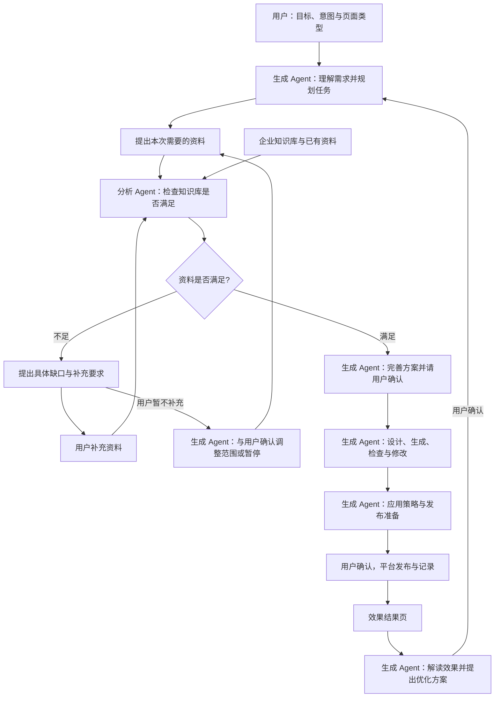
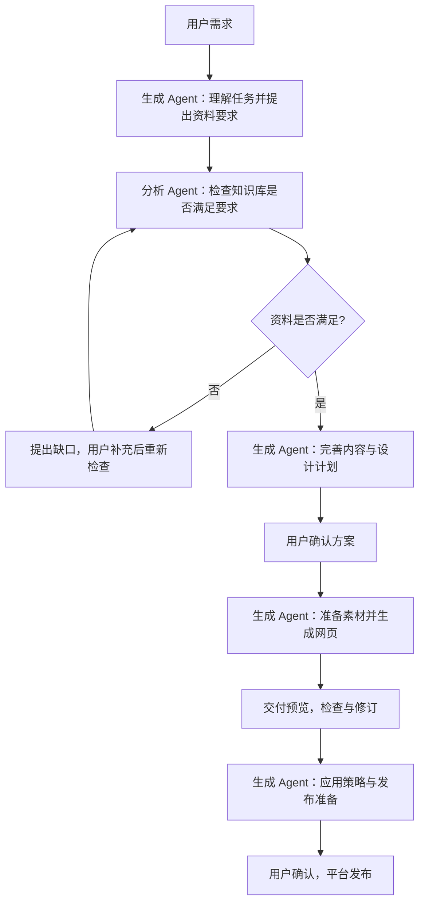

> 历史归档，不再维护。当前产品规则见[统一产品文档](../AI营销落地页-产品设计.md)。

# AI 营销落地页：产品方案与完整流程-副本

版本：v0.1｜状态：未发布草案，供产品评审。

本方案说明用户如何创建、使用和评估营销落地页，重点是多 Agent 协作、资料补充、页面生成、使用策略和效果结果页。保留现有五类页面，不涉及原型代码字段、接口或底层实现。当前交付为设计文档，未改动应用代码。

业务依据：数字门户 PRD 中“机制 B · 从访客意图到营销页的生成”“机制 C · 相同意图访客再进入时如何推送”，以及《AI智能落地页-运营链与访客链.drawio》。本轮确认的产品方向优先，历史讨论中适用的内容已纳入。

## 1. 产品要解决什么问题

门户已经通过 SEO、SEM 和站内内容吸引访客，下一步需要判断访客想解决什么问题，提供相应的营销内容，引导其咨询、报价、预约或提交需求，并知道这些内容有没有带来有效线索。

运营人员只需要先说明两件事：**希望访客做什么，以及访客为什么需要这个页面。**生成 Agent 作为主 Agent，理解需求、规划内容、组织生成、建议使用策略并推动后续优化。分析 Agent 只接受主 Agent 提出的资料要求，判断现有知识是否满足；不足时指出需要用户补充的内容。

每个营销任务统一管理“落地页、推广入口、转化动作、应用策略和效果记录”。一张页面可以服务多个推广位置，不需要为每个位置重复创建完整页面。

| 概念         | 用户需要理解的含义                 | 例子                         |
| ------------ | ---------------------------------- | ---------------------------- |
| 转化动作     | 希望访客完成什么                   | 获取报价                     |
| 访客意图     | 访客正在解决什么问题               | 为高温蒸汽场景寻找合适阀门   |
| 页面类型     | 这张页面主要怎样组织内容           | 产品营销                     |
| 页面发布位置 | 完整页面实际位于哪里               | 官网中的独立落地页           |
| 应用策略     | 在哪些页面、对哪些访客、何时推荐它 | 相关产品页阅读过半时展示横幅 |
| 应用效果     | 推荐是否带来访问和业务结果         | 横幅带来的询盘与有效线索     |

独立落地页是主要承接资产。首屏 Banner、页中横幅、侧边广告位、底部弹出、智能客服推送都是使用该资产的入口。页面也可以仅发布链接，用于 SEO 内链、SEM 或外部分享，不启用站内推广。

## 2. 多 Agent 产品架构

采用“生成 Agent 主导、分析 Agent 按需检查资料”的多 Agent 架构。**生成 Agent 是主 Agent；分析 Agent 是资料满足性检查助手，不是上游需求策划者或效果分析者。**

| 角色                   | 负责的问题                                                   | 主要输出                                                     | 边界                                               |
| ---------------------- | ------------------------------------------------------------ | ------------------------------------------------------------ | -------------------------------------------------- |
| 生成 Agent（主 Agent） | 用户要做什么？如何形成页面？需要什么资料？如何使用和改进？   | 意图摘要、资料要求、页面任务书、内容与设计、推广素材、策略建议、效果解读与修改方案 | 主导完整流程；不编造资料，不擅自发布               |
| 分析 Agent（资料检查） | 主 Agent 要求的资料，现有知识库是否足够提供？缺什么？用户补充后是否满足？ | 满足/部分满足/不满足的结论、可用依据、缺失项及影响、补充要求 | 不定义意图、不策划页面、不选择策略、不解读营销效果 |
| 用户                   | 业务事实是否正确、是否同意方案与发布？                       | 补充资料、确认方案、调整策略、确认发布与优化                 | 不需要手工在两个 Agent 间传递上下文                |
| 产品平台               | 如何执行确认后的发布、展示、收集和记录？                     | 发布结果、访客展示、真实线索、效果数据                       | 执行已确认策略，不在访客等待时临时生成页面         |

生成 Agent 复用 Open Design 的网页流程，从理解任务、规划内容与设计到素材准备、网页生成和修改。分析 Agent 作为这条主流程中的按需协作节点，检查知识库能否提供主 Agent 需要的事实，不能替代主 Agent 做页面决策。



### 两个 Agent 如何交接

1. 生成 Agent 先理解用户请求，确定需要的内容，例如“要回答高温适配问题，需要耐温参数与适用工况资料”。
2. 分析 Agent 按这些要求检查知识库，返回可用资料、尚缺内容、缺失对任务的影响。它回答“资料能否满足要求”，不回答“页面应该怎么做”。
3. 不足时，在当前任务中展示补充要求；用户上传、选择或补充说明后，由分析 Agent 重新检查。
4. 检查满足后，资料和结论返回生成 Agent，由主 Agent 继续完善方案、生成和修改。
5. 用户不补充时，由生成 Agent 提出缩小范围、改变表达或暂停等选择，并由用户确认；分析 Agent 不自行改目标。

生成过程中发现新资料需求，或用户更换产品、目标人群、主动作时，生成 Agent 重新明确受影响的资料要求，仅按需调用分析 Agent。没有新增资料问题时，主流程直接继续，不要求每个阶段都经过分析 Agent 审批。

内容是否回答意图、行动是否一致由生成 Agent 负责检查；页面显示、按钮和表单可用性由平台检查。分析 Agent 不作为生成完成后的通用审核 Agent。

## 3. 完整产品流程与阶段输入输出

| 阶段                 | 用户输入或已有信息             | 主要处理方与动作                                             | 输出给用户的结果               | 用户下一步                     |
| -------------------- | ------------------------------ | ------------------------------------------------------------ | ------------------------------ | ------------------------------ |
| 1 选择目标           | 希望访客完成的动作             | 平台展示可选动作                                             | 主转化目标                     | 选择一项，可增加次要动作       |
| 2 描述意图           | 一句话需求，可选页面类型、产品 | 生成 Agent 理解人群、场景和问题                              | 意图摘要、类型建议             | 确认或修改                     |
| 3 检查资料与已有页面 | 企业知识库、产品、已有内容     | 生成 Agent 提出资料要求并判断页面复用；分析 Agent 检查资料是否满足 | 已具备内容、关键缺口、复用建议 | 补充、缩小范围、复用或新建     |
| 4 确认页面方案       | 足够的资料与明确目标           | 生成 Agent 组织买家问题和内容结构                            | 页面任务书、推荐使用场景       | 确认内容方案                   |
| 5 确认设计并生成     | 页面任务书、品牌素材           | 生成 Agent 给出设计方向并生成                                | 页面草稿与预选位置的推广素材   | 预览和提出修改                 |
| 6 检查与修订         | 草稿、原目标与资料             | 生成 Agent 检查业务内容并修改；平台检查可用性                | 可发布版本、待处理问题         | 确认页面                       |
| 7 配置使用策略       | 页面、推荐场景、网站可用位置   | 生成 Agent 建议，用户调整                                    | 谁在何处、何时看到什么的策略   | 预览命中效果并确认             |
| 8 确认发布           | 页面地址、入口素材、策略       | 平台执行用户确认的发布                                       | 页面链接、各位置启用结果       | 查看或调整投放                 |
| 9 记录实际效果       | 真实展示、访问、咨询和提交     | 平台记录，生成 Agent 解读并提出优化建议                      | 效果结果页、线索明细、改进建议 | 调策略、改页面、暂停或继续观察 |

用户可以保存草稿并稍后继续。补充资料或修改目标后，只重新处理受影响的步骤，不要求重新填写所有内容。已经发布的页面继续使用原版本，新修改先进入预览。

## 4. 用户最开始怎么输入

### 4.1 第一步：六种转化动作

| 转化动作 | 适合的目的                   | 真正完成的标准                     |
| -------- | ---------------------------- | ---------------------------------- |
| 获取报价 | 让买家提交采购或询价需求     | 询价成功提交并被接收               |
| 预约沟通 | 预约演示、技术交流、展会洽谈 | 预约记录成功创建                   |
| 领取资料 | 获取目录、选型指南或对比资料 | 资料成功提供；是否获得线索另行统计 |
| 发起咨询 | 进入智能客服或人工咨询       | 发出首条有效消息或咨询请求被接收   |
| 提交需求 | 收集定制、选型、解决方案需求 | 需求成功提交并被接收               |
| 活动报名 | 参加促销、展会或线上活动     | 报名记录成功创建                   |

只打开表单、点击按钮或打开客服窗口，不算已完成业务转化。每页选一个主动作，可以有一个弱化的次要动作，例如“获取报价”为主、“下载参数资料”为辅。

### 4.2 第二步：描述要做的页面及其服务对象

这一步由**创建页面的运营人员**输入，不是让网站访客填写。目的是让生成 Agent 理解：这张页面给谁看、重点介绍什么、需要解决对方的什么疑问，从而确定页面内容和所需资料。

第一步已经选了“希望访客完成什么动作”，这里补充“访客为什么会愿意完成这个动作”。例如，同样选择“获取报价”，介绍产品适配能力与介绍供应商可信度，需要的页面内容并不相同。

**界面提示：**“你想做一张什么页面？给谁看？希望重点介绍什么？”

用户可以直接输入：“我要做一个面向化工厂采购的产品营销页，介绍高温蒸汽阀门，重点说明适用工况和产品能力，吸引他们询价。”不用先学习“意图分类”，也不用额外选择了解期、对比期或决策期。

#### 用户不知道怎么写时，提供可点击的需求示例

下面是输入辅助，不是新增分类或必填步骤。点击示例后填入输入框，用户可以修改；已经输入明确需求时直接继续。系统可结合当前企业和产品提供更贴近业务的示例，但不假设企业具备未经确认的能力。

| 需求示例：运营人员可以这样说                   | 生成 Agent 据此确定的内容重点            |
| ---------------------------------------------- | ---------------------------------------- |
| “介绍这款产品适合哪些工况，让采购来询价。”     | 适用范围、关键参数、应用说明、询价入口   |
| “让客户了解我们的供应能力，愿意联系我们。”     | 公司能力、真实资质、案例、联系入口       |
| “介绍我们的定制服务，让客户提交特殊需求。”     | 可定制范围、合作过程、案例、需求提交入口 |
| “做一个活动页，说明参与产品和规则，吸引报名。” | 活动利益、适用产品、真实规则、报名入口   |
| “做一个展会页，让客户了解展品并预约洽谈。”     | 展品、时间地点、洽谈内容、预约入口       |

这些内容只是规划方向。比如需要展示案例，但知识库没有案例，仍须按后续资料检查流程处理，不能因为示例中提到就自动生成。

#### 输入后发生什么

1. **生成 Agent 理解并反馈。**显示一句可编辑的理解结果，例如：“这张页面面向化工厂采购，重点说明高温蒸汽场景的适配能力，主要引导询价。”
2. **明确制作要求。**生成 Agent 根据需求建议页面类型、内容重点和需要的资料。用户已选定的主动作保持不变；若有不匹配，只提出建议供用户确认。
3. **按需检查资料。**生成 Agent 提出“需要对应产品、工况说明和参数”等要求，分析 Agent 再检查知识库是否满足。
4. **进入方案阶段。**资料满足后，由生成 Agent 组织页面内容并继续主流程。

文档中“访客意图”就是这里所说的“页面要解决访客的什么问题”。它用于帮助生成 Agent 决定内容，不是额外让运营人员填写的一套专业分类，也不表示已经识别出某个真实访客的想法。

关键词不是必填。可以结合产品、现有页面或已授权的搜索数据提供需求建议，但用户只需确认自己的页面需求。

### 4.3 保留五类页面

| 页面类型 | 内容组织重点                                     | 典型使用场景                 |
| -------- | ------------------------------------------------ | ---------------------------- |
| 产品营销 | 适配结论、参数、应用、优势证据、常见问题、行动   | 型号查询、产品比较、采购询价 |
| 线索获取 | 客户问题、解决方式、能力案例、合作步骤、需求表单 | 解决方案、定制需求、技术预约 |
| 品牌介绍 | 公司定位、能力、资质案例、服务范围、联系入口     | 供应商评估、品牌核实         |
| 促销活动 | 活动利益、适用产品、真实规则与有效期、行动       | 采购活动、促销推广           |
| 展会页面 | 展会价值、展品、时间地点、洽谈内容、预约         | 展会预热、参会预约           |

知识型、优势型、报价型作为内容结构策略，不新增页面类型。用户主动指定类型时优先保留；生成 Agent 发现不合适则解释并建议，不能静默替换。

## 5. 资料检查：只让用户补关键缺口

此阶段不展示一大张企业或产品字段表。生成 Agent 先提出本次页面需要的资料，分析 Agent 只围绕“现有资料能否满足这些要求”给出三种结果：

| 检查结果     | 用户看到什么                                                 | 如何继续                                   |
| ------------ | ------------------------------------------------------------ | ------------------------------------------ |
| 资料足够     | “已找到产品介绍、关键参数和相关案例，可以生成。”             | 查看方案并确认                             |
| 部分缺失     | “产品资料齐全，但没有交期依据；建议补充，或不展示具体交期。” | 补充或接受缩小范围                         |
| 关键资料缺失 | “未找到本次产品/活动资料，无法支撑这个页面。”                | 补充资料、换用已有产品、调整目标或保存待办 |

### 缺口卡片只回答四件事

**缺什么、影响什么、怎么补、不补会怎样。**例如：

> **缺少耐温资料**  
> 本次页面要回答“是否适合高温蒸汽”，但现有知识库中没有对应参数或应用说明。  
> 可以上传产品手册、选择已有资料，或补充经确认的产品说明。  
> 如果暂时没有，建议改为“咨询适用工况”，不展示具体耐温承诺。  
> 操作：上传资料 / 选择资料 / 补充说明 / 调整页面范围。

### 补充与重新检查的流程

1. 分析 Agent 先检查已有资料，避免向用户索取已经存在的信息。
2. 按“必须补充”和“可选增强”排序，只先展示阻碍当前任务的关键项。
3. 用户上传、选择或填写后，分析 Agent 重新检查，并说明“已解决什么、还缺什么”。
4. 信息矛盾时把冲突具体展示给用户确认，例如两份产品手册参数不同。
5. 用户跳过可选内容后，将对应模块从方案中移除；关键事实缺失不能用虚构内容替代。
6. 新增资料默认用于本任务；用户可选择同时保存到企业知识库，供后续复用。

缺少客服、表单或发布位置等能力时，区别于“缺少内容资料”：允许先看页面草稿，但在发布前清楚列为待准备事项，不能让用户误以为已经能收集真实线索。

### 贯穿示例

用户要求“高温阀门产品营销页，用来获取报价”。知识库只有公司简介和常温产品资料。生成 Agent 先明确需要高温适用资料；分析 Agent 检查后说明“现有资料不能证明这款产品适用于高温”，并要求补充。若用户无法提供，由生成 Agent 提出“改做已有产品页”或“改为不承诺参数的技术咨询页”，供用户决定。用户选择补充后再检查，通过后才把确认的产品与参数交给生成 Agent。

## 6. 页面生成与预览流程

### 6.1 先确认内容方案

生成 Agent 展示页面大纲，每个模块说明：买家有什么疑问、页面准备如何回答、依据来自哪里、下一步希望买家做什么。用户可调整顺序、删去可选模块或补充重点。

示例：“适不适用”由产品与工况说明回答；“为什么可信”由真实认证或案例回答；“如何进一步沟通”由询价入口承接。无案例就不展示案例，不补造客户故事。

### 6.2 再确认设计方向并生成

生成 Agent 使用 Open Design 的网页设计能力，结合品牌、意图和页面类型给出推荐方向，包括首屏重点、色彩、信息密度和行动按钮。用户接受或提出修改后生成完整页面。默认一个完整推荐方向，用户需要比较时再提供备选。

同一内容方案可以派生选中推广位置所需的短标题、利益点、图片和按钮，不强制一次生成五套无用素材。SEO/SEM 适配从内容规划开始，随页面一并完成：

| 用途     | 需要适配的内容                                         |
| -------- | ------------------------------------------------------ |
| SEO      | 与意图一致的标题、摘要、正文问题解答和相关内容链接     |
| SEM      | 广告承诺与首屏一致、明确行动、真实可用的咨询或提交路径 |
| 站内推广 | 对应位置的短文案、图片、按钮，点击后与落地页承诺一致   |

SEM 可先提供页面链接用于投放，不默认操作广告账户。SEO 适配完成不代表保证排名或流量增长。

### 6.3 用户如何修改

工作台提供“内容大纲、页面预览、推广素材”三个视图；页面可切换电脑和手机。用户直接点击某个区域提出“标题更短”“突出选型能力”“换成真实产品图”等要求。

修改视觉、表达、主动作或目标人群均由生成 Agent 处理并确认受影响的方案；涉及新的事实要求时，才调用分析 Agent 检查资料是否满足。每次修改先形成草稿，不直接覆盖访客正在访问的版本。

### 6.4 Open Design 实际如何一步步形成营销落地页

本节依据此前实际读取的 Open Design 设计文档与本地“汽车服务营销页”运行记录，按产品可理解的方式描述调用流程。核查版本为 Open Design 0.22.2；这是该案例采用的流程，不代表它所有任务都完全相同。

**它的核心顺序是：理解请求并选择网页规范 → 汇集设计依据 → 形成页面计划 → 检查计划是否可执行 → 准备素材 → 按计划生成网页 → 加载预览。**这能解释为什么最终得到一张内容、视觉和交互相互配合的页面。

| 步骤                    | 输入是什么                                   | 这一步实际在做什么                                           | 输出是什么           | 为什么需要这一步                                             |
| ----------------------- | -------------------------------------------- | ------------------------------------------------------------ | -------------------- | ------------------------------------------------------------ |
| 1. 判断要生成的作品     | 用户需求与当前项目类型                       | 判断用户要的是可访问的网页，还是海报、图片等物料。汽车营销页采用网页设计规范 | 明确的网页生成任务   | “营销”可以指网页也可以指图片，先选对制作方式，避免产物形态错误 |
| 2. 汇集生成依据         | 用户需求、已有上下文、设计规范和当前可用能力 | 把业务要求与核心设计、流程、网页交互规则一起交给设计 Agent   | 一份完整的任务上下文 | 让 Agent 知道要实现什么、遵守什么规则、能使用什么素材与工具  |
| 3. 把需求变成页面计划   | 完整任务上下文                               | 明确受众、页面目标、内容模块、主要行为与最终交付；记录没有资料时的假设与限制 | 页面内容与功能计划   | 先回答“页面应该有什么、用户怎么使用”，避免直接堆砌区块       |
| 4. 确定统一设计方向     | 页面目标与内容计划                           | 确定配色、字体、间距、组件风格、动效和响应式要求，并将其写入计划 | 统一的设计约定       | 保证各个模块属于同一个页面，后续生成和修改有共同依据         |
| 5. 确认计划可以进入生成 | 内容、功能、设计和交付计划                   | Open Design 的运行流程检查计划是否完整、是否具备执行条件，保存后进入生成阶段，并延续已有会话 | 已确定的生成依据     | 防止计划与执行脱节，避免换一个阶段后丢失已经明确的要求       |
| 6. 准备所需素材         | 计划中的图片等素材需求                       | 有需要时读取素材处理规范，使用现有素材或通过实际可用能力获取素材；核对素材是否可用 | 可供页面使用的素材   | 先取得真实可用的素材，再安排图片与内容，避免生成不存在的图片路径 |
| 7. 按计划制作页面       | 已确定计划、设计约定和素材                   | 生成完整网页，将内容、布局、响应式、导航、按钮、表单校验和状态反馈组合起来 | 可以预览的网页与素材 | 把前面分别确定的内容与设计落实成用户能浏览和操作的页面       |
| 8. 交付并加载预览       | 生成后的网页文件                             | 写出交付物，更新完成状态，由 Open Design 加载页面供查看      | 用户看到的营销落地页 | 从设计计划走到具体成果，用户可以检查内容和交互，并提出下一轮修改 |

步骤 3 和 4 在该案例中体现在同一份页面计划里，表中分开解释是为了让读者理解两类决策，并不表示有两次独立的 Agent 调用。步骤 5 是运行流程对计划的检查，也不等于已经完成视觉或业务效果验收。

#### 每类文档在流程中起什么作用

| 实际读取/使用的文档                      | 用通俗的话解释其作用                               | 主要影响的步骤   |
| ---------------------------------------- | -------------------------------------------------- | ---------------- |
| 任务类型映射说明                         | 决定这次该采用网页、图片还是其他作品规范           | 选择制作方式     |
| 核心设计规则（core-system-prompt.md）    | 约定整体规划、制作与交付的基本要求                 | 理解、规划与生成 |
| 通用编排规则（general-orchestration.md） | 说明先处理输入、再规划、何时进入制作、如何完成交付 | 组织完整流程     |
| 网页规范（prototype.md）                 | 约定布局、视觉、响应式、按钮、表单和交互细节       | 页面计划与制作   |
| 素材处理规范（od-next-media-inputs）     | 在需要素材时指导获取、复用和确认素材是否可用       | 素材准备         |

本次网页使用的是 **prototype 网页规范**。Open Design 中另有 marketing.md，但它主要面向固定画布营销物料；不能仅凭“营销页”名称认为本次调用了这份文档。素材规范按需要使用，也不是每个网页都必须搜索或生成图片。

#### 用你生成的汽车页说明这条流程

原始需求是：做一个汽车行业独立营销页，包含公司介绍、汽车介绍，收集客户保养周期，便于后续提醒。

- **页面计划：**把需求拆成首屏价值介绍、公司介绍、车型展示、服务说明和保养登记。
- **设计方向：**确定深蓝、灰白和琥珀强调色，统一间距、表单样式，并考虑手机阅读。
- **功能计划：**包含导航跳转、登记信息校验、提交状态反馈等。
- **素材准备：**调用素材规范，搜索并获取汽车服务场景图片。
- **页面生成：**将上述计划与图片组合成完整网页，供 Open Design 预览。

这说明页面效果不是只来自某一句提示词，而是来自“内容计划、统一设计规范、可用素材、具体交互”共同约束下的生成。但该案例的登记只是模拟成功反馈，没有真实保存客户信息；不能将可预览原型视为已完成业务转化闭环。

#### 我们的双 Agent 产品如何承接这条流程



需要区分三处边界：

1. **主流程属于生成 Agent。**它沿用 Open Design 从任务理解到计划、素材和网页生成的流程。分析 Agent 仅在需要时检查知识资料是否满足主 Agent 的要求；补充完成后回到主流程。
2. **计划与生成之间新增用户确认。**你那次 Open Design 记录是在计划通过后自动继续生成；本产品为了便于运营控制，增加内容与设计确认，不能说原案例已具备这个人工节点。
3. **生成之后新增业务落地。**生成 Agent 继续负责应用策略和优化建议；平台执行真实表单、网站发布和效果记录。核查版本没有“生成后反复截图评分直到满意”的自动循环；产品检查与用户修订属于新增步骤。

这样保留了 Open Design 从计划到网页的设计逻辑，又使生成结果服务于真实的营销目标。

### 6.5 从源码流程模板到汽车页实例：每一步的输入与输出

#### 项目目录的参考价值

用户提供的汽车页项目目录（历史外部资料未包含在本交付包）是一次生成的工作目录，能够证明最终生成了什么，也能看到配套资源，但它本身不是完整的通用调用流程模板。

| 目录中的内容                  | 可以说明什么                                         | 不能据此推断什么                                             |
| ----------------------------- | ---------------------------------------------------- | ------------------------------------------------------------ |
| index.html                    | 实际页面内容、样式、表单和交互                       | 不能单靠成品还原每一步调用顺序                               |
| assets/workshop.jpg           | 本次页面实际引用的汽车服务场景图片                   | 不代表以后所有页面都用这张图或都要搜索图片                   |
| .od-frames 中的布局与设备资源 | 本次任务准备了网页相关资源                           | 资源存在不等于全部在最终页面使用                             |
| index.html.artifact.json      | 交付物被识别为 HTML，入口指向 index.html，状态为完成 | “完成”不等于已上线或已收集线索；列出可导出格式不代表已逐一导出 |
| .file-versions                | 可用于查看已保存的文件版本                           | 不是完整的 Agent 对话或调用日志                              |

完整解释需要结合三类证据：**源文件说明通用规则，任务运行记录说明本次怎样执行，项目目录说明最终产物。**以下例子据此整理，不从网页外观反推未经记录的 Agent 行为。

#### 通用模板从哪些源文件提取

此处只给阅读入口与用途，不要求产品评审者阅读代码。以下为已读取并保存的源文件副本，可点击追溯。

| 来源                                                         | 提取出的通用规则                                             |
| ------------------------------------------------------------ | ------------------------------------------------------------ |
| [任务类型映射说明](../open-design-reuse/upstream/plugins/_official/scenarios/od-next-strategy/references/task-profile-mapping.md) | 先确定作品类型，再采用对应规范；网页使用 prototype           |
| [通用流程规则](../open-design-reuse/upstream/plugins/_official/scenarios/od-next-strategy/assets/general-orchestration.md) | 新建任务先理解需求、检查输入、必要时澄清，确定内容与设计计划后再生成；小范围改动有单独的直接修改路径 |
| [网页设计规范](../open-design-reuse/upstream/plugins/_official/scenarios/od-next-strategy/assets/task-profiles/prototype.md) | 将视觉、布局、手机适配及交互要求落实到网页                   |
| [素材处理规范](../open-design-reuse/upstream/skills/od-next-media-inputs/SKILL.md) | 按计划准备需要的素材，有现成可用素材时复用                   |
| [首次请求组装流程](../open-design-reuse/source-excerpts/apps/daemon/src/strategies/od-next/initial-prompt-bundle-service.ts) | 汇集请求、设计规则、项目上下文与实际可用能力                 |
| [计划进入生成的流程](../open-design-reuse/source-excerpts/apps/daemon/src/strategies/od-next/automatic-simple-production.ts) | 已验证的计划才能进入生成，延续已有会话与计划                 |

这些规则构成流程模板，不是一份规定“所有营销页必须有五个固定区块”的版式模板。不同目标会产生不同内容计划，确定计划之后再生成相应网页。

#### 实例输入

本次记录中的原始用户需求是：

> 生成一个营销页，汽车行业，想要一个单独的页面，应该有公司介绍，汽车介绍，收集客户保养周期的信息。方便推送来我们公司

下面的输出除明确标为“产品化建议”外，均来自已保存的计划、运行记录或实际产物，采用面向产品读者的归纳，不是逐字的模型对话转录。

| 生成主流程的步骤      | 本例输入                               | 做了什么                                       | 本例输出                                                     | 下一步如何使用                                               |
| --------------------- | -------------------------------------- | ---------------------------------------------- | ------------------------------------------------------------ | ------------------------------------------------------------ |
| 1. 选择网页制作流程   | 原始需求与网页项目类型                 | 确定要交付可浏览和操作的独立网页               | 使用网页规范，最终交付一张 HTML 页面                         | 后续遵循网页布局与交互要求，而不是海报画布要求               |
| 2. 汇集任务依据       | 用户需求、网页规范、通用流程与运行能力 | 把制作目标与规则一起提供给生成运行器           | 任务上下文包含核心规则、网页要求、用户请求；本例未绑定额外品牌设计系统 | 生成 Agent 在统一依据下理解与规划                            |
| 3. 明确目标与受众     | “公司介绍、汽车介绍、收集保养周期”     | 明确页面服务谁、主行为是什么                   | 面向有购车、维保或周期保养需求的车主；浏览服务后填写保养提醒登记 | 决定模块与行动入口，避免只做车辆展示页                       |
| 4. 识别输入条件与限制 | 未提供具体公司、真实车型和隐私政策     | 在计划中记录假设及未提供的资料                 | 使用可替换的公司和车型示例；保养登记只模拟提交；不编造未经确认的品牌承诺 | 明确这是可预览原型，不能当作真实业务已接通                   |
| 5. 规划内容与交互     | 目标、受众、限制                       | 将需求拆成页面内容和操作要求                   | 首屏、公司介绍、车型展示、服务保障、保养登记；导航、输入校验、提交反馈及手机适配 | 生成时每个模块和功能都有明确任务                             |
| 6. 确定视觉方向       | 汽车服务场景与内容计划                 | 确定整个页面共用的视觉风格                     | 深蓝、石墨灰、白色，琥珀强调；中文无衬线字体；统一间距、轻圆角表单和短时状态反馈 | 指导各模块共同的视觉表达，不各自随机设计                     |
| 7. 检查并确定生成计划 | 内容、交互、视觉与交付要求             | 运行流程检查计划并保存，进入同一会话的生成阶段 | 本例为一张页面的单构建任务，输出目标为 index.html            | 把已经明确的要求带入实际制作，无需用户重新描述               |
| 8. 准备素材           | 页面需要汽车服务场景图                 | 按需调用素材规范，搜索并获取图片               | 实际使用的 assets/workshop.jpg                               | 网页引用已获取的图片进行排版                                 |
| 9. 生成完整网页       | 计划与素材                             | 组合文字、样式、图片、导航、登记表单与反馈     | index.html；登记包含姓名、手机号、车型、上次保养时间、周期及用途同意项 | 可在预览中检查从浏览到登记的完整体验                         |
| 10. 交付与预览        | 网页与素材文件                         | 完成交付物记录并供应用预览                     | 页面文件及完成状态，可查看最终页面                           | 用户查看成果；业务接入或修改是下一步，不是此次已经完成的部分 |

步骤 3—7 属于同一规划阶段中的不同工作，拆开是为了说明输入输出，不表示五个独立 Agent 或五次独立模型调用。本例的主要运行阶段是“规划”和“生成”。

**需要特别注意步骤 4：**Open Design 此实例允许记录假设后生成演示内容，并没有证据表明它调用了我们设计的资料检查 Agent，也没有完成真实企业资料补充。我们的产品应在主 Agent 明确资料要求后，按需插入分析 Agent 的检查环节，不能把实例中的占位内容处理直接当成生产标准。

#### 同一例子放进我们的产品，资料检查如何协作

下面是**产品化建议示例，不是原实例已发生的对话**：

- **生成 Agent 提出要求：**“这次要介绍公司和车型并收集保养周期，需要公司介绍、展示车型及图片、希望收集的保养信息，以及登记后的处理方式。”
- **分析 Agent 返回检查结果：**“知识库已有公司介绍；未找到可展示车型与图片，也未明确保养登记后由谁跟进。请补充这些内容。”
- **用户补充：**选择车型资料并说明登记后的跟进方式。分析 Agent 再确认哪些要求已经满足；未接通实际登记能力时保留发布前待办。
- **生成 Agent 继续：**根据确认资料组织页面、设计方向与表单内容，生成草稿；平台确认真实提交路径后，用户再决定发布。

这段协作的输入是“主 Agent 为完成任务需要什么”，输出是“哪些已经满足、哪些还需要补充”。分析 Agent 不替主 Agent 决定页面模块、设计风格或推广策略。

#### 生成结果怎样验收

本次可核实：页面及图片存在；表单有必填、手机号等检查；提交后出现成功反馈并禁用提交按钮。**提交处理没有真实保存客户资料，因此只能证明演示交互存在。**真实登记、客服后续提醒、推广策略、SEO/SEM 效果及线索记录仍需本产品完成。

查看实例网页（历史外部资料未包含在本交付包） · [查看已提取的计划与运行依据](../open-design-reuse/observed-run.json)

## 7. 应用策略：这张落地页在什么情况下使用

策略配置是生成后的独立步骤，不是简单勾选“投放到 Banner”。生成 Agent 根据意图和网站内容先推荐，用户调整后确认。

每条策略用一句完整的话说明：**在什么页面，面向什么访客，满足什么条件时，以什么入口展示什么内容，点击后做什么。**

### 7.1 策略配置页的内容

| 配置项   | 用户需要选择的内容                             | 例子                                   |
| -------- | ---------------------------------------------- | -------------------------------------- |
| 策略名称 | 便于识别的业务名称                             | 高温阀门采购承接                       |
| 使用位置 | 五类入口中选择一种                             | 页中横幅                               |
| 页面范围 | 指定页面、栏目或相关主题页面                   | 蒸汽系统相关文章与阀门产品页           |
| 目标访客 | 全部相关访客，或限定意图、语言、地区、访问状态 | 正在对比相关产品的访客                 |
| 触发条件 | 到达、阅读到指定位置、回访、对话表达等         | 阅读超过一半                           |
| 展示内容 | 选用生成素材，可编辑                           | “核对工况，获取适配建议”               |
| 点击动作 | 进入落地页；必要时直接咨询或预约               | 进入本次产品营销页                     |
| 排除条件 | 不再推荐的情况                                 | 已在目标页、已提交询价、已关闭本次提示 |
| 展示频次 | 每次访问、每天的上限和冷却时间                 | 同一页面推广每天最多两次               |
| 生效范围 | 开始结束时间、电脑/手机、启用或暂停            | 本月有效，电脑和手机                   |
| 优先级   | 多条策略同时满足时谁优先                       | 指定产品意图优先于泛行业意图           |

建议默认使用“全部必要条件都满足”再触发。多个备选触发条件明确显示“满足任一”，不让用户猜测规则如何组合。

### 7.2 五种位置的推荐使用方式

以下条件是可调整的起点，不是已验证的转化规律。

| 位置         | 适合什么场景                                     | 建议触发                                       | 不适合或需要避免                                           |
| ------------ | ------------------------------------------------ | ---------------------------------------------- | ---------------------------------------------------------- |
| 首屏 Banner  | 当前访问主题已明确，希望第一眼给出相关承接       | 到达指定页面，内容主题或已知兴趣匹配           | 无依据地对所有首页访客推荐特定产品；替换未经确认的首页内容 |
| 页中横幅     | 访客正在阅读知识、方案或产品内容，需要下一步引导 | 相关页面阅读超过一半，或读到指定章节           | 在不相关文章中插入，阅读尚未开始就打断                     |
| 侧边广告位   | 对比产品、研究参数时持续提供低干扰入口           | 相关页面且适合对比/决策需求                    | 手机上没有合适位置时强行挤入正文                           |
| 底部弹出     | 访客已阅读较多但尚未行动，需要适度提醒           | 阅读接近底部，或电脑端出现离开信号；本次未转化 | 一进入就遮挡正文、重复弹出、关闭后立即再推                 |
| 智能客服推送 | 访客在对话中明确表达需求，适合推荐具体页面       | 提到对应产品、场景、报价或资料需求             | 与对话无关的硬推；客服和弹窗同时重复打断                   |

手机不使用鼠标离开条件；侧边位置不可用时默认不展示，用户可改为页中横幅。网站尚未提供某个位置或未接入客服时，配置页明确显示“暂不可用”，允许预览，不显示虚假的已启用状态。

### 7.3 三条完整策略示例

**产品采购承接：**在高温阀门相关产品页，访客阅读超过一半且尚未询价时，展示页中横幅“核对工况，获取报价”，点击进入本次产品营销页。同一次访问只展示一次；已在目标页不重复推荐。

**展会预约：**展会开始前，在展会介绍页首屏展示“预约现场技术交流”，仅在活动有效期内启用。点击进入展会页面；结束后停止入口展示，不继续接受过期预约。

**客服推荐：**访客在客服对话中询问高温工况，客服确认对应需求后推荐已发布的选型落地页，并附上“这里可以查看适配说明，也可以提交工况”的说明。用户已经拿到同一页面时，不机械地重复推送。

### 7.4 策略预览与测试

配置页右侧显示入口在目标页面中的预览。下方提供“模拟访客场景”：选择访问页、设备、是否回访、阅读位置或对话需求，显示“会展示/不会展示”及原因。用户可以看到“由于已经提交询价，本策略不再展示”，避免发布后才发现规则配错。

发布后还提供策略运行诊断：满足条件、被频控、被更高优先级覆盖、位置不可用等原因的汇总。匹配判断不等于真实曝光，效果记录以访客实际看到入口为准。

### 7.5 频控、冲突与默认行为

- 建议同一可识别访客对同一落地页的主动推广，跨位置每天合计最多两次；底部弹出每次访问最多一次。用户可调整，结果页保留实际策略记录。
- 客服主动推荐与底部弹出不同时触发；用户关闭提示后，本次访问不再主动重复推荐同一内容。
- 多条策略同时命中，优先选择更具体的意图，再看人工优先级；同一个位置只展示一个入口。
- 已完成主转化、正在访问该落地页、活动过期或内容不适用时排除。访客主动询问时，客服仍可正常回答。
- 识别不到访客意图时使用相关页面的通用入口或原有内容，不强行认定高意向。
- 关闭全部推广策略与下线落地页是两个操作，分别确认，避免误伤 SEO 或外部已分享的链接。

## 8. 发布与实际使用

发布确认页分成两块：**落地页发布**和**应用策略启用**。

落地页部分展示页面名称、类型、目标、网站地址和预览；策略部分逐条展示位置、适用范围、触发条件、素材、有效期和频次。用户可以只发布页面，暂不启用任何推广策略。

平台先确认页面可访问，再启用相应入口。页面未发布成功时不启用入口；若页面成功但某个推广位置失败，清楚列出成功项与失败项，用户只需重试失败位置。

访客在线访问时使用已经生成、确认并发布的内容，不等待 Agent 现场创作。搜索直达、广告直达和站内推荐共用落地页，但分别记录来源。滚动横幅、底部弹出、客服推送在访问过程中按条件触发。

页面修改和策略修改分别保存记录：改页面可以不改投放位置，调频次可以不重新生成页面。若内容承诺改变，应检查相关入口文案后一起确认，避免入口仍宣传旧内容。

## 9. 效果结果页：用户要看到什么

结果页回答四个问题：**用了多少次、带来多少访问、完成多少转化、下一步应该怎么调整。**这是一张可持续使用的管理页面，不是生成结束时只显示一个成功链接。

### 9.1 页面结构

```text
落地页名称 ｜ 页面类型 ｜ 主转化目标 ｜ 发布状态
查看页面   修改页面   配置策略   暂停推广   更多

筛选：时间范围 / 来源渠道 / 推广位置 / 使用策略 / 页面版本
数据状态：最后更新时间、尚未接入的数据、统计说明

核心结果：访问次数 ｜ 转化访问次数 ｜ 转化率 ｜ 新增线索 ｜ 有效线索

[效果概览] [推广位置与策略] [转化与线索] [分析建议] [版本与操作记录]

效果概览：趋势 + 转化漏斗 + 来源对比
推广位置与策略：曝光、点击、到达、转化、状态、操作
转化与线索：动作记录、需求内容、跟进状态
分析建议：观察到的问题、证据、建议、适用操作
版本与操作记录：页面改动、策略改动、发布时间、效果时间段
```

推广曝光与点击放在推广标签及相关概览中。没有配置站内推广时不显示一排意义不明的零，而显示“当前仅通过页面链接承接访问”。

### 9.2 需要记录的业务信息

这些是结果页需要的业务记录，不要求运营人员手动填写系统字段。

| 记录对象     | 应记录什么                                                   | 用户在哪里看、用来做什么                           |
| ------------ | ------------------------------------------------------------ | -------------------------------------------------- |
| 页面基本情况 | 页面名称、类型、主目标、目标意图、地址、负责人、发布时间、状态、使用版本 | 页头和版本记录，确认在评估哪张页面                 |
| 使用策略     | 策略名称、位置、适用页面、人群条件、触发规则、频次、有效期、启停时间 | 策略列表，解释页面是在什么条件下被使用             |
| 推广展示     | 哪个位置、哪条策略、何时实际展示、展示的素材版本             | 比较入口效果；未进入可见区域不算曝光               |
| 点击与到达   | 点击的入口、点击时间、是否实际进入落地页、来源页面           | 找到“点击了但没有到达”的损失                       |
| 页面访问     | 时间、来源渠道、相关推广入口、设备、语言、阅读程度、有效停留 | 了解流量构成及阅读情况                             |
| 转化动作     | 报价/预约/资料/咨询等动作、开始时间、成功或失败、失败原因、所属页面与入口 | 判断主动作是否真的完成                             |
| 线索内容     | 访客实际提供的姓名、联系方式、公司、需求，以及所选产品/预约内容等 | 只展示对应表单或对话实际收集的信息，不强制所有字段 |
| 线索跟进     | 新增/待跟进/已联系/有效/无效等状态、负责人、处理时间、无效原因 | 判断访问是否带来业务价值                           |
| 修改与发布   | 谁在何时改了哪些内容或策略、何时生效、对应页面版本           | 对照前后效果，避免不同版本混看                     |

资料领取不一定产生线索，咨询也不一定得到联系方式。结果页分别记录“动作完成”和“新增线索”，不能一律称为留资。未接入销售跟进结果时，有效线索显示“待回流”，不显示为零。

### 9.3 指标定义

| 指标               | 含义与展示口径                                             |
| ------------------ | ---------------------------------------------------------- |
| 页面浏览量         | 页面被查看的次数，同一访问可多次浏览                       |
| 访问次数           | 按一次连续访问统计的会话数，作为主要转化率分母             |
| 访客数             | 可识别的去重访客估算，不等同于精确自然人数                 |
| 转化访问次数       | 至少完成一次主动作的访问次数，同次多次提交不重复计入转化率 |
| 页面转化率         | 转化访问次数 ÷ 访问次数；同时显示分子与分母                |
| 动作成功次数       | 实际成功的业务动作数量，可与转化访问次数不同               |
| 新增线索数         | 实际新建的线索数量，重复提交按业务规则合并                 |
| 有效线索率         | 已判定有效线索 ÷ 已完成有效性判定的线索；另列待判定数      |
| 推广曝光/点击次数  | 实际展示与点击的次数；同一连续展示不因重复记录增加曝光     |
| 推广点击率         | 同一位置和统计范围内点击次数 ÷ 曝光次数                    |
| 入口到达后转化率   | 归属于该入口的转化访问次数 ÷ 归属于该入口的到达访问次数    |
| 表单完成率         | 成功提交表单的访问次数 ÷ 开始填写表单的访问次数            |
| 有效停留与阅读程度 | 页面可见期间的阅读情况，辅助解释，不能单独证明转化改善     |

分母为零显示“—”；数据尚未接入显示“未接入”；有记录且真实为零才显示“0”。多个动作分别统计，主动作作为主指标。跨日期可能出现先点击后到达/转化，报表应提示时间窗口，不能强行要求不同事件的日汇总一一相等。

### 9.4 推广位置与策略表

| 位置/策略               | 状态       | 曝光     | 点击     | 点击率   | 到达访问 | 转化访问 | 新增线索 | 有效线索         | 操作                 |
| ----------------------- | ---------- | -------- | -------- | -------- | -------- | -------- | -------- | ---------------- | -------------------- |
| 首屏 Banner / 对应策略  | 启用或暂停 | 实际数据 | 实际数据 | 实际数据 | 实际数据 | 实际数据 | 实际数据 | 实际数据或待回流 | 看素材、改策略、暂停 |
| 页中横幅 / 对应策略     | 同上       | 同上     | 同上     | 同上     | 同上     | 同上     | 同上     | 同上             | 同上                 |
| 侧边广告位 / 对应策略   | 同上       | 同上     | 同上     | 同上     | 同上     | 同上     | 同上     | 同上             | 同上                 |
| 底部弹出 / 对应策略     | 同上       | 同上     | 同上     | 同上     | 同上     | 同上     | 同上     | 同上             | 同上                 |
| 智能客服推送 / 对应策略 | 同上       | 同上     | 同上     | 同上     | 同上     | 同上     | 同上     | 同上             | 同上                 |

只列实际配置的位置；一类位置可以展开多条策略。支持按有效线索、转化访问或点击率排序，不能只按曝光量评判好坏。若入口直接发起咨询，单独显示“入口直接转化”，不算作落地页到达后的转化。

来源对比单独展示 SEO、SEM、站内推荐、社媒/外链、直接或未知来源。站内推荐的五种位置是其下钻维度，不与“站内推荐”重复加总。首次获客来源和最近推广入口分别保留；一个转化在汇总中只计一次，其他触点可在详情中查看。

### 9.5 转化与线索详情

列表展示：发生时间、动作、联系人或匿名状态、需求摘要、来源、推广位置、对应页面版本、处理状态。点击进入详情，可查看访问与提交的关联路径、用户实际填写内容、跟进结果。

允许筛选“提交失败”“有转化但无联系方式”“待跟进”“有效线索”；查看联系方式按现有业务权限执行。表单失败记录用于修复流程，不自动创建已成功的线索。

### 9.6 生成 Agent 根据结果提出优化建议

平台负责提供真实统计结果；生成 Agent 将结果用于后续页面与策略改进。这里不调用资料检查用的分析 Agent，除非新的改进方案需要核查或补充知识资料。

| 观察到的情况         | 可以提出的假设                               | 推荐操作                           |
| -------------------- | -------------------------------------------- | ---------------------------------- |
| 曝光多、点击少       | 入口文案不清楚、出现位置不合适或意图匹配偏宽 | 改入口文案、缩小范围、比较不同位置 |
| 点击多、到达少       | 链接、加载或跳转可能存在问题                 | 先检查访问路径，再判断文案         |
| 到达多、主动作少     | 内容与入口承诺不一致、信任不足或行动不清晰   | 调整首屏、补证据、明确 CTA         |
| 开始填表多、成功少   | 字段门槛或提交错误影响完成                   | 检查错误、减少非必要问题           |
| 转化不少、有效线索少 | 吸引人群不准确或缺少必要需求区分             | 收紧场景，调整内容与关键问题       |
| 曝光不足             | 条件过严、可用流量少或位置未生效             | 查看策略诊断，不直接判定页面无效   |

每条建议必须包含观察数据、可能原因、建议动作和不确定性。数据不足时显示“继续观察”，不宣称显著提升。点击率高不代表线索质量更高；前后对比受流量变化影响，也不直接证明改版带来因果提升。

用户可选择“修改页面”“调整策略”“暂停推广”“继续观察”。修改内容交给生成 Agent；调整条件也由生成 Agent 辅助确认。首期不自动改版发布，后续可以增加用户确认的 A/B 测试。

### 9.7 结果页的状态

- 发布成功但还没有数据：显示可访问链接、已启用策略与“等待真实访问”，可做独立标记的测试，测试数据默认排除。
- 有访问但没有转化：显示真实零值与漏斗，不把没有数据的跟进结果混为零。
- 采集异常或某渠道未接入：显著标注受影响范围与最后更新时间。
- 页面已下线或策略暂停：保留历史效果，并标注停止时间。
- 切换版本：按该版本生效时间查看，多个版本合看时标明。

## 10. 工作台页面与交互组织

| 页面或视图     | 主要内容                                               | 主要操作                       |
| -------------- | ------------------------------------------------------ | ------------------------------ |
| 营销页列表     | 页面名称、类型、目标、状态、启用策略数、近期访问与转化 | 新建、继续草稿、查看效果       |
| 创建入口       | 六种动作、意图输入、五类页面选择                       | 开始分析                       |
| 分析与补充     | 意图摘要、已有资料、缺口卡、已有页面                   | 补充、调整、复用、确认         |
| 方案与生成     | 内容大纲、设计方向、生成进度                           | 确认、生成、取消               |
| 页面与素材预览 | 电脑/手机页面、各位置素材                              | 选择区域修改、确认页面         |
| 策略配置       | 条件、频次、素材、目标页面、场景模拟                   | 接受推荐、调整、保存           |
| 发布确认       | 页面地址、启用策略、未解决事项                         | 发布或保存草稿                 |
| 效果结果页     | 指标、漏斗、策略、线索、建议、版本                     | 改页面、改策略、暂停、继续观察 |

现有左侧资料区域可以保留为辅助信息，但默认收起已获取内容，不把它变成创建任务必须填完的表单。主区显示当前步骤需要用户处理的事项，右侧显示对应方案或预览。

对话中明确标识“分析 Agent 正在检查资料”“生成 Agent 正在制作页面”，展示结论与交接结果，不展示内部推理或技术日志。用户只面对一个连贯任务，不必手工切换 Agent。

## 11. 一个完整业务例子

1. 用户选择“获取报价”，输入“面向化工厂采购，做高温蒸汽阀门的产品营销页”。
2. 生成 Agent 确认人群与问题，提出高温参数等资料要求；分析 Agent 检查知识库后，展示缺口及补充要求。
3. 用户上传对应手册。分析 Agent 重新检查，确认关键参数可用，但仍无交期资料，用户同意不做具体交期承诺。
4. 生成 Agent 输出“适用工况—产品参数—真实证据—常见问题—询价”的页面方案，并推荐在相关产品页横幅和客服对话中使用。
5. 用户确认内容；生成 Agent 提供设计方向，接受后生成页面、横幅与客服卡片。
6. 生成 Agent 检查内容未超出已确认资料；用户预览并调整标题。
7. 用户确认策略：相关产品页读过一半且未询价时展示横幅；客服识别相应工况时推荐，跨位置控制重复展示。
8. 用户确认发布，平台返回页面链接与两条策略启用结果。
9. 效果页记录横幅曝光、点击、到达、询价成功、新增线索及后续有效性；客服来源单独展示。
10. 如果横幅点击多但询价少，生成 Agent 根据结果提出检查与修改建议，用户确认后由它继续改版；若改版需要新增事实，再调用分析 Agent 检查资料。

## 12. 产品验收重点

1. 可以从“动作 + 一句话意图”开始，不要求先填完企业和产品参数。
2. 两个 Agent 的职责、检查结果和交接对用户清晰可见；资料不足有明确补充闭环。
3. 五类页面全部保留，不用新增类型代替原有分类。
4. 已有合适页面时可复用或更新，不为近义关键词不断创建重复页面。
5. 生成 Agent 主导需求、页面、策略与优化；分析 Agent 仅按主 Agent 的资料要求判断是否满足并提出补充项。
6. 用户能配置并模拟五种使用位置的场景、条件、频次、排除规则和点击动作。
7. 页面发布与推广启用分开确认，失败项明确；修改不直接覆盖线上版本。
8. 真实转化与按钮点击区分，效果页包含推广记录、访问、转化、线索、跟进和版本。
9. 报表区分零、无数据、未接入、待回流，能够从指标进入具体策略和线索详情。
10. 效果分析有证据和不确定性；用户能从建议直接进入改页面或改策略流程。

## 13. 历史讨论的保留与调整

保留：从转化动作出发；意图驱动内容；五类页面；关键词可选；资料自动获取；独立落地页配多位置入口；Open Design 设计生成；SEO/SEM 适配；用户确认发布；真实转化和持续评估。

本版调整：明确生成 Agent 主导、分析 Agent 检查资料满足性的双 Agent 协作；资料检查改为简洁缺口卡；策略从“发布位置勾选”提升为完整场景配置；补齐效果结果页及业务记录；移除原型实现字段、接口、源码清单和底层技术架构。技术研究材料独立保留，不作为本产品文档的阅读前提。