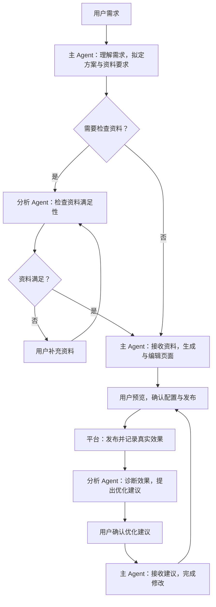
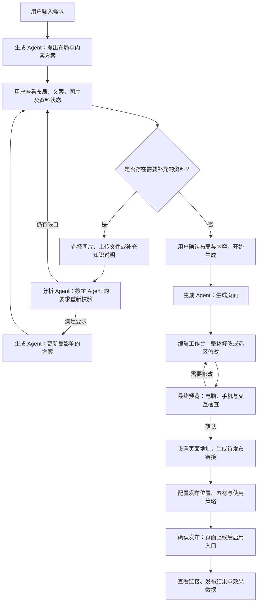
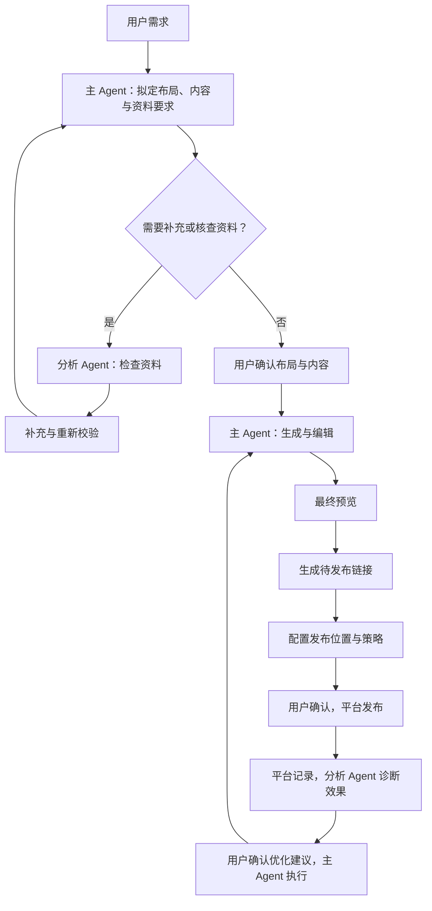

> 历史归档，不再维护。当前产品规则见[统一产品文档](../AI营销落地页-产品设计.md)。

# AI 营销落地页：产品方案与完整流程

版本：v0.1｜状态：未发布草案，供产品评审。

产品范围：营销落地页的创建、资料补充、双 Agent 协作、页面生成、应用策略、发布和效果评估。支持产品营销、线索获取、品牌介绍、促销活动、展会页面五类页面。

业务依据：数字门户 PRD 中“机制 B · 从访客意图到营销页的生成”“机制 C · 相同意图访客再进入时如何推送”，以及《AI智能落地页-运营链与访客链.drawio》。

## 1. 产品要解决什么问题

门户已经通过 SEO、SEM 和站内内容吸引访客，下一步需要判断访客想解决什么问题，提供相应的营销内容，引导其咨询、报价、预约或提交需求，并知道这些内容有没有带来有效线索。

运营人员只需要先说明两件事：**希望访客做什么，以及访客为什么需要这个页面。**生成 Agent 作为主 Agent，接收需求、资料和确认后的建议，完成页面规划、生成、编辑和应用配置。分析 Agent 在生成前检查资料是否满足要求，在发布后分析实际效果并提出优化建议；平台负责记录数据和执行发布。

每个营销任务统一管理“落地页、推广入口、转化动作、应用策略和效果记录”。一张页面可以服务多个推广位置，不需要为每个位置重复创建完整页面。

### 1.1 产品对象与完整选项

以下为 v0.1 产品范围。固定类型列出全部选项；业务数据由当前站点提供；需求描述允许自由输入。

| 产品对象 | 完整选项或内容范围 | 使用规则 |
| --- | --- | --- |
| 转化动作 | 获取报价、预约沟通、领取资料、发起咨询、提交需求、活动报名 | 主动作单选，可添加一个不同的次要动作 |
| 访客意图 | 了解与选型、场景解决方案、规格适配、产品/方案比较、供应商评估、价格采购、定制需求、活动优惠、展会预约、品牌核实与回访、自定义需求 | 前十项为建议方向；生成 Agent 从一句话需求归纳，可保留自定义，不强迫用户分类 |
| 页面类型 | 产品营销、线索获取、品牌介绍、促销活动、展会页面 | 每页单选，仅保留这五类 |
| 页面发布目标 | 当前网站、其他已接入网站 | 站点单选；在所选站点设置独立页面地址，具体站点来自可用列表 |
| 页面地址处理 | 新建页面地址、更新已有落地页 | 单选；新建时填写或接受建议地址，更新时选择可更新页面并确认替换 |
| 页面使用方式 | 仅发布链接、发布链接并启用站内推广 | 单选；两者均保留可直接访问的落地页 |
| 链接使用渠道 | SEO 内链、SEM 落地、社媒/外链分享、直接访问 | 可同时使用；渠道标记用于适配与统计，不自动操作外部渠道 |
| 站内推广位置 | 首屏 Banner、页中横幅、侧边广告位、底部弹出、智能客服推送 | 可启用多个位置，每条策略只绑定一个位置 |
| 应用策略 | 页面范围、目标访客、触发条件、展示素材、点击动作、排除条件、频控、设备、有效期、优先级、启停 | 完整可选值见第 7.1 节 |
| 应用效果 | 推广展示、点击、页面到达与阅读、动作开始/成功/失败、新增线索、跟进与有效性、策略和页面版本变化 | 自动记录与业务回流；结果页口径见第 9 节 |

推广入口用于引导访问或发起受支持的动作，完整落地页在所选网站的独立地址发布。未接入的网站和推广位置不可启用，不能用示例地址代替真实发布。

### 1.2 状态与用户操作

| 对象 | 完整状态 | 用户操作 |
| --- | --- | --- |
| 创建任务 | 草稿、分析需求中、待补充资料、待确认方案、生成中、待检查或修改、待发布、发布中、发布完成、部分发布失败、失败、已取消 | 编辑、补充、确认、取消、重试、继续 |
| 落地页 | 未发布、已发布、已下线 | 发布、生成新版本、更新发布、下线、重新发布 |
| 应用策略 | 草稿、待启用、生效中、已暂停、已结束、异常 | 保存、启用、暂停、恢复、结束、处理异常 |

已发布页面生成新草稿时，线上页面仍为“已发布”，创建任务单独显示编辑进度。“仅发布链接”不等于未完成产品流程；没有配置的推广位置不显示为失败。

### 1.3 核心目标与范围

核心目标是承接门户已有及新增的 SEO 流量，通过与需求匹配的内容帮助访客继续阅读和判断，最终完成报价、咨询、预约等动作。页面生成效率和视觉质量是手段，访问后的有效转化是主要业务结果。

| 范围 | 产品职责 |
|---|---|
| 营销页创建 | 五类页面、转化动作、需求输入、布局与内容确认、资料补充、生成和编辑 |
| 流量承接 | 搜索直达、站内内链、五种推广入口；SEM 和外部分享使用正式链接 |
| 业务转化 | 绑定已有表单、客服、预约或资料服务，记录真实完成结果 |
| 效果反馈 | 平台记录，分析 Agent 诊断和建议，主 Agent 执行经确认的修改 |
| 已有能力复用 | 企业知识库、产品资料、智能客服、站点发布与线索系统 |
| 后续扩展 | 定时发现缺口、自动排优先级、受控 A/B 测试；不作为当前人工确认链路的前置条件 |

本产品不重新建设知识库或智能客服，不默认修改广告账户、不自动发布改版。收集保养周期是汽车页的示例目标，不将汽车业务或后续消息推送系统固化为门户产品的通用功能。

### 1.4 谁使用、如何承接已有工作

| 使用入口 | 已有匹配页面时 | 缺少匹配页面时 |
|---|---|---|
| 运营人员 | 查看效果、复用页面或创建修改草稿 | 选择动作并描述需求，进入创建流程 |
| SEO | 选择现有页面并配置相关内链 | 进入相同创建流程，发布后提供页面链接与锚文本建议 |
| 内容运营 | 在文章或社媒内容中引用正式链接 | 创建承接页后引用 |
| 广告优化人员 | 复制正式链接用于 SEM | 提交页面需求，走确认与发布流程 |
| 其他 Agent | 获取已发布页面供任务引用 | 创建待确认任务，不能绕过用户发布确认 |
| 定时任务（后续） | 汇总可复用资产 | 提出缺口候选，不在当前版本自动发布 |

生成 Agent 根据需求检索并判断是否已有合适页面，先展示“复用、更新、新建”选择。检查内容适配、资料时效和主动作，避免仅因关键词表达不同就重复生成。

## 2. 多 Agent 产品架构

采用“主 Agent 执行、分析 Agent 检查与分析”的多 Agent 架构。**生成 Agent 接收信息并完成制作；分析 Agent 负责资料满足性检查和发布后的效果分析。**

| 角色 | 负责的问题 | 主要输出 | 边界 |
| ---------------------- | ------------------------------------------------------------ | ------------------------------------------------------------ | -------------------------------------------------- |
| 生成 Agent（主 Agent） | 如何把需求、资料和确认后的建议落实为页面与应用配置？ | 页面方案、布局内容、推广素材、修改版本、应用配置 | 主导制作与执行，不代替分析 Agent 做效果诊断，不擅自发布 |
| 分析 Agent | 资料能否满足制作要求？实际应用效果如何？应该优化什么？ | 资料检查结果、补充要求、效果诊断、优化建议与依据 | 不代替主 Agent 制作页面；建议经用户确认后交主 Agent 执行 |
| 用户 | 业务事实是否正确、是否同意方案与发布？ | 补充资料、确认方案、调整策略、确认发布与优化 | 不需要手工在两个 Agent 间传递上下文 |
| 产品平台 | 如何执行确认后的发布、展示、收集和记录？ | 发布结果、访客展示、真实线索、效果数据 | 执行已确认策略，不在访客等待时临时生成页面 |

生成 Agent 复用 Open Design 的网页流程，从理解任务、规划内容与设计到素材准备、网页生成和修改。分析 Agent 在制作阶段检查知识库能否满足资料要求，在运营阶段分析实际效果；主 Agent 接收其检查结论和经确认的优化建议继续执行。




### 两个 Agent 如何交接

1. 生成 Agent 先理解用户请求，确定需要的内容，例如“要回答高温适配问题，需要耐温参数与适用工况资料”。
2. 分析 Agent 按这些要求检查知识库，返回可用资料、尚缺内容、缺失对任务的影响。它回答“资料能否满足要求”，不回答“页面应该怎么做”。
3. 不足时，在当前任务中展示补充要求；用户上传、选择或补充说明后，由分析 Agent 重新检查。
4. 检查满足后，资料和结论返回生成 Agent，由主 Agent 继续完善方案、生成和修改。
5. 用户不补充时，由生成 Agent 提出缩小范围、改变表达或暂停等选择，并由用户确认；分析 Agent 不自行改目标。

生成过程中发现新资料需求，或用户更换产品、目标人群、主动作时，生成 Agent 重新明确受影响的资料要求，仅按需调用分析 Agent。没有新增资料问题时，主流程直接继续，不要求每个阶段都经过分析 Agent 审批。

内容是否回答意图、行动是否一致由生成 Agent 负责检查；页面显示、按钮和表单可用性由平台检查。分析 Agent 不作为生成完成后的通用审核 Agent。

## 3. 完整产品流程与阶段输入输出

| 阶段 | 输入 | 处理方与操作 | 输出及用户下一步 |
| --- | --- | --- | --- |
| 1 选择目标与描述需求 | 转化动作、一句话需求、页面类型 | 生成 Agent 理解人群、场景与问题 | 确认需求摘要 |
| 2 拟定布局与内容 | 需求、企业资料、品牌素材 | 生成 Agent 提出结构、文案、视觉及资料要求 | 在方案页查看布局与内容 |
| 3 补充并重新校验 | 图片/知识缺口、用户补充内容 | 分析 Agent 按主 Agent 的要求检查；生成 Agent 更新方案 | 查看逐项结果，未满足则继续补充或调整范围 |
| 4 确认方案并生成 | 已确认布局、内容与可用资料 | 用户确认；生成 Agent 制作网页 | 进入页面编辑工作台 |
| 5 编辑页面 | 页面草稿、整体或局部修改要求 | 生成 Agent 修改；涉及新资料时按需校验 | 查看修改结果，保存或继续迭代 |
| 6 最终预览 | 当前草稿、设备与主动作 | 用户检查访客视角，平台检查可用性 | 返回编辑或确认预览 |
| 7 生成链接 | 确认后的页面、站点与页面地址 | 平台检查地址，生成待发布链接 | 进入发布位置配置 |
| 8 配置位置与策略 | 页面链接、位置选择、适配素材 | 生成 Agent 提供素材和策略建议，用户配置与模拟 | 确认各位置展示及条件，或仅发布链接 |
| 9 确认发布 | 页面、地址、主动作、位置和策略 | 用户确认；平台先发布页面，再启用入口 | 查看正式链接和分项发布结果 |
| 10 查看效果并优化 | 真实展示、访问、转化和线索 | 平台记录；分析 Agent 解读并提出优化建议 | 调整页面或策略、暂停或继续观察 |

用户交互详情见第 6.1—6.3 节。用户可保存并继续任务，补充后仅校验受影响内容；已发布页面在新版本确认发布前保持不变。

## 4. 用户最开始怎么输入

### 4.1 第一步：六种转化动作

| 转化动作 | 适合的目的 | 真正完成的标准 |
| -------- | ---------------------------- | ---------------------------------- |
| 获取报价 | 让买家提交采购或询价需求 | 询价成功提交并被接收 |
| 预约沟通 | 预约演示、技术交流、展会洽谈 | 预约记录成功创建 |
| 领取资料 | 获取目录、选型指南或对比资料 | 资料成功提供；是否获得线索另行统计 |
| 发起咨询 | 进入智能客服或人工咨询 | 发出首条有效消息或咨询请求被接收 |
| 提交需求 | 收集定制、选型、解决方案需求 | 需求成功提交并被接收 |
| 活动报名 | 参加促销、展会或线上活动 | 报名记录成功创建 |

只打开表单、点击按钮或打开客服窗口，不算已完成业务转化。每页选一个主动作，可以有一个弱化的次要动作，例如“获取报价”为主、“下载参数资料”为辅。

### 4.2 第二步：描述要做的页面及其服务对象

由**创建页面的运营人员**描述需求，生成 Agent 据此明确：这张页面给谁看、重点介绍什么、需要解决对方的什么疑问，从而确定页面内容和所需资料。

第一步已经选了“希望访客完成什么动作”，这里补充“访客为什么会愿意完成这个动作”。例如，同样选择“获取报价”，介绍产品适配能力与介绍供应商可信度，需要的页面内容并不相同。

**界面提示：**“你想做一张什么页面？给谁看？希望重点介绍什么？”

用户可以直接输入：“我要做一个面向化工厂采购的产品营销页，介绍高温蒸汽阀门，重点说明适用工况和产品能力，吸引他们询价。”不用先学习“意图分类”，也不用额外选择了解期、对比期或决策期。

#### 用户不知道怎么写时，提供可点击的需求示例

需求示例作为可选输入辅助。点击后填入输入框，支持修改；已有明确需求时直接继续。系统可结合当前企业和产品提供更贴近业务的示例，但不假设企业具备未经确认的能力。

| 需求示例：运营人员可以这样说 | 生成 Agent 据此确定的内容重点 |
| ---------------------------------------------- | ---------------------------------------- |
| “介绍这款产品适合哪些工况，让采购来询价。” | 适用范围、关键参数、应用说明、询价入口 |
| “让客户了解我们的供应能力，愿意联系我们。” | 公司能力、真实资质、案例、联系入口 |
| “介绍我们的定制服务，让客户提交特殊需求。” | 可定制范围、合作过程、案例、需求提交入口 |
| “做一个活动页，说明参与产品和规则，吸引报名。” | 活动利益、适用产品、真实规则、报名入口 |
| “做一个展会页，让客户了解展品并预约洽谈。” | 展品、时间地点、洽谈内容、预约入口 |

这些内容只是规划方向。比如需要展示案例，但知识库没有案例，仍须按后续资料检查流程处理，不能因为示例中提到就自动生成。

#### 输入后发生什么

1. **生成 Agent 理解并反馈。**显示一句可编辑的理解结果，例如：“这张页面面向化工厂采购，重点说明高温蒸汽场景的适配能力，主要引导询价。”
2. **明确制作要求。**生成 Agent 根据需求建议页面类型、内容重点和需要的资料。用户已选定的主动作保持不变；若有不匹配，只提出建议供用户确认。
3. **按需检查资料。**生成 Agent 提出“需要对应产品、工况说明和参数”等要求，分析 Agent 再检查知识库是否满足。
4. **进入方案阶段。**资料满足后，由生成 Agent 组织页面内容并继续主流程。

“访客意图”指页面需要解决的访客问题，由生成 Agent 根据运营需求归纳，用于决定内容重点。真实访客的需求匹配由页面应用策略另行判断。

关键词不是必填。可以结合产品、现有页面或已授权的搜索数据提供需求建议，但用户只需确认自己的页面需求。

### 4.3 保留五类页面

| 页面类型 | 内容组织重点 | 典型使用场景 |
| -------- | ------------------------------------------------ | ---------------------------- |
| 产品营销 | 适配结论、参数、应用、优势证据、常见问题、行动 | 型号查询、产品比较、采购询价 |
| 线索获取 | 客户问题、解决方式、能力案例、合作步骤、需求表单 | 解决方案、定制需求、技术预约 |
| 品牌介绍 | 公司定位、能力、资质案例、服务范围、联系入口 | 供应商评估、品牌核实 |
| 促销活动 | 活动利益、适用产品、真实规则与有效期、行动 | 采购活动、促销推广 |
| 展会页面 | 展会价值、展品、时间地点、洽谈内容、预约 | 展会预热、参会预约 |

知识型、优势型、报价型作为内容结构策略，不新增页面类型。用户主动指定类型时优先保留；生成 Agent 发现不合适则解释并建议，不能静默替换。

## 5. 资料检查：只让用户补关键缺口

生成 Agent 根据页面目标提出所需资料，分析 Agent 只围绕“现有资料能否满足这些要求”给出三种结果：

| 检查结果 | 用户看到什么 | 如何继续 |
| ------------ | ------------------------------------------------------------ | ------------------------------------------ |
| 资料足够 | “已找到产品介绍、关键参数和相关案例，可以生成。” | 查看方案并确认 |
| 部分缺失 | “产品资料齐全，但没有交期依据；建议补充，或不展示具体交期。” | 补充或接受缩小范围 |
| 关键资料缺失 | “未找到本次产品/活动资料，无法支撑这个页面。” | 补充资料、换用已有产品、调整目标或保存待办 |

### 缺口卡片只回答四件事

**缺什么、影响什么、怎么补、不补会怎样。**例如：

> **缺少耐温资料**  
> 本次页面要回答“是否适合高温蒸汽”，但现有知识库中没有对应参数或应用说明。  
> 可以上传产品手册、选择已有资料，或补充经确认的产品说明。  
> 如果暂时没有，建议改为“咨询适用工况”，不展示具体耐温承诺。  
> 操作：上传资料 / 选择资料 / 补充说明 / 调整页面范围。

### 补充与重新检查的流程

1. 分析 Agent 先检查已有资料，避免向用户索取已经存在的信息。
2. 按“必须补充”和“可选增强”排序，只先展示阻碍当前任务的关键项。
3. 用户上传、选择或填写后，分析 Agent 重新检查，并说明“已解决什么、还缺什么”。
4. 信息矛盾时把冲突具体展示给用户确认，例如两份产品手册参数不同。
5. 用户跳过可选内容后，将对应模块从方案中移除；关键事实缺失不能用虚构内容替代。
6. 新增资料默认用于本任务；用户可选择同时保存到企业知识库，供后续复用。

缺少客服、表单或发布位置等能力时，区别于“缺少内容资料”：允许先看页面草稿，但在发布前清楚列为待准备事项，不能让用户误以为已经能收集真实线索。

### 贯穿示例

用户要求“高温阀门产品营销页，用来获取报价”。知识库只有公司简介和常温产品资料。生成 Agent 先明确需要高温适用资料；分析 Agent 检查后说明“现有资料不能证明这款产品适用于高温”，并要求补充。若用户无法提供，由生成 Agent 提出“改做已有产品页”或“改为不承诺参数的技术咨询页”，供用户决定。用户选择补充后再检查，通过后才把确认的产品与参数交给生成 Agent。

## 6. 用户交互：确认方案、补充校验、生成编辑与预览

用户主路径为：**输入需求 → 确认布局与内容 → 补充图片和知识资料并重新校验 → 确认生成 → 编辑页面 → 最终预览 → 生成链接 → 配置发布位置 → 确认发布。**

生成后的工作台采用 Open Design 的对话式页面编辑方式：在同一任务内预览页面、提出整体或局部修改、查看修改结果并继续迭代。生成前的布局确认、知识补充与校验是产品明确设置的交互步骤。



### 6.1 生成前：布局、内容与资料确认

#### 界面组织

方案确认页使用同一工作台，顶部显示“需求 → 方案确认 → 生成与编辑 → 预览 → 链接与发布”的步骤导航。

| 区域 | 展示内容 | 用户操作 |
| --- | --- | --- |
| 左侧模块目录 | 首屏、产品、案例、FAQ、表单等拟定模块及顺序 | 选择模块、调整顺序、删除可选模块、提出增加模块 |
| 中间布局预览 | 页面线框、模块排布、标题位置、图文比例、主行动按钮和表单位置 | 选择布局方向；点击模块查看内容；提出“改为左文右图”等调整 |
| 右侧详情 | 当前模块的标题、文案草稿、图片、事实依据与缺口 | 编辑文字、换图、补资料、调整重点 |
| 下方协作区 | 生成 Agent 的方案说明、分析 Agent 的资料检查结果 | 用自然语言提出修改，查看待处理项 |
| 底部操作区 | 保存草稿、重新校验、确认方案并生成 | 处理当前步骤，进入生成 |

布局预览是结构方案，供确认模块和视觉方向；完整网页在确认后生成。默认提供一个推荐布局，用户可请求备选。用户无需只靠文字想象页面，也无需先生成整页才能发现模块顺序不合适。

#### 需要确认的内容

| 确认项 | 用户看到什么 | 可做的调整 |
| --- | --- | --- |
| 页面结构 | 模块清单、上下顺序、模块之间的承接关系 | 调整顺序、增减模块 |
| 首屏布局 | 主标题、说明、图片位置、主要按钮 | 修改图文布局、强调重点、按钮位置 |
| 正文内容 | 各模块标题与文案草稿、所回答的访客问题 | 直接编辑草稿或要求 Agent 改写 |
| 视觉方向 | 配色、字体风格、信息密度 | 接受推荐或提出更改 |
| 图片素材 | 已选图片及用途、待补图片位置 | 选择、上传、替换；允许时申请生成 |
| 转化区域 | 主动作、按钮文案、表单问题及位置 | 调整文案和必要问题，不改变已确认目标 |
| 内容依据 | 已有资料、缺失或冲突项 | 查看依据、补充、调整内容范围 |

#### 缺少图片或知识内容时

每个受影响模块显示“待补充”，点击打开补充面板。面板说明缺什么、用于哪一部分、如何补充；不要求用户离开任务重新创建资料。

| 缺口 | 可选择的处理方式 | 处理后的状态 |
| --- | --- | --- |
| 公司或产品图片 | 从素材库选择、上传图片、替换为其他已确认素材 | 待校验 |
| 通用装饰或场景图 | 从素材库选择、上传、允许图片生成时申请生成 | 获取成功后待校验；生成图不能冒充真实产品或客户案例 |
| 产品参数、公司能力、活动规则等知识 | 从知识库选择资料、上传文件、补充说明 | 待校验 |
| 内容冲突 | 选择有效资料并说明适用范围，或更新资料 | 待校验 |
| 非关键模块缺资料 | 删除该模块，或由生成 Agent 调整为不依赖该资料的表达 | 方案待更新 |
| 关键资料暂时无法提供 | 保存待补充，或由生成 Agent 提出调整目标/范围的方案 | 保持草稿，等待处理 |

补充完成后，用户点击“重新校验”。分析 Agent 只判断补充内容是否满足生成 Agent 的资料要求，返回“满足、仍缺失、存在冲突”；生成 Agent 据此更新相关文案、图片或布局。平台同时检查图片文件是否能正常使用。

重新校验结果定位到具体模块：已解决项标为“已满足”，未解决项说明原因和下一步。上传成功不直接等于校验通过。新资料默认仅用于本任务，可选保存到企业知识库。

“确认方案并生成”的条件为：布局与内容已确认、关键图片/知识缺口已解决或经确认移除相应要求、没有待处理的事实冲突。仅影响上线的事项，例如真实表单尚未接通，允许生成草稿，但持续标注为发布前待办。

用户修改已确认的关键内容后，仅受影响模块转为待确认；新增资料要求按需重新校验。内容与布局保持联动，不能显示旧布局配新文案却仍标为全部确认。

### 6.2 生成后：对话式页面编辑

点击“确认方案并生成”后，工作台显示素材准备、页面生成、预览就绪的进度。完成后自动进入编辑状态，沿用同一需求和方案上下文。

| 交互 | 用户操作 | 生成 Agent / 平台反馈 |
| --- | --- | --- |
| 整体修改 | 在对话中输入“整体更简洁”“突出产品参数”等要求 | 说明调整范围，生成修改后的页面 |
| 局部修改 | 选择页面区域，再输入“缩短标题”“图片换成这张”等要求 | 针对选中区域修改，更新预览 |
| 图片替换 | 选择图片区域，上传或选择素材 | 校验适用性后替换，检查图文布局 |
| 内容调整 | 选择文案区域提出改写要求 | 保留已确认事实，修改表达 |
| 结构调整 | 提出移动、增加、删除模块 | 更新页面；目标或资料要求改变时返回相关确认步骤 |
| 查看修改结果 | 在当前预览中浏览、切换设备 | 展示最新草稿，可查看版本记录并恢复先前草稿 |
| 继续迭代 | 对新结果再次提出修改 | 保持同一任务上下文继续编辑 |

页面编辑以“对话提出要求、结合页面选区修改、即时查看结果”为基本方式。选区编辑和版本恢复作为工作台能力提供，具体控件以可复用的 Open Design 编辑能力为基础适配。

修改事实或引入新资料要求时，生成 Agent 按需调用分析 Agent；纯视觉和措辞调整直接处理。处理中显示当前进度，失败保留上一份可用草稿。用户可以取消当前修改、继续编辑或保存离开。

### 6.3 最终预览、生成链接与发布位置配置

#### 最终预览

用户点击“预览”进入访客视角，隐藏编辑选区和协作面板。支持电脑、平板、手机预览，检查文字、图片、布局、按钮跳转、表单问题和反馈。

预览操作包括“返回编辑”“测试主动作”“确认预览，生成链接”。测试提交明确标为测试记录，不进入正式效果统计；未接通的动作标为模拟，不能以模拟成功通过真实发布检查。

SEO 标题、摘要及分享展示在预览详情中确认；SEM 适配检查页面首屏与投放承诺一致。推广素材在后续选择具体发布位置后生成或复用。

#### 生成链接

“生成链接”先让用户选择站点、确认页面名称与地址，再得到**待发布链接**。它用于绑定发布位置与检查地址，不提前开放草稿。

| 链接状态 | 用途 | 用户操作 |
| --- | --- | --- |
| 草稿预览链接 | 内部查看确认的草稿，标注预览状态 | 查看、复制用于内部评审；不作为正式投放地址 |
| 待发布链接 | 已确认的正式目标地址，页面尚未上线 | 复制地址、继续配置发布位置；提示当前未公开可用 |
| 已发布链接 | 页面发布成功后的正式访问地址 | 打开验证、复制用于 SEO 内链、SEM 或分享 |

已有页面改版保持原正式地址；新草稿不覆盖线上内容，发布确认后才更新。首次生成地址发生冲突时提示修改，不能覆盖其他页面。

#### 配置发布位置

链接确定后进入“发布位置与策略”页，选择“仅发布链接”或“发布并启用站内推广”。站内位置完整选项为：首屏 Banner、页中横幅、侧边广告位、底部弹出、智能客服推送。

每选择一个位置，展示对应素材与目标页面中的效果。尚无适配素材时，由生成 Agent 根据已确认页面生成，用户预览确认；随后配置页面范围、人群、触发、排除、频控和有效期，完整选项见第 7.1 节。

用户可保存配置、返回预览或点击“确认发布”。最终清单同时展示页面地址、主动作可用性、各位置素材和策略。平台先发布页面并验证访问，再启用入口；结果页分别显示各项成功或失败状态。

主按钮顺序固定为：**确认方案并生成 → 预览 → 确认预览，生成链接 → 配置发布位置 → 确认发布 → 查看效果。**生成完成、预览确认和公开发布分别表示不同状态。

### 6.4 Open Design 网页生成流程

流程基线：Open Design 0.22.2 的网页新建流程。核心阶段为规划与生成，小范围修改采用直接编辑流程。

**它的核心顺序是：理解请求并选择网页规范 → 汇集设计依据 → 形成页面计划 → 检查计划是否可执行 → 准备素材 → 按计划生成网页 → 加载预览。**这能解释为什么最终得到一张内容、视觉和交互相互配合的页面。

| 步骤 | 输入是什么 | 这一步实际在做什么 | 输出是什么 | 为什么需要这一步 |
| ----------------------- | -------------------------------------------- | ------------------------------------------------------------ | -------------------- | ------------------------------------------------------------ |
| 1. 判断要生成的作品 | 用户需求与当前项目类型 | 判断用户要的是可访问的网页，还是海报、图片等物料。汽车营销页采用网页设计规范 | 明确的网页生成任务 | “营销”可以指网页也可以指图片，先选对制作方式，避免产物形态错误 |
| 2. 汇集生成依据 | 用户需求、已有上下文、设计规范和当前可用能力 | 把业务要求与核心设计、流程、网页交互规则一起交给设计 Agent | 一份完整的任务上下文 | 让 Agent 知道要实现什么、遵守什么规则、能使用什么素材与工具 |
| 3. 把需求变成页面计划 | 完整任务上下文 | 明确受众、页面目标、内容模块、主要行为与最终交付；记录没有资料时的假设与限制 | 页面内容与功能计划 | 先回答“页面应该有什么、用户怎么使用”，避免直接堆砌区块 |
| 4. 确定统一设计方向 | 页面目标与内容计划 | 确定配色、字体、间距、组件风格、动效和响应式要求，并将其写入计划 | 统一的设计约定 | 保证各个模块属于同一个页面，后续生成和修改有共同依据 |
| 5. 确认计划可以进入生成 | 内容、功能、设计和交付计划 | Open Design 的运行流程检查计划是否完整、是否具备执行条件，保存后进入生成阶段，并延续已有会话 | 已确定的生成依据 | 防止计划与执行脱节，避免换一个阶段后丢失已经明确的要求 |
| 6. 准备所需素材 | 计划中的图片等素材需求 | 有需要时读取素材处理规范，使用现有素材或通过实际可用能力获取素材；核对素材是否可用 | 可供页面使用的素材 | 先取得真实可用的素材，再安排图片与内容，避免生成不存在的图片路径 |
| 7. 按计划制作页面 | 已确定计划、设计约定和素材 | 生成完整网页，将内容、布局、响应式、导航、按钮、表单校验和状态反馈组合起来 | 可以预览的网页与素材 | 把前面分别确定的内容与设计落实成用户能浏览和操作的页面 |
| 8. 交付并加载预览 | 生成后的网页文件 | 写出交付物，更新完成状态，由 Open Design 加载页面供查看 | 用户看到的营销落地页 | 从设计计划走到具体成果，用户可以检查内容和交互，并提出下一轮修改 |

内容规划与设计方向共同形成一份页面计划。计划通过执行条件检查后进入生成阶段；页面与业务功能验收在产物交付后进行。

#### 每类文档在流程中起什么作用

| 设计规范 | 职责 | 对应步骤 |
| ---------------------------------------- | -------------------------------------------------- | ---------------- |
| 任务类型映射说明 | 决定这次该采用网页、图片还是其他作品规范 | 选择制作方式 |
| 核心设计规则（core-system-prompt.md） | 约定整体规划、制作与交付的基本要求 | 理解、规划与生成 |
| 通用编排规则（general-orchestration.md） | 说明先处理输入、再规划、何时进入制作、如何完成交付 | 组织完整流程 |
| 网页规范（prototype.md） | 约定布局、视觉、响应式、按钮、表单和交互细节 | 页面计划与制作 |
| 素材处理规范（od-next-media-inputs） | 在需要素材时指导获取、复用和确认素材是否可用 | 素材准备 |

营销落地页采用 **prototype 网页规范**；marketing.md 适用于固定画布营销物料。素材规范按需加载，优先复用已有可用素材。

#### 双 Agent 与网页生成流程的衔接



流程职责：

1. 生成 Agent 负责从任务理解到计划、素材、网页生成及后续策略。分析 Agent 按其资料要求执行检查，补充完成后返回主流程。
2. 本产品在生成前设置内容与设计确认。Open Design 的原生单页流程可在计划通过后自动进入生成。
3. 平台负责页面可用性检查、真实表单、发布和效果记录。生成 Agent 根据检查结果与用户反馈修订页面。

### 6.5 生成实例：汽车服务营销页

**目标：**创建汽车行业独立营销页，介绍公司与车型，收集客户保养周期，用于后续提醒。

**实例范围：**Open Design 生成的页面原型，包含示例公司与车型内容、场景图片及模拟登记交互。

| 生成主流程的步骤 | 本例输入 | 做了什么 | 本例输出 | 下一步如何使用 |
| --------------------- | -------------------------------------- | ---------------------------------------------- | ------------------------------------------------------------ | ------------------------------------------------------------ |
| 1. 选择网页制作流程 | 原始需求与网页项目类型 | 确定要交付可浏览和操作的独立网页 | 使用网页规范，最终交付一张 HTML 页面 | 后续按网页布局与交互要求制作 |
| 2. 汇集任务依据 | 用户需求、网页规范、通用流程与运行能力 | 把制作目标与规则一起提供给生成运行器 | 任务上下文包含核心规则、网页要求、用户请求；本例未绑定额外品牌设计系统 | 生成 Agent 在统一依据下理解与规划 |
| 3. 明确目标与受众 | “公司介绍、汽车介绍、收集保养周期” | 明确页面服务谁、主行为是什么 | 面向有购车、维保或周期保养需求的车主；浏览服务后填写保养提醒登记 | 决定模块与行动入口，避免只做车辆展示页 |
| 4. 识别输入条件与限制 | 未提供具体公司、真实车型和隐私政策 | 在计划中记录假设及未提供的资料 | 使用可替换的公司和车型示例；保养登记只模拟提交；不编造未经确认的品牌承诺 | 明确这是可预览原型，不能当作真实业务已接通 |
| 5. 规划内容与交互 | 目标、受众、限制 | 将需求拆成页面内容和操作要求 | 首屏、公司介绍、车型展示、服务保障、保养登记；导航、输入校验、提交反馈及手机适配 | 生成时每个模块和功能都有明确任务 |
| 6. 确定视觉方向 | 汽车服务场景与内容计划 | 确定整个页面共用的视觉风格 | 深蓝、石墨灰、白色，琥珀强调；中文无衬线字体；统一间距、轻圆角表单和短时状态反馈 | 指导各模块共同的视觉表达，不各自随机设计 |
| 7. 检查并确定生成计划 | 内容、交互、视觉与交付要求 | 运行流程检查计划并保存，进入同一会话的生成阶段 | 本例为一张页面的单构建任务，输出目标为 index.html | 把已经明确的要求带入实际制作，无需用户重新描述 |
| 8. 准备素材 | 页面需要汽车服务场景图 | 按需调用素材规范，搜索并获取图片 | 实际使用的 assets/workshop.jpg | 网页引用已获取的图片进行排版 |
| 9. 生成完整网页 | 计划与素材 | 组合文字、样式、图片、导航、登记表单与反馈 | index.html；登记包含姓名、手机号、车型、上次保养时间、周期及用途同意项 | 可在预览中检查从浏览到登记的完整体验 |
| 10. 交付与预览 | 网页与素材文件 | 完成交付物记录并供应用预览 | 页面文件及完成状态，可查看最终页面 | 进入页面验收、业务接入及修订流程 |

步骤 3—7 在同一规划阶段内完成，输出统一的内容、设计与执行计划。随后进入素材准备和页面生成。

#### 产品流程示例：资料不足时的协作

真实业务页面在生成前检查必要资料。以下为同类业务的资料补充流程：

- **生成 Agent 提出要求：**“这次要介绍公司和车型并收集保养周期，需要公司介绍、展示车型及图片、希望收集的保养信息，以及登记后的处理方式。”
- **分析 Agent 返回检查结果：**“知识库已有公司介绍；未找到可展示车型与图片，也未明确保养登记后由谁跟进。请补充这些内容。”
- **用户补充：**选择车型资料并说明登记后的跟进方式。分析 Agent 再确认哪些要求已经满足；未接通实际登记能力时保留发布前待办。
- **生成 Agent 继续：**根据确认资料组织页面、设计方向与表单内容，生成草稿；平台确认真实提交路径后，用户再决定发布。

这段协作的输入是“主 Agent 为完成任务需要什么”，输出是“哪些已经满足、哪些还需要补充”。分析 Agent 不替主 Agent 决定页面模块、设计风格或推广策略。

#### 实例产物与发布条件

实例产物包含网页、汽车服务图片、登记表单、输入校验和提交成功反馈。登记信息未保存至业务系统。正式发布需要接通真实登记与后续处理，完成页面及提交验证；推广策略和效果记录由平台管理。

## 7. 应用策略：这张落地页在什么情况下使用

策略配置是独立步骤，定义页面的使用范围、展示条件、入口内容与频次。生成 Agent 根据意图和网站内容先推荐，用户调整后确认。

每条策略用一句完整的话说明：**在什么页面，面向什么访客，满足什么条件时，以什么入口展示什么内容，点击后做什么。**

### 7.1 策略配置页的内容与完整选项

以下为 v0.1 支持范围。“固定选项”完整列出；“业务列表”从当前网站或已配置内容中选择；“填写项”允许输入名称或数值。未接入的能力显示为不可用，并说明原因。

#### 7.1.1 基本配置

| 配置项 | 完整选项或取值范围 | 选择方式 | 默认与约束 |
| --- | --- | --- | --- |
| 策略名称 | 用户填写业务名称 | 文本，必填 | 生成 Agent 建议，可修改 |
| 关联落地页 | 当前任务页面；选择已有落地页 | 单选；已有页面来自本网站可用列表 | 默认当前任务；启用前必须已发布 |
| 使用位置 | 首屏 Banner、页中横幅、侧边广告位、底部弹出、智能客服推送 | 单选 | 一条策略对应一个位置；多位置创建多条策略 |
| 页面范围方式 | 全站、指定栏目、指定页面、相关主题页面 | 单选 | 默认相关主题页面，但必须确认匹配清单 |
| 指定栏目 | 当前站点实际栏目 | 多选，业务列表 | 仅选择“指定栏目”时出现；至少选一项 |
| 指定页面 | 当前站点已发布页面 | 多选，业务列表 | 仅选择“指定页面”时出现；至少选一项 |
| 相关主题页面 | 生成 Agent 建议的相关页面清单 | 确认清单，可增删 | 保存时固定清单；新增页面不自动加入，需更新确认 |
| 设备 | 电脑、平板、手机 | 多选 | 默认该位置支持的设备；至少一项 |
| 开始方式 | 确认发布后立即生效、指定开始时间 | 单选 | 默认立即生效；时间按站点时区展示 |
| 结束方式 | 不设结束时间、指定结束时间 | 单选 | 活动类默认活动结束时间；结束必须晚于开始 |
| 发布时状态 | 启用、暂不启用 | 单选 | 默认启用，发布确认时可调整 |
| 运行状态 | 待启用、生效中、已暂停、已结束、异常 | 系统显示，非下拉选择 | 操作：启用、暂停、恢复、结束；异常需处理后恢复 |
| 人工优先级 | 高、普通、低 | 单选 | 默认普通；同等级按意图匹配具体程度，再按策略列表顺序选择 |

全站范围也只在已提供对应位置的页面生效。“电脑侧栏”不会因选择全站而出现在无侧栏页面。配置暂存称为“草稿”，尚未成为运行中的策略。

#### 7.1.2 目标访客

先选“全部适用访客”或“按条件筛选”。选择筛选后，下列维度均可选填，不填表示该维度不限制。不同维度之间必须同时满足；同一维度内选中的多个值满足任一即可。

| 筛选维度 | 完整选项或取值范围 | 选择方式 | 默认与适用条件 |
| --- | --- | --- | --- |
| 访客筛选方式 | 全部适用访客、按条件筛选 | 单选 | 默认全部适用访客，仍受页面范围和排除条件限制 |
| 获客来源 | SEO、SEM、社媒/外链、直接访问、未知来源 | 多选 | 默认不限制；按当前访问的外部来源判断 |
| 本次页面进入方式 | 外部直达、站内内链、首屏 Banner、页中横幅、侧边广告位、底部弹出、智能客服推送、未知 | 多选 | 默认不限制；与获客来源分别记录和筛选 |
| 来源判定 | 已识别付费来源记 SEM；其余按搜索、社媒/外链、直接访问判断，信息不足记未知 | 固定规则说明 | 站内点击不覆盖获客来源；最近入口另记，直接访问表示没有来源信息且符合直接访问规则 |
| 需求主题 | 本落地页服务的意图；选择其他已确认意图 | 多选，任务意图库 | 默认不限；必须有可用的页面、行为或对话依据 |
| 需求阶段 | 了解、对比、决策、无法判断 | 多选 | 默认不限；回访不作为需求阶段 |
| 访问状态 | 首次可识别访问、回访、无法判断 | 多选 | 默认不限；无法识别不强行归为首次 |
| 语言 | 当前站点已支持的语言 | 多选，业务列表 | 默认落地页支持的语言；无法识别时使用站点默认语言 |
| 地区 | 不限制、指定国家/地区 | 单选模式；指定时多选地区列表 | 默认不限制；选指定地区后，无法识别地区的访客不命中 |

需求主题是对已有页面服务意图的引用，不要求运营人员重新填写一套专业分类。自然搜索词不可用时不能把推测当成访客真实搜索词。

#### 7.1.3 触发条件

“触发”定义展示时机，“目标访客”定义展示对象。回访、地区、来源属于筛选条件，不重复放到触发列表。

| 触发类型 | 完整参数选项或范围 | 默认建议 | 适用位置 |
| --- | --- | --- | --- |
| 进入适用页面 | 无附加参数 | 首屏 Banner、侧栏默认 | 首屏 Banner、侧边广告位 |
| 页面阅读达到比例 | 25%、50%、75%、80%、自定义 1%—100% | 横幅 50%，底部 80% | 页中横幅、底部弹出 |
| 指定内容进入视野 | 从当前页面可选区块中选择 | 按内容承接关系建议 | 页中横幅；仅明确页面且存在区块时可用 |
| 有效停留达到时长 | 15 秒、30 秒、60 秒、自定义 1—600 秒 | 30 秒 | 页中横幅、底部弹出 |
| 出现离开信号 | 电脑端离开信号；最低有效停留 30 秒 | 30 秒且未转化 | 底部弹出，仅电脑 |
| 访客在对话中表达需求 | 选择该页面对应的已确认需求主题 | 本页主题 | 智能客服推送 |
| 客服确认高意向 | 客服给出的高意向判断，且与所选需求主题匹配 | 仅在客服具备该能力时提供 | 智能客服推送 |

触发条件组合完整选项：**满足任一、全部满足**。单条件无需选择组合；多条件默认“满足任一”，界面以完整句子预览。目标访客筛选、页面范围、有效期和排除条件始终必须通过，不能被“任一触发”绕过。

对于“全部满足”，已发生的触发事件在本次访问中保留，达到最后一项条件时才展示。触发事件不能跨访问累计。首屏和侧栏仅支持“进入适用页面”，不显示不适用的滚动或对话选项。

#### 7.1.4 展示内容与点击动作

| 配置项 | 完整选项或取值范围 | 选择方式 | 默认与约束 |
| --- | --- | --- | --- |
| 素材来源 | 使用当前生成素材、选择已有适配素材、编辑后保存新素材 | 单选方式，素材列表选择 | 默认当前位置的生成素材 |
| 素材样式 | 首屏：图文横幅/纯文字横幅；页中：图文横幅/纯文字横幅；侧栏：图文卡片/文字卡片；底部：短文案与按钮/图文与按钮；客服：引导语与链接卡/引导语与图文卡 | 在所属位置内单选 | 根据可用素材推荐；底部必须有关闭按钮 |
| 可编辑内容 | 标题、简短说明、按钮文字；图文样式可选图片；客服可编辑引导语 | 文本或素材选择 | 不要求所有位置出现全部内容；展示预览检查容纳情况 |
| 点击动作 | 打开关联落地页、直接发起咨询、直接预约 | 单选 | 默认打开落地页；直接动作需已接通对应业务能力 |
| 打开方式 | 当前窗口、新窗口 | 单选，仅打开落地页时出现 | 默认当前窗口；客服端遵循所在客户端支持方式 |
| 咨询目标 | 已配置智能客服、已配置人工咨询渠道 | 单选，业务列表 | 未接入时禁用；不显示虚构渠道 |
| 预约目标 | 已配置预约服务或预约表单 | 单选，业务列表 | 未接入时禁用 |

报价、资料领取、需求提交和活动报名默认通过落地页承接，v0.1 不提供任意推广位内嵌这些表单的选项。点击动作与页面主转化动作分别记录；直接咨询/预约可以产生入口直接转化。

#### 7.1.5 排除与频控

| 配置项 | 完整选项或范围 | 选择方式 | 默认与约束 |
| --- | --- | --- | --- |
| 必须排除 | 正在访问关联落地页、页面未发布或不可访问、策略不在有效期、当前位置不可用 | 固定启用 | 不允许关闭 |
| 可选排除 | 已完成主转化、当前访问已关闭同一推广、指定页面、指定栏目 | 多选 | 默认开启前两项；其他从网站列表中选 |
| 已转化排除周期 | 本次访问、最近 7 天、最近 30 天 | 单选 | 默认最近 30 天；依赖可识别记录，无法跨设备识别时不承诺跨设备排除 |
| 单次访问曝光上限 | 1 次、2 次、3 次 | 单选 | 默认 1 次；底部弹出固定 1 次 |
| 每日曝光上限 | 1 次、2 次、3 次、5 次 | 单选 | 默认 2 次；同一落地页跨所有主动推广位置累计 |
| 两次曝光最小间隔 | 不额外限制、30 分钟、1 小时、4 小时、24 小时 | 单选 | 默认 1 小时；其他频控仍然有效 |
| 主动打断冲突 | 底部弹出与客服主动推送互斥 | 固定规则 | 同时命中按优先级选择；不会同时展示 |

频控以实际可见曝光计数。每日上限按站点时区的自然日计算；最小间隔按距离上次曝光的实际时长计算。日上限和间隔是同一落地页的共享配置，在任一策略修改时提醒“将影响该落地页其他推广策略”；单次访问上限按单条策略设置，同时受共享上限约束。

关闭排除可由用户配置，但底部弹出一旦关闭，本次访问不得再次弹出同一页面推广。客服对访客主动提出的问题正常回答，不计为策略主动推送。

#### 7.1.6 条件组合示例

> 使用位置：页中横幅；页面范围：指定产品栏目；目标访客：需求阶段为“对比”或“决策”；触发：阅读达到 50% 或有效停留达到 30 秒；排除：已转化、已关闭、正在目标页；点击：当前窗口打开落地页；每日上限：2 次；间隔：1 小时。

完整判断为：**在指定栏目 AND 阶段属于对比或决策 AND（阅读达到 50% OR 停留达到 30 秒）AND 未命中排除条件 AND 未超频控**。生成 Agent 负责建议可用组合，用户确认后生效。

### 7.2 五种位置的推荐使用方式

以下条件是可调整的起点，不是已验证的转化规律。

| 位置 | 适合什么场景 | 建议触发 | 不适合或需要避免 |
| ------------ | ------------------------------------------------ | ---------------------------------------------- | ---------------------------------------------------------- |
| 首屏 Banner | 当前访问主题已明确，希望第一眼给出相关承接 | 到达指定页面，内容主题或已知兴趣匹配 | 无依据地对所有首页访客推荐特定产品；替换未经确认的首页内容 |
| 页中横幅 | 访客正在阅读知识、方案或产品内容，需要下一步引导 | 相关页面阅读超过一半，或读到指定章节 | 在不相关文章中插入，阅读尚未开始就打断 |
| 侧边广告位 | 对比产品、研究参数时持续提供低干扰入口 | 相关页面且适合对比/决策需求 | 手机上没有合适位置时强行挤入正文 |
| 底部弹出 | 访客已阅读较多但尚未行动，需要适度提醒 | 阅读接近底部，或电脑端出现离开信号；本次未转化 | 一进入就遮挡正文、重复弹出、关闭后立即再推 |
| 智能客服推送 | 访客在对话中明确表达需求，适合推荐具体页面 | 提到对应产品、场景、报价或资料需求 | 与对话无关的硬推；客服和弹窗同时重复打断 |

手机不使用鼠标离开条件；侧边位置不可用时默认不展示，用户可改为页中横幅。网站尚未提供某个位置或未接入客服时，配置页明确显示“暂不可用”，允许预览，不显示虚假的已启用状态。

### 7.3 三条完整策略示例

**产品采购承接：**在高温阀门相关产品页，访客阅读超过一半且尚未询价时，展示页中横幅“核对工况，获取报价”，点击进入本次产品营销页。同一次访问只展示一次；已在目标页不重复推荐。

**展会预约：**展会开始前，在展会介绍页首屏展示“预约现场技术交流”，仅在活动有效期内启用。点击进入展会页面；结束后停止入口展示，不继续接受过期预约。

**客服推荐：**访客在客服对话中询问高温工况，客服确认对应需求后推荐已发布的选型落地页，并附上“这里可以查看适配说明，也可以提交工况”的说明。用户已经拿到同一页面时，不机械地重复推送。

### 7.4 策略预览与测试

配置页右侧显示入口在目标页面中的预览。下方提供“模拟访客场景”：选择访问页、设备、是否回访、阅读位置或对话需求，显示“会展示/不会展示”及原因。用户可以看到“由于已经提交询价，本策略不再展示”，避免发布后才发现规则配错。

发布后还提供策略运行诊断：满足条件、被频控、被更高优先级覆盖、位置不可用等原因的汇总。匹配判断不等于真实曝光，效果记录以访客实际看到入口为准。

### 7.5 频控、冲突与默认行为

- 默认同一可识别访客对同一落地页的主动推广，跨位置每日合计最多两次、间隔至少一小时；底部弹出每次访问最多一次。可选范围与共享配置按第 7.1 节执行。
- 客服主动推荐与底部弹出不同时触发；用户关闭提示后，本次访问不再主动重复推荐同一内容。
- 多条策略同时命中，先比较人工优先级，再比较意图具体程度，仍相同时按策略列表顺序选择；同一个位置只展示一个入口。
- 已完成主转化、正在访问该落地页、活动过期或内容不适用时排除。访客主动询问时，客服仍可正常回答。
- 识别不到访客意图时使用相关页面的通用入口或原有内容，不强行认定高意向。
- 关闭全部推广策略与下线落地页是两个操作，分别确认，避免误伤 SEO 或外部已分享的链接。

## 8. 发布与实际使用

完成最终预览、生成待发布链接和位置配置后，发布确认页分成两块：**落地页发布**和**应用策略启用**。

落地页部分展示页面名称、类型、目标、网站地址和预览；策略部分逐条展示位置、适用范围、触发条件、素材、有效期和频次。用户可以只发布页面，暂不启用任何推广策略。

平台先确认页面可访问，再启用相应入口。页面未发布成功时不启用入口；若页面成功但某个推广位置失败，清楚列出成功项与失败项，用户只需重试失败位置。

访客在线访问时使用已经生成、确认并发布的内容，不等待 Agent 现场创作。搜索直达、广告直达和站内推荐共用落地页，但分别记录来源。滚动横幅、底部弹出、客服推送在访问过程中按条件触发。

页面修改和策略修改分别保存记录：改页面可以不改投放位置，调频次可以不重新生成页面。若内容承诺改变，应检查相关入口文案后一起确认，避免入口仍宣传旧内容。

### 8.1 SEO/SEM 与站内链接承接

发布准备包含以下业务事项，由用户确认后交平台执行；已有页面可直接复用这些分发方式。

| 项目 | 页面发布时提供或检查的内容 |
|---|---|
| SEO 页面内容 | 首屏和正文回答目标问题，确认页面标题、搜索摘要、相关内链和图片说明 |
| 搜索可发现性 | 正式页面允许正常访问与抓取；站点支持时加入站点地图，确认重复地址的主页面归属 |
| 站内内链 | 推荐适合引用的首页、栏目、产品或文章页面及锚文本，用户选定后插入；无发布权限时只给建议 |
| SEM | 检查广告主题、首屏承诺和主动作一致，提供正式链接与来源标记，不自动更改广告账户 |
| 五位置推广 | 在关联页面或对话中按已确认策略推荐，访客已在目标页时不再推荐同一页面 |

发布成功只表示页面和选定入口可用，不承诺立即被收录、获得排名或提升转化。自然搜索缺少访客级关键词时，使用已知页面主题、可用行为和对话信号；聚合搜索数据用于内容规划，不冒充某个访客的真实搜索词。搜索引擎和访客均能访问一致的核心业务内容。

## 9. 效果结果页：用户要看到什么

结果页回答四个问题：**用了多少次、带来多少访问、完成多少转化、下一步应该怎么调整。**结果页持续展示使用情况，并提供策略调整、页面修改与线索跟进入口。

### 9.1 页面结构

```text
落地页名称 ｜ 页面类型 ｜ 主转化目标 ｜ 发布状态
查看页面   修改页面   配置策略   暂停推广   更多
​
筛选：时间范围 / 来源渠道 / 推广位置 / 使用策略 / 页面版本
数据状态：最后更新时间、尚未接入的数据、统计说明
​
核心结果：访问次数 ｜ 转化访问次数 ｜ 转化率 ｜ 新增线索 ｜ 有效线索
​
[效果概览] [推广位置与策略] [转化与线索] [分析建议] [版本与操作记录]
​
效果概览：趋势 + 转化漏斗 + 来源对比
推广位置与策略：曝光、点击、到达、转化、状态、操作
转化与线索：动作记录、需求内容、跟进状态
分析建议：观察到的问题、证据、建议、适用操作
版本与操作记录：页面改动、策略改动、发布时间、效果时间段

```

推广曝光与点击放在推广标签及相关概览中。没有配置站内推广时不显示一排意义不明的零，而显示“当前仅通过页面链接承接访问”。

### 9.2 需要记录的业务信息

这些是结果页需要的业务记录，不要求运营人员手动填写系统字段。

| 记录对象 | 应记录什么 | 用户在哪里看、用来做什么 |
| ------------ | ------------------------------------------------------------ | -------------------------------------------------- |
| 页面基本情况 | 页面名称、类型、主目标、目标意图、地址、负责人、发布时间、状态、使用版本 | 页头和版本记录，确认在评估哪张页面 |
| 使用策略 | 策略名称、位置、适用页面、人群条件、触发规则、频次、有效期、启停时间 | 策略列表，解释页面是在什么条件下被使用 |
| 推广展示 | 哪个位置、哪条策略、何时实际展示、展示的素材版本 | 比较入口效果；未进入可见区域不算曝光 |
| 点击与到达 | 点击的入口、点击时间、是否实际进入落地页、来源页面 | 找到“点击了但没有到达”的损失 |
| 页面访问 | 时间、来源渠道、相关推广入口、设备、语言、阅读程度、有效停留 | 了解流量构成及阅读情况 |
| 转化动作 | 报价/预约/资料/咨询等动作、开始时间、成功或失败、失败原因、所属页面与入口 | 判断主动作是否真的完成 |
| 线索内容 | 访客实际提供的姓名、联系方式、公司、需求，以及所选产品/预约内容等 | 只展示对应表单或对话实际收集的信息，不强制所有字段 |
| 线索跟进 | 新增/待跟进/已联系/有效/无效等状态、负责人、处理时间、无效原因 | 判断访问是否带来业务价值 |
| 修改与发布 | 谁在何时改了哪些内容或策略、何时生效、对应页面版本 | 对照前后效果，避免不同版本混看 |

资料领取不一定产生线索，咨询也不一定得到联系方式。结果页分别记录“动作完成”和“新增线索”，不能一律称为留资。未接入销售跟进结果时，有效线索显示“待回流”，不显示为零。

### 9.3 指标定义

| 指标 | 含义与展示口径 |
| ------------------ | ---------------------------------------------------------- |
| 页面浏览量 | 页面被查看的次数，同一访问可多次浏览 |
| 访问次数 | 按一次连续访问统计的会话数，作为主要转化率分母 |
| 访客数 | 可识别的去重访客估算，不等同于精确自然人数 |
| 转化访问次数 | 至少完成一次主动作的访问次数，同次多次提交不重复计入转化率 |
| 页面转化率 | 转化访问次数 ÷ 访问次数；同时显示分子与分母 |
| 动作成功次数 | 实际成功的业务动作数量，可与转化访问次数不同 |
| 新增线索数 | 实际新建的线索数量，重复提交按业务规则合并 |
| 有效线索率 | 已判定有效线索 ÷ 已完成有效性判定的线索；另列待判定数 |
| 推广曝光/点击次数 | 实际展示与点击的次数；同一连续展示不因重复记录增加曝光 |
| 推广点击率 | 同一位置和统计范围内点击次数 ÷ 曝光次数 |
| 入口到达后转化率 | 归属于该入口的转化访问次数 ÷ 归属于该入口的到达访问次数 |
| 表单完成率 | 成功提交表单的访问次数 ÷ 开始填写表单的访问次数 |
| 有效停留与阅读程度 | 页面可见期间的阅读情况，辅助解释，不能单独证明转化改善 |

分母为零显示“—”；数据尚未接入显示“未接入”；有记录且真实为零才显示“0”。多个动作分别统计，主动作作为主指标。跨日期可能出现先点击后到达/转化，报表应提示时间窗口，不能强行要求不同事件的日汇总一一相等。

### 9.4 推广位置与策略表

| 位置/策略 | 状态 | 曝光 | 点击 | 点击率 | 到达访问 | 转化访问 | 新增线索 | 有效线索 | 操作 |
| ----------------------- | ---------- | -------- | -------- | -------- | -------- | -------- | -------- | ---------------- | -------------------- |
| 首屏 Banner / 对应策略 | 启用或暂停 | 实际数据 | 实际数据 | 实际数据 | 实际数据 | 实际数据 | 实际数据 | 实际数据或待回流 | 看素材、改策略、暂停 |
| 页中横幅 / 对应策略 | 同上 | 同上 | 同上 | 同上 | 同上 | 同上 | 同上 | 同上 | 同上 |
| 侧边广告位 / 对应策略 | 同上 | 同上 | 同上 | 同上 | 同上 | 同上 | 同上 | 同上 | 同上 |
| 底部弹出 / 对应策略 | 同上 | 同上 | 同上 | 同上 | 同上 | 同上 | 同上 | 同上 | 同上 |
| 智能客服推送 / 对应策略 | 同上 | 同上 | 同上 | 同上 | 同上 | 同上 | 同上 | 同上 | 同上 |

只列实际配置的位置；一类位置可以展开多条策略。支持按有效线索、转化访问或点击率排序，不能只按曝光量评判好坏。若入口直接发起咨询，单独显示“入口直接转化”，不算作落地页到达后的转化。

来源报表分两个独立视角：获客来源（SEO、SEM、社媒/外链、直接访问、未知）和页面进入方式（外部直达、站内内链、五种推广位置、未知）。例如 SEO 访客点击页中横幅进入落地页，获客来源仍为 SEO，进入方式为页中横幅；两张表不能相加。一个转化在同一汇总口径下只计一次，其他触点在详情中查看。

### 9.5 转化与线索详情

列表展示：发生时间、动作、联系人或匿名状态、需求摘要、来源、推广位置、对应页面版本、处理状态。点击进入详情，可查看访问与提交的关联路径、用户实际填写内容、跟进结果。

允许筛选“提交失败”“有转化但无联系方式”“待跟进”“有效线索”；查看联系方式按现有业务权限执行。表单失败记录用于修复流程，不自动创建已成功的线索。

### 9.6 分析 Agent 解读效果，主 Agent 执行优化

平台汇总真实展示、访问、咨询和提交数据。分析 Agent 对照页面目标与应用策略，判断流失环节、提出可能原因和优化建议。用户确认后，生成 Agent 接收建议及相关依据，完成页面或推广素材修改、应用配置调整；平台发布后继续记录效果。

| 观察到的情况 | 可以提出的假设 | 推荐操作 |
| -------------------- | -------------------------------------------- | ---------------------------------- |
| 曝光多、点击少 | 入口文案不清楚、出现位置不合适或意图匹配偏宽 | 改入口文案、缩小范围、比较不同位置 |
| 点击多、到达少 | 链接、加载或跳转可能存在问题 | 先检查访问路径，再判断文案 |
| 到达多、主动作少 | 内容与入口承诺不一致、信任不足或行动不清晰 | 调整首屏、补证据、明确 CTA |
| 开始填表多、成功少 | 字段门槛或提交错误影响完成 | 检查错误、减少非必要问题 |
| 转化不少、有效线索少 | 吸引人群不准确或缺少必要需求区分 | 收紧场景，调整内容与关键问题 |
| 曝光不足 | 条件过严、可用流量少或位置未生效 | 查看策略诊断，不直接判定页面无效 |

每条建议必须包含观察数据、可能原因、建议动作和不确定性。数据不足时显示“继续观察”，不宣称显著提升。点击率高不代表线索质量更高；前后对比受流量变化影响，也不直接证明改版带来因果提升。

用户可选择“修改页面”“调整策略”“暂停推广”“继续观察”。分析 Agent 将建议整理为优化任务，说明问题、依据、建议修改项和期望观察的指标；用户确认后交给主 Agent 执行。主 Agent 返回修改结果供预览，用户确认发布后，分析 Agent 再评估新版本效果。首期不自动改版发布。

### 9.7 结果页的状态

- 发布成功但还没有数据：显示可访问链接、已启用策略与“等待真实访问”，可做独立标记的测试，测试数据默认排除。
- 有访问但没有转化：显示真实零值与漏斗，不把没有数据的跟进结果混为零。
- 采集异常或某渠道未接入：显著标注受影响范围与最后更新时间。
- 页面已下线或策略暂停：保留历史效果，并标注停止时间。
- 切换版本：按该版本生效时间查看，多个版本合看时标明。

## 10. 工作台页面与交互组织

| 页面或视图 | 主要内容 | 主要操作 |
| --- | --- | --- |
| 营销页列表 | 页面名称、类型、目标、状态、近期访问与转化 | 新建、继续草稿、查看效果 |
| 创建入口 | 六种动作、需求输入、五类页面 | 提交需求 |
| 布局与内容确认 | 模块目录、布局线框、文案草稿、图片与依据 | 改布局、改内容、补充资料、确认方案 |
| 资料补充面板 | 缺口、影响、素材库、上传与知识说明 | 选择或上传、重新校验、查看结果 |
| 生成与编辑工作台 | 对话、页面、选区、设备切换、版本记录 | 整体或局部修改、恢复草稿、保存 |
| 最终预览 | 访客视角、主动作测试、SEO/分享信息 | 返回编辑、确认预览 |
| 生成链接 | 网站、页面地址、链接状态 | 确认地址、生成待发布链接 |
| 发布位置与策略 | 五位置选择、素材预览、触发规则、场景模拟 | 生成适配素材、调整、保存、确认 |
| 发布确认与结果 | 正式地址、各位置、待办、分项结果 | 发布、重试失败项、查看正式页面 |
| 效果结果页 | 指标、漏斗、策略、线索、建议、版本 | 改页面、改策略、暂停、继续观察 |

同一工作台保留需求与资料上下文；通过顶部步骤导航和阶段主按钮引导用户。分析 Agent 的资料检查在当前任务内完成，用户无需手工切换 Agent。各步骤的按钮、返回路径和通过条件见第 6.1—6.3 节。

## 11. 一个完整业务例子

1. 用户选择“获取报价”，输入“面向化工厂采购，做高温蒸汽阀门的产品营销页”。
2. 生成 Agent 确认人群与问题，提出高温参数等资料要求；分析 Agent 检查知识库后，展示缺口及补充要求。
3. 用户上传对应手册。分析 Agent 重新检查，确认关键参数可用，但仍无交期资料，用户同意不做具体交期承诺。
4. 生成 Agent 输出“适用工况—产品参数—真实证据—常见问题—询价”的页面方案，并推荐在相关产品页横幅和客服对话中使用。
5. 用户确认内容；生成 Agent 提供设计方向，接受后生成页面、横幅与客服卡片。
6. 生成 Agent 检查内容未超出已确认资料；用户预览并调整标题。
7. 用户完成最终预览，选择站点并生成待发布链接，再确认策略：相关产品页读过一半且未询价时展示横幅；客服识别相应工况时推荐，跨位置控制重复展示。
8. 用户确认发布，平台返回页面链接与两条策略启用结果。
9. 效果页记录横幅曝光、点击、到达、询价成功、新增线索及后续有效性；客服来源单独展示。
10. 如果横幅点击多但询价少，分析 Agent 结合访问和转化数据提出检查与修改建议；用户确认后，主 Agent 接收建议并改版。修改需要新增事实时，由分析 Agent 检查资料是否满足；发布后继续评估效果。

## 12. 产品验收重点

1. 可以从“动作 + 一句话意图”开始，不要求先填完企业和产品参数。
2. 两个 Agent 的职责、检查结果和交接对用户清晰可见；资料不足有明确补充闭环。
3. 五类页面全部保留，不用新增类型代替原有分类。
4. 已有合适页面时可复用或更新，不为近义关键词不断创建重复页面。
5. 生成 Agent 接收需求、资料和确认后的优化建议，完成制作与修改；分析 Agent 负责资料检查、效果诊断和优化建议。
6. 用户能配置并模拟五种使用位置的场景、条件、频次、排除规则和点击动作。
7. 页面发布与推广启用分开确认，失败项明确；修改不直接覆盖线上版本。
8. 真实转化与按钮点击区分，效果页包含推广记录、访问、转化、线索、跟进和版本。
9. 报表区分零、无数据、未接入、待回流，能够从指标进入具体策略和线索详情。
10. 效果分析有证据和不确定性；用户能从建议直接进入改页面或改策略流程。

## 13. 参考资料

| 参考资料 | 流程依据 |
| ------------------------------------------------------------ | ------------------------------------------------------------ |
| [任务类型映射说明](../open-design-reuse/upstream/plugins/_official/scenarios/od-next-strategy/references/task-profile-mapping.md) | 先确定作品类型，再采用对应规范；网页使用 prototype |
| [通用流程规则](../open-design-reuse/upstream/plugins/_official/scenarios/od-next-strategy/assets/general-orchestration.md) | 新建任务先理解需求、检查输入、必要时澄清，确定内容与设计计划后再生成；小范围改动有单独的直接修改路径 |
| [网页设计规范](../open-design-reuse/upstream/plugins/_official/scenarios/od-next-strategy/assets/task-profiles/prototype.md) | 将视觉、布局、手机适配及交互要求落实到网页 |
| [素材处理规范](../open-design-reuse/upstream/skills/od-next-media-inputs/SKILL.md) | 按计划准备需要的素材，有现成可用素材时复用 |
| [首次请求组装流程](../open-design-reuse/source-excerpts/apps/daemon/src/strategies/od-next/initial-prompt-bundle-service.ts) | 汇集请求、设计规则、项目上下文与实际可用能力 |
| [计划进入生成的流程](../open-design-reuse/source-excerpts/apps/daemon/src/strategies/od-next/automatic-simple-production.ts) | 已验证的计划才能进入生成，延续已有会话与计划 |

- 业务流程：[AI智能落地页—运营链与访客链](../AI智能落地页-运营链与访客链.drawio)。
- 案例产物：汽车服务营销页（历史外部资料未包含在本交付包）。
- 案例计划：[汽车页生成计划](../open-design-reuse/observed-run.json)。
