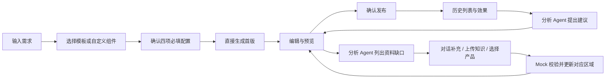

> 历史归档，不再维护。当前产品规则见[统一产品文档](../AI营销落地页-产品设计.md)。

# AI 营销落地页：模板、公共组件与交互设计

版本：v0.2（前端 Mock）  
入口：http://127.0.0.1:5186/

## 1. 产品目标与操作路径

营销页承接 SEO、SEM、社媒和门户站内流量，围绕访客问题组织内容，引导咨询、询价、资料领取或报名，并记录各推广位置的效果。

主流程为：**对话创建 → 编辑与预览 → 发布**。历史页面列表独立于创建流程，可继续编辑草稿、预览历史页面、查看已发布页面效果。

模板选择不再形成独立的长向导。用户在同一创建页描述需求、浏览模板、完成配置，然后直接生成。首次生成允许资料缺失，以明确的占位内容呈现；不因图片、知识或产品缺失阻止首版创建。

“确认布局与内容”作为编辑区的可选检查入口保留。用户可以先看首版，再确定组件、顺序、布局和文案。

## 2. 模板分类与来源

保留产品营销、线索获取、品牌介绍、促销活动、展会页面五类业务类型。业务类型决定内容重点；布局模式决定表现形式；模板是组件、顺序、默认布局和样式的组合。业务类型与布局不绑定，用户可在编辑中调整。

以下是本产品的 12 个改编模板，不是对竞品模板源代码的复制。参考案例说明设计方向，具体组件组合由本产品定义。

| 模板 | 分类 | 默认布局 | 主要特点与组件组合 | 参考来源 |
|---|---|---|---|---|
| 精工 · 产品方案 | 产品营销 | 左右分栏 | 价值主张、产品能力、应用场景、技术支持、询价 | Open Design 汽车服务实例：分栏首屏、服务说明与登记表单，改编为工业场景 |
| 黑曜 · 技术发布 | 产品营销 | 深色科技 | 高对比首屏、核心优势、参数对比、视频占位、预约 | [Instapage Ascend AI](https://instapage.com/en/landing-page-templates/ascend-ai-technology-and-software)：官方分类为科技软件、产品推广、留资表单、深色 |
| 匠作 · 产品细节 | 产品营销 | 沉浸展示 | 主视觉、产品画廊、工艺优势、客户案例、询价 | [Unbounce 案例集中的 GREATS](https://unbounce.com/landing-page-examples-built-with-unbounce/)：工艺、图片、视频与证言 |
| 协作 · 行业方案 | 线索获取 | 首屏表单 | 业务挑战、解决方案、协作流程、提交需求 | [Unbounce 案例集中的 Procurify](https://unbounce.com/landing-page-examples-built-with-unbounce/)；本产品将其 B2B 方向改编为行业方案，表单结构为产品设计 |
| 知行 · 资料领取 | 线索获取 | 首屏表单 | 内容价值、资料目录、适用人群、FAQ、精简字段 | [Unbounce 案例集中的 Later](https://unbounce.com/landing-page-examples-built-with-unbounce/)：内容营销与线索培育 |
| 远见 · 品牌叙事 | 品牌介绍 | 编辑式叙事 | 建筑感视觉、品牌介绍、能力说明、服务网络 | [Instapage ARC Architecture Studio](https://instapage.com/en/landing-page-templates/arc-architecture-studio)：官方分类包含现代、极简、专业与预约 |
| 序章 · 品牌杂志 | 品牌介绍 | 编辑式叙事 | 纸感色彩、品牌故事、项目画廊、发展历程 | Open Design `open-design-landing` 与 Atelier Zero：编辑式图文、能力卡片、方法时间线、作品和证言 |
| 聚焦 · 采购季 | 促销活动 | 居中聚焦 | 活动产品、参与说明、服务支持、报名 | [Unbounce 案例集中的 Zola](https://unbounce.com/landing-page-examples-built-with-unbounce/)：设计展示、FAQ 与优惠入口，改编为采购活动 |
| 集采 · 产品系列 | 促销活动 | 左右分栏 | 产品矩阵、采购优势、参与说明、询价 | [Unbounce 案例集中的 Drizzle Honey](https://unbounce.com/landing-page-examples-built-with-unbounce/)：系列产品信息与批发采购 |
| 启程 · 专属活动 | 促销活动 | 沉浸展示 | 活动权益、参与流程、FAQ、报名 | [Unbounce 案例集中的 Wavehuggers](https://unbounce.com/landing-page-examples-built-with-unbounce/)：专属优惠与预约入口 |
| 交汇 · 展会邀请 | 展会页面 | 编辑式叙事 | 展会信息、展品、议程、预约洽谈 | 本产品展会组合；使用 Open Design Prototype 的可编辑、响应式产物组织方式，不作为官方展会模板标注 |
| 共创 · 专题交流 | 展会页面 | 首屏表单 | 活动主题、嘉宾画廊、议程、报名 | [Unbounce 案例集中的 Cameo](https://unbounce.com/landing-page-examples-built-with-unbounce/)：人物展示与流程引导，改编为专题交流 |

模板卡片显示分类、视觉缩略图、用途、来源及选中状态。原型中的图片为自制示意图或显式占位；企业图片由资料选择与上传补充。

## 3. 公共组件与布局模式

### 3.1 组件目录

| 公共组件 | 页面表现 | 主要可编辑内容 | 缺失资料的处理 |
|---|---|---|---|
| 首屏 | 主标题、说明、主行动、主图或表单 | 标题、正文、文字颜色、首屏布局、显隐 | 主图使用占位 |
| 核心优势 | 能力卡片 | 标题、正文、列数、颜色 | 标注能力依据待补充 |
| 产品列表 | 产品卡片与行动入口 | 关联产品、说明、列数 | 产品选择占位；规格单独待补 |
| 参数对比 | 参数表格 | 标题、说明；规格由业务资料带入 | 不虚构对比参数 |
| 客户案例 | 引文、案例与来源 | 标题、正文、颜色 | 客户名称、授权与依据占位 |
| 图片画廊 | 场景或项目图片组 | 标题、说明、列数、图片 | 显示图片占位 |
| 实力数据 | 指标组 | 标题、列数；数据来自选填字段 | 使用“—”，不编造数量 |
| 流程与议程 | 编号步骤 | 标题、说明、列数 | 时间和说明采用占位或已选资料 |
| 常见问题 | 可折叠问答 | 标题、说明 | 未选知识时保留答案占位 |
| 留资表单 | 字段组与主行动 | 平台字段集、逐项字段选择 | 默认采用 Agent 规则推荐 |
| 行动横幅 | 收益文案与 CTA | 标题、正文、颜色 | 使用明确的待补说明 |
| 图文介绍 | 标题、正文、资料依据 | 文案、颜色 | 知识依据占位 |
| 视频区域 | 视频或播放区域 | 视频文件地址 | 保留视频占位 |
| 页脚 | 联系行动与品牌信息 | 显隐 | 使用企业信息 |

首屏和页脚为结构区域，其余 12 类组件可重复添加。组件可以从左侧拖入画布的插入位置；点击组件也可追加，适合触摸设备。组件大纲支持拖拽排序、上移、显隐、属性编辑和删除。

模板预先选择上述组件并确定顺序。自定义模式由用户选择业务类型和组件，不需要先套用模板。两种模式生成后进入同一个编辑器。

### 3.2 布局枚举

- 左右分栏：主张与视觉并置，适合产品和服务。
- 居中聚焦：集中呈现一个核心行动，适合活动。
- 编辑式叙事：图文编排，适合品牌和展会介绍。
- 首屏表单：介绍与表单并置，适合线索获取。
- 沉浸展示：强调主视觉，适合产品细节和活动。
- 深色科技：高对比展示能力，适合技术发布。

布局切换保留已有内容。列数支持 1、2、3 列，手机下自动折为单列。

## 4. 对话创建与字段规则

### 4.1 自动带入

公司名称、官网地址、所属行业、主营产品由企业上下文获取。当前原型使用字段参考中的企业信息作为 Mock，显示在高级设置中，无需逐项输入。

### 4.2 必填配置

目标市场、语言、主色调、字体风格必须有值。创建页直接显示四项配置，提供默认值；切换为“请选择”后禁止生成，并提示补齐。页面需求及模板／自定义起点属于创建所需输入。

| 字段 | 当前原型枚举 |
|---|---|
| 目标市场 | 中国大陆、全球市场、亚太地区、欧洲地区 |
| 语言 | 中文简体、English、中文繁體 |
| 主色调 | 预设色、模板色；高级设置可用颜色选择器调整 |
| 字体风格 | 现代无衬线、经典衬线、技术等宽 |

字体风格真实影响页面字体栈；语言配置保存在草稿中，Mock 不执行自动翻译。

### 4.3 可选配置

主要转化动作提供默认值，可在高级设置调整：获取报价、预约沟通、领取资料、发起咨询、提交需求、活动报名。

同步访客意图、知识选择、产品选择、Logo、页面主图、表单字段集合、以下业务字段均为选填。不存在“必须先接收到行为分析结果”的创建限制。

| 适用范围 | 选填字段 |
|---|---|
| 公共 | 核心卖点、目标买家画像、联系方式、竞品名称或网址 |
| 产品营销 | 产品规格／型号、产品认证、最小起订量、生产交货周期 |
| 线索获取 | 询盘诱因／优惠、截止日期 |
| 品牌介绍 | 创立年份、品牌故事要点、重要里程碑、工厂面积、员工及研发人数、核心设备／产线、年产能 |
| 促销活动 | 促销优惠内容、活动截止时间、额外赠品／权益 |
| 展会页面 | 展会名称、展台号、展会时间、展会地点 |

字段配置均保存于页面草稿。原型只将部分字段映射到固定组件（如规格、实力数据、优惠与时间）；完整语义生成由后续 Agent 实现。

## 5. 资料缺口与对话补充

首版生成后，生成 Agent 交付页面，分析 Agent 列出缺失资料。缺失资料不阻止首版形成，也不要求用户重新填写整份表单。

| 缺口 | 交互入口 | 输入 | Mock 输出 |
|---|---|---|---|
| 知识依据 | 缺口按钮／对话附件 | 选择知识、上传文件、补充说明 | 记录资料名称；模拟校验后更新内容依据 |
| 页面主图 | 缺口按钮 | 选择示意素材，或上传 PNG／JPEG／WebP | 替换图片占位，保存本地预览 |
| 关联产品 | 缺口按钮 | 产品库多选 | 更新产品组件；未提供规格继续占位 |
| 文字资料 | “通过对话补充资料” | 逐项输入经确认的说明 | 更新相关正文与对话记录 |
| 视频素材 | 缺口按钮 | 视频文件 URL | 更新视频组件；可在预览播放 |

图片单文件上限为 1 MB，以控制本地存储体积。知识文件上传只记录名称，不执行解析。对话补充是本地规则演示，不代表真实内容理解或真实性核验。

分析 Agent 负责判断资料是否满足需要，生成 Agent 负责将补充内容应用到页面。补充后保留其他组件、布局与已有编辑。

## 6. 编辑与预览

左侧包括“对话”“组件”“布局与内容”三个入口；右侧为画布。

- 对话：展示需求、生成结果、分析反馈与后续修改记录；支持选区修改和逐项补充资料。
- 组件：拖入或点击添加公共组件。
- 布局与内容：管理布局、组件顺序、显隐、表单收集字段及图片。
- 选区属性：点击区域的“属性”修改标题、正文、文字颜色和内容列数。
- 设备：电脑、平板、手机三种预览宽度；“预览页面”隐藏选区与插入控件。
- 版本：对话修改可恢复最近一次修改前的草稿；历史页面列表管理多个独立页面。

### 表单字段

平台字段集合包含基础联系、采购询价、活动报名、资料领取，并提供 Agent 推荐和自定义。

| 字段集 | 字段 |
|---|---|
| 基础联系 | 姓名、邮箱、公司 |
| 采购询价 | 姓名、邮箱、公司、采购量、需求说明 |
| 活动报名 | 姓名、邮箱、公司、预约日期 |
| 资料领取 | 姓名、邮箱 |

可逐项选择的完整字段：姓名、邮箱、电话、公司、职位、国家／地区、采购量、需求说明、预约日期。

表单配置同步至画布和演示表单，邮箱与日期采用对应输入控件。表单提交只演示交互，不产生真实线索。

## 7. 发布与意图推送

默认仅发布链接，可按需配置五种推广位置。页面路径与 SEO 标题、Meta 描述折叠在可选设置中；确认发布时自动生成本地链接，并保存该页面的模拟发布快照。之后编辑草稿不覆盖上次发布快照，重新发布才更新。

每种推广位置提供门户页面场景预览：首屏主视觉、段落间横幅、侧边卡片、底部弹层、客服对话推荐。入口可打开对应页面；弹层与客服卡片可关闭并重新预览。位置样式预览与规则匹配结果分开展示，避免把“看到样式”误认为“实际已推送”。

| 位置 | 基础触发条件 |
|---|---|
| 首屏 Banner | 意图命中、意向等级至少中、当日未见过此页；未匹配展示默认 Banner |
| 页中横幅 | 意图命中、滚动超过 50%、主题相关；可配置更高阈值或停留条件 |
| 侧边广告位 | 意图命中、对比或决策阶段、电脑访问 |
| 底部弹出 | 意图命中、滚动达到 80% 或电脑端离开信号、本会话未触发 |
| 智能客服推送 | 意图命中、客服识别高意向或表达对应需求 |

共同策略：意图指纹匹配、频次限制、排除已转化／已关闭／当前目标页访客。Mock 支持不同访客状态并显示不推送原因。

## 8. PRD 机制 C、D 对照

| PRD 要求 | 当前原型能力 | 实际实现边界 |
|---|---|---|
| 行为分析同步意图 | 可选的了解、对比、决策 Mock；来源词根、阶段、画像形成指纹 | 没有真实行为分析服务 |
| 阶段影响内容与 CTA | 选择意图可带入推荐结构和动作，允许用户调整 | 规则映射，无模型推理 |
| 企业与行业知识生成 | 知识选择、缺口反馈、占位与补充流程 | 没有真实 RAG |
| SEO／SEM 适配 | 独立 SEO 标题、Meta 描述配置；链接可用于渠道演示 | 不执行真实索引、广告绑定或服务端元信息发布 |
| 客户确认后发布 | 页面预览、确认、自动链接与本地发布快照 | 不写入 CMS |
| 相同意图匹配推送 | 五种位置、规则模拟、未匹配和排除反馈 | 不实现服务端 200ms 响应或 SSR |
| 位置效果追踪 | 曝光、点击、到达、转化、点击率、转化率；停留与跳出样例 | 预设数据，不代表真实监测 |
| 分析结果再次优化 | 分析 Agent 建议带回生成 Agent 编辑 | 不自动执行 A/B 实验 |

因此，本原型覆盖机制 C、D 的产品交互与可点击 Mock；真实模型、数据服务、服务端匹配和线上统计不属于本次交付。

## 9. Open Design 对应关系

Open Design `open-design-landing` 是参数化的设计模板：`schema.ts` 定义输入，`inputs.example.json` 提供实例，`scripts/placeholder.ts` 生成占位资源，`scripts/compose.ts` 将输入与样式组合为 HTML；图片可以使用占位、外部提供或生成三种策略。该结构说明“先形成可预览产物、再补素材”的设计依据。

本产品对应为：页面配置与组件数组 → 占位首版 → 资料补充 → 同一画布更新。当前使用 React 组件和本地状态实现，未调用 Open Design 的脚本或 Agent。

本地参考：

- Open Design 参数化模板说明（历史外部资料未包含在本交付包）
- Atelier Zero 设计体系（历史外部资料未包含在本交付包）
- [Prototype 流程快照](../open-design-reuse/upstream/plugins/_official/scenarios/od-next-strategy/assets/task-profiles/prototype.md)
- [对话入口参考](../reference/首页参考.png)、[组件编辑参考](../reference/竞品参考1.png)、[选区与设备参考](<../reference/open design设计.png>)

## 10. 页面历史与交付文件

历史列表记录页面名称、企业、类型、关联意图、发布状态、更新时间，支持搜索、状态筛选、继续编辑、预览和查看效果。新建不会删除已有页面。记录保存于当前浏览器的 localStorage，跨浏览器共享与多人协作不在 Mock 范围内。

| 文件 | 职责 |
|---|---|
| `frontend/src/pages/studio/MarketingStudio.tsx` | 页面状态、对话、资料、历史、发布与效果 |
| `StudioStart.tsx` | 对话式创建、必填配置、模板与自定义起点 |
| `StudioCanvas.tsx` | 模板缩略图、组件渲染、画布插入与选区 |
| `blocks.ts` | 组件、布局、表单字段集、选填字段和产品示例 |
| `PlacementPreview.tsx` | 五种推广位置的门户场景预览 |
| `intentRules.ts` | 意图示例与推送规则模拟 |
| `studio.css` | 工作台与响应式页面样式 |

启动：在 `frontend` 目录执行 `npm run dev -- --host 127.0.0.1 --port 5186 --strictPort`。构建：`npm run build`。

## 11. 修改交付记录

本次交付包含以下前端改动：

1. 对话式创建首页：需求输入、资料入口、高级设置和模板选择集中在同一页面，支持直接生成首版。
2. 模板扩展为 12 个，保留五类业务分类，显示来源、用途与选中状态；增加自定义组件起点。
3. 企业信息自动带入 Mock；目标市场、语言、主色调、字体风格提供必填配置，其余业务字段放入高级设置。
4. 首版允许资料缺失，以图片、知识、产品、视频等占位呈现；左侧提供逐项补充入口及对话反馈。
5. 公共组件库与模板共用渲染方式，增加组件添加、拖拽插入、排序、显隐、删除、属性编辑和布局切换。
6. 表单支持平台字段集合、Agent 规则推荐和自定义字段，并同步至页面及演示表单。
7. 编辑区增加电脑、平板、手机预览；保留“确认布局与内容”作为可选入口。
8. 发布区增加五种推广位置的网站场景预览、入口链接、可关闭卡片和规则结果说明。
9. 历史页面列表保留多个页面，提供搜索、状态筛选、继续编辑、预览与效果入口；模拟发布保存页面快照。
10. 访客意图为可选前置数据；手动创建无需关联意图，个性化推送则按意图匹配结果模拟。

### 验证状态

修改已保存至源文件，最近一次 TypeScript 与 Vite 构建通过。完整交互验收尚未完成，本记录不表示所有操作均已验证通过。

自行验收时建议重点检查：

- 对话补充及“执行修改”：本轮检查中未确认修改后的版本号、消息与画布内容一致更新，需要重点复核。
- 拖拽：从组件库插入画布、调整组件顺序，以及触摸设备上的点击添加。
- 模板与自定义：切换模板后保留需求，自定义组件在生成后正确呈现。
- 必填与选填：四项必填配置的缺失提示；没有访客意图和知识资料仍可生成占位首版。
- 资料补齐：知识文件、图片、产品选择与对话文字补充是否更新对应区域。
- 属性与表单：标题、正文、颜色、列数、显隐和字段集是否同步到预览。
- 历史与发布：新建后原页面保留；切换历史页面和预览链接是否对应正确内容及表单。
- 响应式与推广：电脑、平板、手机布局，以及五种位置的显示、关闭、跳转和匹配提示。

当前交付仍为前端 Mock。知识文件解析、真实 Agent 推理、完整语义内容生成、自动翻译、服务端匹配、线上发布和真实统计均未接入。
