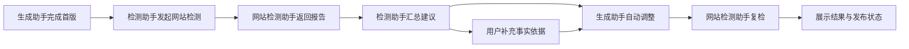

> 历史归档，不再维护。当前产品规则见[统一产品文档](../AI营销落地页-产品设计.md)。

# AI 营销落地页：网站检测协作与接口预留

版本：v0.5（未发布）  
依据：`数字门户-PRD.html` → 3. AI 内容运营智能体（含营销页）→ 机制 A、机制 B。

## 1. 范围

本期只实现前端交互预留和固定返回数据，不实现网站检测 Agent、评分算法、全站爬取、知识检索或自动修复引擎。不调用真实服务，不根据固定示例分数阻断发布，也不将示例意见真正改写进页面。

生成后，界面展示调用网站检测助手、接收意见、生成助手调整、接收复检结果的过程。点击“网站检测”查看分数、问题、调整记录及需要补充的资料。支持重新检测和进入资料补充。示例结果固定，不代表对当前页面执行了实际检测。

## 2. 职责

| 角色 | 职责 | 输出 |
| --- | --- | --- |
| 生成助手 | 接收业务目标和资料，生成页面；接收检测建议并执行允许的修改 | 页面内容及修改记录 |
| 检测助手（分析协调角色） | 检查知识库是否满足生成需要；调用独立的网站检测助手，汇总两类检测结果 | 资料缺口、可自动调整事项、需用户处理事项 |
| 网站检测助手（独立 Agent） | 页面生成后，根据 PRD 机制 A、B 检查内容；修改后复检 | 完整度、AI 友好度、问题证据、建议及发布判定 |

知识库缺口检查与网站检测是两个独立能力。知识资料齐全不代表页面质量达标；页面结构问题也不等同于知识库缺资料。网站检测助手不直接修改页面，生成助手执行修改。

## 3. 交互



侧栏保留一个检测入口，避免新增独立向导步骤。详情弹窗包含：

- 内容完整度、AI 友好度及调整前后对比。
- 已自动调整的项目及修改记录。
- 无法自动解决的资料缺口，提供补充入口。
- 可展开的五层内容规则与九维三柱详情。
- 最近检测时间和重新检测操作。

## 4. 传给网站检测 Agent 的参数 JSON

建议接口：`POST /api/v1/website-audits`。以下为接口契约示例，前端尚未发送请求。初检与复检复用同一契约，通过 `phase` 区分。

```json
{
  "schemaVersion": "0.1",
  "requestId": "audit-request-001",
  "projectId": "portal-001",
  "pageId": "landing-001",
  "contentRevision": "draft-revision-008",
  "phase": "initial",
  "previousReportId": null,
  "requestedBy": "analysis-agent",
  "targetAgent": "website-audit-agent",
  "scope": "current-page-with-site-context",
  "ruleSet": {
    "id": "digital-portal-content-operations",
    "version": "prd-v1.4",
    "mechanisms": ["A", "B"]
  },
  "businessContext": {
    "pageType": "产品营销",
    "conversionAction": "获取报价",
    "targetMarket": "中国大陆",
    "language": "zh-CN",
    "visitorIntent": null
  },
  "page": {
    "title": "闸门产品与选型服务",
    "summary": "根据应用需求提供产品信息与选型咨询。",
    "contentRef": "artifact://landing-001/draft-revision-008/page.html",
    "previewUrl": null,
    "publishedUrl": null,
    "seo": {
      "title": "闸门产品与选型服务",
      "description": "了解产品参数、应用范围与咨询方式。",
      "structuredData": []
    },
    "sections": [
      {
        "id": "hero",
        "type": "hero",
        "title": "闸门产品与选型服务",
        "body": "根据应用需求提供产品信息与选型咨询。",
        "sourceIds": ["knowledge-product-001"],
        "containsPlaceholder": false
      },
      {
        "id": "parameters",
        "type": "parameter-table",
        "fields": [],
        "sourceIds": [],
        "containsPlaceholder": true
      }
    ],
    "assets": [
      {
        "assetId": "asset-001",
        "type": "image",
        "alt": "产品结构图",
        "sourceId": "product-001"
      }
    ],
    "internalLinks": [],
    "contentModifiedAt": "2026-09-16T10:00:00+08:00"
  },
  "knowledgeContext": {
    "directoryIds": ["products", "company"],
    "productIds": ["product-001"],
    "sources": [
      {
        "id": "knowledge-product-001",
        "title": "产品手册",
        "type": "knowledge-document",
        "contentRef": "knowledge://product-001/manual",
        "verifiedAt": null,
        "factsUpdatedAt": null
      }
    ],
    "knownGaps": ["产品规格与型号", "认证编号及验证依据"]
  },
  "siteContext": {
    "siteId": "site-001",
    "baseUrl": "https://example.com",
    "llmsTxtRef": null,
    "sitemapRef": null,
    "contentManifestRef": null,
    "crawlabilityReportRef": null
  }
}
```

说明：

- `contentRevision` 标识草稿内容快照，与发布版本号不同。
- `contentRef` 为受控内容引用，不要求公开发布后才能检测。示例 URI 不代表已存在的服务。
- `visitorIntent` 可为 null，不作为必填前提。
- `contentModifiedAt` 是页面编辑时间；`factsUpdatedAt` 是业务事实更新时间，二者不能互相替代。
- 目录、产品、来源传稳定 ID，Agent 按授权范围读取。缺少站点级上下文返回待核验，不能宣称 llms.txt 或 sitemap 已部署。
- 五类页面类型均沿用现有定义。若某项不适用，Agent 需返回理由及计分处理，前端不自行忽略规则。

## 5. 接收网站检测结果的 JSON

```json
{
  "schemaVersion": "0.1",
  "requestId": "audit-request-001",
  "reportId": "audit-report-001",
  "pageId": "landing-001",
  "contentRevision": "draft-revision-008",
  "phase": "initial",
  "status": "completed",
  "checkedAt": "2026-09-16T10:01:00+08:00",
  "ruleSetVersion": "prd-v1.4",
  "completeness": {
    "score": 68,
    "level": "有短板",
    "layers": [
      {"key": "foundation", "label": "基础层", "weight": 25, "score": 60},
      {"key": "value", "label": "价值层", "weight": 25, "score": 70},
      {"key": "trust", "label": "信任层", "weight": 15, "score": 50},
      {"key": "conversion", "label": "转化层", "weight": 20, "score": 80},
      {"key": "seo", "label": "SEO 层", "weight": 15, "score": 80}
    ],
    "bodyCharacterCount": 260,
    "depthStatus": "too-short",
    "freshnessStatus": "unknown"
  },
  "aiReadiness": {
    "score": 72,
    "pillars": [
      {"key": "discoverability", "weight": 25, "score": 60},
      {"key": "parseability", "weight": 40, "score": 80},
      {"key": "authority", "weight": 35, "score": 70}
    ],
    "dimensionKeys": [
      "site-discovery", "page-accessibility", "structured-index",
      "content-structure", "self-containment", "semantic-clarity",
      "fact-density", "authority-signals", "freshness"
    ]
  },
  "findings": [
    {
      "id": "finding-001",
      "mechanism": "B",
      "dimension": "self-containment",
      "severity": "warning",
      "sectionId": "faq",
      "evidence": "回答依赖前文，缺少独立的问题背景。",
      "recommendation": "使用已有知识来源，将回答改写为独立完整的问答。",
      "resolution": "auto-adjust",
      "sourceIds": ["knowledge-product-001"]
    },
    {
      "id": "finding-002",
      "mechanism": "A",
      "dimension": "foundation",
      "severity": "warning",
      "sectionId": "parameters",
      "evidence": "参数区域为空，知识来源没有对应规格。",
      "recommendation": "补充经确认的产品参数。",
      "resolution": "request-user-input",
      "requiredFields": ["产品规格/型号"],
      "sourceIds": []
    }
  ],
  "siteDependencies": [
    {"key": "sitemap", "status": "pending-verification"},
    {"key": "llms-txt", "status": "pending-verification"}
  ],
  "publishDecision": {
    "status": "warning",
    "requiresAcknowledgement": true,
    "reasons": ["AI 友好度处于 65–79 分区间"]
  }
}
```

分数、明细、建议和发布判定均由网站检测服务返回，前端负责展示。上例 findings 仅展示两类意见，真实返回应包含完整问题列表及九维评分明细。

## 6. 检测助手交给生成助手的修改参数 JSON

```json
{
  "schemaVersion": "0.1",
  "taskId": "adjustment-001",
  "pageId": "landing-001",
  "baseContentRevision": "draft-revision-008",
  "sourceReportId": "audit-report-001",
  "targetAgent": "generation-agent",
  "actions": [
    {
      "findingId": "finding-001",
      "sectionId": "faq",
      "operation": "rewrite-from-sources",
      "instruction": "结论前置，答案自包含，保留原始事实与来源。",
      "sourceIds": ["knowledge-product-001"]
    }
  ],
  "deferredFindings": ["finding-002"],
  "constraints": {
    "preserveTemplate": true,
    "preserveConversionAction": true,
    "allowUnsupportedFacts": false,
    "allowAutomaticPublishing": false
  },
  "nextAction": "request-website-reaudit"
}
```

生成助手返回修改后的内容引用、新的草稿修订标识、已完成与未完成事项；检测助手随后以 `phase: "recheck"`、`previousReportId: "audit-report-001"` 发起复检。

## 7. PRD 规则引用与接入约束

机制 A：基础层 25%、价值层 25%、信任层 15%、转化层 20%、SEO 层 15%。模块计分为缺失 0、不完整 0.5、完整 1。总分低于 60 待优化，60–80 有短板，高于 80 达标。动态信息超过 180 天未更新标记过时；正文不足 300 字标记过短。

机制 B：被看见 25%、被理解 40%、被信任 35%，包含 PRD 的九个维度。AI 友好度 ≥80 可发布，65–79 提示警告，低于 65 阻断。接入后使用服务端返回的判定；原型不实现该算法或使用固定分数形成真实发布控制。

自动调整只处理可由现有来源支持的内容与结构。认证编号、案例数据、作者资质、标准及事实日期不能凭空生成；这些缺口交给用户补充。

页面修订变化后，旧报告不得被当作新页面的有效结果。按 `requestId + pageId + contentRevision` 匹配响应；丢弃迟到结果。检测失败或超时显示重试入口，不能当作通过。检测与调整不生成发布版本，只有用户确认发布才产生版本记录。

本站点级能力依赖实际网站服务，当前页检测不能直接代替全站扫描。引用次数与 AI 来源流量只用于外部结果追踪，不参与评分，也不承诺被 AI 引用。

## 8. 本次原型实现

- 新增网站检测入口与报告弹窗。
- 使用固定报告呈现五层完整度、九维三柱、调整前后分数和补充项。
- 使用前端状态演示独立网站检测助手、检测助手和生成助手的协作。
- 未实现真实 Agent、计算分数、自动改写或站点部署。
- TypeScript 与 Vite 构建通过；未做浏览器验收。
