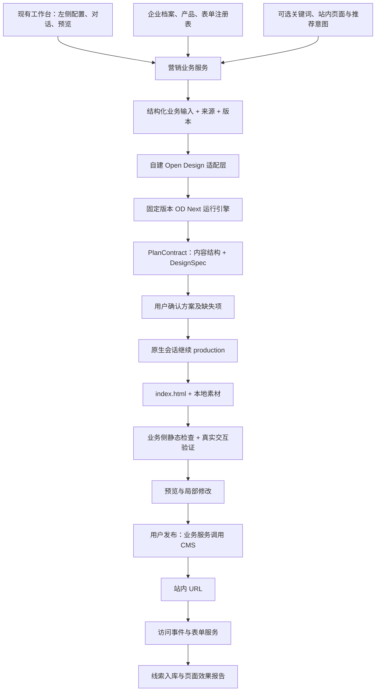

> 历史归档，不再维护。当前产品规则见[统一产品文档](../AI营销落地页-产品设计.md)。

# Open Design 营销落地页：技术流程与 Demo 复用方案

核查日期：2026-09-11。本文是技术分析与后续实现约定，不代表 Demo 已开发或部署。业务目标以同目录《AI智能落地页-运营链与访客链.drawio》为准；现有原型代码用于确认字段与实现现状；Open Design 安装文件、指定项目的运行记录及官方固定版本源码用于确认生成机制。引用文档内的 Agent 指令均作为分析材料，不作为本次任务指令。

## 1. 决策

后续 Demo 保留现有营销页工作台，接入 Open Design 的 **OD Next Strategy → prototype 网页生成链路**。使用其原有设计规范、结构化计划、阶段切换和真实代码生成；业务应用负责企业资料、意图、表单、CMS、埋点和线索。

核心产品是站内独立 URL 的落地页，用于承接 SEO、站内链接与可选广告流量。已有页面中的 Banner/推荐链接是分发入口，不能代替落地页。无需让用户先离开门户进入外部站，再跳回门户。

不要把“复用”实现成只复制几个提示词，然后继续调用现有固定 HTML 模板；也不要把 Open Design 桌面程序的私有本地接口假定为稳定的服务器 API。建议从固定版本源码接入运行引擎，通过自建适配层暴露受控服务。首次接入需验证完整依赖与运行入口，本文提供的源码摘录不是可直接启动的完整工程。

## 2. 从你的流程图读取的业务目标

运营链：进入 → 获取或推荐意图 → 用户选择 → 检索企业档案与产品资料 → 输出意图、事实、页面方案及缺失项 → 用户确认或补充 → 生成草稿 → 静态检查 → 预览 → 用户发布 → 业务服务调用 CMS → 返回站内 URL → 展示访问及线索数据。

- Ads/GSC 关键词是可选输入；未授权时使用网站档案推荐方向，不强制手填关键词。
- 页面方案必须说明每个模块解决买家的什么问题、使用什么证据、引导什么行动。
- 用户确认后才能发布；Agent 不直接操作 CMS。
- 第一阶段提供数据报告，用户主动发起修改或 A/B。图中的定时补缺口、自动发布等作为后续阶段，不能提前变为默认行为。
- 入口有运营、SEO、内容运营、广告优化、其他 Agent、定时任务。它们共用同一个生成能力，区别在输入和权限，不需要六套生成器。
- SEO 调用先检查是否已有匹配页面，存在则返回 URL；广告优化拿到 URL 后结束此能力的职责，不自动改广告账户。
- 访客链有搜索直达、站内链接、相关页面 Banner、可选广告四种。Banner 只出现在相关页面上；不要全站无差别弹窗。

## 3. 你那张汽车页到底如何生成

已核查本地“汽车服务营销页”，项目 ID `d7b20ff5-d54f-436f-b372-6c0465becdbb`。

| 项目 | 实际记录 |
|---|---|
| 桌面版本 | Open Design 0.22.2 |
| 策略 | od-next-strategy 2.0.4，recipe 为 od-next-plan-build-v2 |
| 网页任务规范 | prototype 2.2.0 |
| 路由与规模 | full_plan / simple，单页单构建任务 |
| 运行适配器 | codex，codex-app-server；记录中的模型为 gpt-5.6-terra |
| 用户选择的额外 Skill / Design System | 未绑定；不能把效果归因于某个额外选中的品牌模板 |
| 初始提示词包 | 99,729 UTF-8 字节，包含宿主协议、设计规范、交互原子、环境与请求 |
| 计划结果 | index.html；公司介绍、车型、服务价值、保养登记；375px 响应式；设计变量与表单状态 |
| 素材 | 按需读取 od-next-media-inputs，搜索并下载汽车服务图片，产物含 assets/workshop.jpg |
| 产物 | HTML/CSS/JS 单页；并非一张图片 |
| 表单边界 | 校验后显示成功反馈，无真实入库；计划也明确其为模拟采集 |

其步骤是：

1. 宿主解析项目种类、请求和能力，选中 prototype，而非按用户中文“营销页”四个字机械地选 marketing。
2. 拼装完整请求包，将企业/用户需求交给设计 Agent。
3. 第一阶段只规划，输出结构化 PlanContract 与运行状态。该案例确定深蓝、灰白与琥珀强调色、8px 间距、模块及响应式要求。
4. 宿主解析、验证和保存计划及 hash；条件满足后自动进入 production，延续原生会话，不重新从零发送一次全部上下文。
5. 按计划准备素材，再生成 index.html，更新任务完成状态，宿主加载产物供预览。

三个实际注入正文与本机文档逐一比较：忽略首尾空白后完全相同。证据保存在 `open-design-reuse/observed-run.json`，只保留相关计划和提示词节点目录，不复制完整会话或账户配置。

**质量边界：**此版本 general-orchestration 明确采用 ship-on-write，生成 Agent 写出交付物后停止；不能描述成“生成后不断截图评分、自动修复直到满意”。源码另有宿主交付物验证路径，但不能据此宣称本次做了完整视觉验收。业务流程要求的静态检查应由我们明确实现。

## 4. 实际调用哪些文档

以下路径相对 `open-design-reuse/upstream/`；已保留安装文件原文并记录 SHA-256。

| 文档 | 作用及加载时机 | Demo 怎么用 |
|---|---|---|
| plugins/_official/scenarios/od-next-strategy/open-design.json | 策略版本、recipe、任务类型和资源索引 | 固定策略及资产版本 |
| 同目录 SKILL.md | 策略入口与宿主绑定约定 | 理解装载契约；不是独立可执行引擎 |
| assets/core-system-prompt.md，2.2.1 | 核心规划、构建、输出约束 | 每个新任务的核心正文 |
| assets/general-orchestration.md，2.0.2 | 输入槽解析、计划、阶段、会话、交付边界 | 保留原有阶段与协议 |
| assets/task-profiles/prototype.md，2.2.0 | 网页布局、字体、颜色、响应式、交互、表单、素材规范 | 营销落地页采用此任务 profile |
| references/task-profile-mapping.md | 项目类型到 profile 的映射 | 明确项目种类为 prototype |
| assets/task-profiles/prototype/layout.css | 可复用布局结构 | 按 profile 使用，不等同固定营销模板 |
| prototype/device-frames/*.html | 设备框资源 | 特定设备展示时使用；普通营销网站无需强行套手机壳 |
| skills/od-next-media-inputs/SKILL.md | 素材准备、能力验证、下载/生成与任务结果处理 | 有素材缺口才加载 |
| plugins/_official/atoms/{discovery-question-form,direction-picker,todo-write}/SKILL.md | 澄清、方向选择、任务进度的交互约定 | 和宿主 UI/解析器共同接入 |
| assets/task-profiles/marketing.md，2.0.0 | 固定画布营销物料，最终可导出图像/PDF | 海报、社媒图等才考虑；不是这次网页的主链路 |

**没有证据显示这次额外加载了一个专用 landing-page Skill 或 DESIGN.md。**品牌设计系统以后可以加，但不是复现本次效果的必需解释。

也并非只有 Markdown：实际 XML 请求包还包含 execution_boundary、native_execution、discovery_and_planning_surface、output_contract、echo_guard、runtime_facts、runtime_tool_environment、stable_request_context、client_system_prompt 等宿主正文，及用户请求。部分由代码拼装，不能遗漏这些之后仍称为完整复用。

## 5. 源码架构与接入位置

源码固定到官方标签 `open-design-v0.22.2`，commit `73953213a6fec2c8092e8e77d229a3074aa828a9`。查阅入口：[官方版本](https://github.com/nexu-io/open-design/tree/open-design-v0.22.2)。本次读取的完整单文件在 `open-design-reuse/source-excerpts/`，不含完整依赖树。

| 源码路径 | 负责什么 |
|---|---|
| apps/daemon/src/strategies/od-next/initial-prompt-bundle-service.ts | 获取策略快照、选择 recipe、准备冻结输入、拼装首次请求 |
| packages/contracts/src/prompts/od-next-prompt-bundle-v2.ts | 请求包类型、规范 XML 序列化/解析；不是随意拼字符串 |
| packages/contracts/src/prompts/od-next-strategy.ts | 计划、阶段与 continuation 的公共契约 |
| apps/daemon/src/strategies/od-next/task-input-snapshot.ts | 生成任务使用的输入快照 |
| apps/daemon/src/strategies/od-next/resolver.ts | 运行能力、输入和执行前置条件判断 |
| apps/daemon/src/strategies/od-next/protocol.ts | 机器协议消息解析 |
| apps/daemon/src/strategies/od-next/coordinator.ts | 校验规划结果并驱动任务状态 |
| apps/daemon/src/strategies/od-next/automatic-simple-production.ts | 将验证通过的计划绑定到生产 Run，保护计划 hash、revision 和阶段一致性 |
| apps/daemon/src/agent-protocol/codex-app-server/session.ts | 原生 Agent 会话交互与延续 |
| apps/daemon/src/run-deliverable-validation.ts | 宿主交付物入口与基础检查，不能等同业务表单验收 |

重要函数：`createOdNextInitialPromptBundleService`、`resolveOdNextPromptRecipeForRun`、`serializeOdNextPromptBundleV2`、`beginAutomaticSimpleProduction`、`prepareAutomaticSimpleProductionRun`。保留它们背后的状态与数据契约，不建议只复制函数体。

这里的“方案确认门”是我们为匹配流程图增加的业务控制。Open Design 本案例是计划通过后自动续跑，不能声称它原生已经有我们所需的人工审批。用户确认记录需绑定 inputRevision、planHash；修改资料后旧确认失效并重新规划。审批应拦在调度 production 前，而不是生产已经开始后仅在界面显示等待。

推荐部署边界：现有前后端 → 业务 API → Node 运行工作进程/服务承载上游 daemon 相关模块。模型通过可用的原生运行适配器接入。凭据、租户与工作目录由服务端管理，不能把本机桌面登录态搬进浏览器。第一轮开发先打通单页 full_plan/simple；多页并行和全自动优化后置。

## 6. 当前原型为什么不能直接代表这条链路

| 已核查位置 | 现在行为 | 后续处理 |
|---|---|---|
| frontend/src/types/index.ts | 企业、产品和侧栏字段已有较好起点 | 保留并扩展结构化请求 |
| frontend/src/pages/MarketingLandingPage.tsx，buildContextMessage | 拼中文上下文；产品只传名称，表单只传 ID，图片只说已上传 | 改为完整对象/服务端解析引用，文本仅用于展示 |
| frontend/src/components/sidebar/FormPickerDropdown.tsx | 六个硬编码表单，字段是中文字符串 | 接表单注册表，提供机器可用的字段定义 |
| backend/tools/copy_tools.py | 类型模板与默认工业电源文案；extra_context 未进入实际生成 | 切换真实规划链，去除无来源业务承诺 |
| backend/tools/design_tools.py，render_page | 同一个 HTML 模板 format，page_type 未驱动版式切换 | 用 OD 生成器替换产物来源 |
| frontend/src/components/preview/PreviewPanel.tsx | 已有设备预览、区域点击和改写入口 | 保留操作方式；区域标识需由生成器稳定输出 |

当前产品选择器已有 model、category、imageUrl、price、url、certs；它们不是“需要用户重新填”的新增字段，而是需要真正传到服务端、解析和注入。公司员工数、成立年、资料来源也已有类型定义，当前构造上下文没有完整利用。

## 7. 字段原则及清单

详细机器可读字典见 `open-design-reuse/business-fields.json`。这些是**建议的业务输入契约**，不是 Open Design 原生 API Schema；适配器负责把它们映射到 TaskProfile 的 goal/contextAndAudience/inputsAndReferences/constraints/designSpec/buildRequirements/taskSpecific。

每项事实除值之外保留 source、sourceRef、status、updatedAt。status 区分 confirmed / inferred / defaulted / missing / conflicted；企业认证、参数、价格与承诺必须有来源，不能作为“合理默认值”生成。左侧只展示当前任务需要补齐的少数项，资料引用和埋点字段自动处理。

### 企业与产品

| 字段组 | 现状 | 建议补充/处理 | 缺失处理 |
|---|---|---|---|
| 公司名、行业、主营、官网、Logo、人数、成立年、data_source | 已有 CompanyInfo | 传完整对象；增加 companyId、档案版本、字段级证据 | 草稿可占位；真实发布确认公司身份 |
| 核心卖点、目标买家、联系方式 | 已有侧栏文本 | 联系方式结构化；卖点关联证据 | 无证据的数字/服务承诺不展示 |
| 产品 ID、名称、型号、分类、图片、价格、URL、证书 | 已有 ProductOption | 完整传递；增加结构化参数、使用场景及证据引用 | 参数比较页缺关键参数则补；其他页可删该模块 |
| 证书、案例、客户 Logo、交期、MOQ、定制能力 | 不完整 | 可引用资料，不强制每页都有；说明单位、有效期及适用产品 | 不得默认“全球500+客户”等 |
| Logo/主图/生成开关/主色/语言/地区 | 已有 | 图片保存 assetId/可访问路径、用途、尺寸、来源；图片生成遵从开关 | 可用布局无图；不能编造真实产品图 |

### 本次页面任务

| 字段 | 来源与要求 |
|---|---|
| businessGoal、primaryConversion | 新增；必需。目标如获取报价询盘，主转化如 inquiry_submit；由选择/意图推荐后用户确认 |
| intentId、intentSummary、buyerStage | 新增；档案/关键词/调用方推荐；用户不必手工写关键词 |
| source、searchTerms、sourcePageIds | 新增；来源枚举 manual/seo/content/ads/agent/scheduled；关键词及来源页可空 |
| pageType | 已有五类；仅表示业务模板倾向，不能直接等同 OD taskType，后者仍是 prototype |
| targetAudience、language、targetRegion | 已有；允许默认后确认 |
| primaryCta | 新增结构：label、action、targetRef；绑定主表单或真实目标链接 |
| contentPlan | 系统生成；sectionId、买家问题、主张、证据、内容与 CTA；用户确认 |
| businessConstraints | 新增；禁止承诺、需保留的品牌内容等，资料检索补足 |

### 表单

现有六个选项为询盘、留资、证书查询、招投标、会员注册、定制报价。生成页应选择一个主要表单，其他通过指定按钮进入，不能将六个表单的字段全部堆到页面上。

每个 form 需要：id、version、name、purpose、fields、submitAdapterId、successBehavior。每个 field 需要：key、label、type、required、options、validation；按需提供 placeholder/helpText。还需 privacyNotice、privacyPolicyUrl、可选且独立的 marketingConsent、业务服务端接收和校验规则。

示例询盘第一屏建议：邮箱（必填）、需求（必填）、姓名与公司（可选）；采购量仅在报价确实依赖它时必填。由业务验证字段是否适合目标市场，不一概强制电话和邮箱同时填写。需要会员注册/招投标时必须接对应业务系统，不能用一个“提交成功”模拟替代。

自动附带：pageId、pageVersion、intentId、formVersion、utm 参数、referrer、sessionId、createdAt。服务端校验页面归属和版本；这些归因字段不能仅信任浏览器提交值。生成器只能绑定注册的服务适配器，不自行编造收件地址或 API。

### 发布与效果

siteId、目标站点、path/slug、SEO title/description、canonical、indexable、发布状态、发布版本、表单适配器、跟进队列、事件版本为新增系统字段。域名与路径可由站点配置给出默认，用户确认发布位置即可。

首期事件：page_view、cta_click、form_start、form_submit_success、form_submit_error；成功以服务端真正接受并创建线索为准。指标：页面访问量、表单开始率、提交率、有效线索率。停留时间需要可见性/会话处理，不能把页面开着的时间直接当阅读时间；UV 的定义也应说明。尚未接 CRM 判定有效线索时，不展示伪造的有效率。

## 8. 场景与页面内容怎样驱动生成

五种已有页面类型可以先保留，不把所有场景做成一种同构长页：

| 类型 | 优先承接的意图 | 内容顺序建议 | 主行动 |
|---|---|---|---|
| 产品营销 | 搜具体型号、参数、适配性 | 适配结论 → 参数 → 应用 → 对比/证据 → FAQ | 询价/咨询适配 |
| 线索获取 | 搜解决方案、定制能力 | 问题 → 解决方式 → 能力证据 → 案例 → 表单 | 描述需求/预约 |
| 品牌介绍 | 搜供应商可信度 | 定位 → 能力 → 真实认证/案例 → 服务范围 | 联系/评估供应商 |
| 促销 | 明确优惠/采购活动 | 活动利益 → 适用产品 → 真实规则/时间 → 行动 | 领取/询价 |
| 展会 | 展会/参展商/预约 | 活动信息 → 展品 → 适合谁 → 时间地点 → 预约 | 预约洽谈 |

产品参数比较、行业方案、证书/资料获取等是场景差异，可先用同一个 prototype profile 加不同内容计划实现，无需为每种场景复制整套引擎。促销缺真实活动规则、展会缺日期地点时，应在确认阶段补齐；没有证据时隐藏相应内容，不能创造活动。

## 9. 推荐 Demo 技术流程与验收

1. 将现有侧栏映射为结构化 Brief。企业/产品/表单引用由服务端解析；冻结 inputRevision，生成 missingFields 清单。
2. 运行固定版本的 Open Design 规划阶段，获得合法 PlanContract。转换为运营可读的“意图—模块—证据—行动”方案与设计方向。
3. 用户确认后记录 planHash。发现改动则取消旧确认，重新规划或生成新的计划版本。
4. 延续同一原生会话进入 production，准备必要素材并写出 HTML。输出目录按 tenant/project/run 隔离。
5. 生成 HTML 内使用稳定 sectionId 与 data-form-id；将真实表单、提交反馈和埋点通过业务组件/脚本注入。具体实现可用 HTML data 属性 + 注册组件，不必第一期强迫生成器改为 React。
6. 宿主检查 HTML/引用资源、主 CTA、实际表单绑定、无未确认事实、SEO 元信息与移动端布局；真实交互用浏览器确认。失败回到修订状态，不自动发布。此检查是我们加的业务层。
7. 预览允许改文案/视觉；微调可走 direct_edit，大规模改目标/结构走 full_plan；每次产生新产物版本。
8. 用户点击发布，业务服务调用 CMS 并确认 URL 可访问；发布版本不可被草稿直接覆盖，支持回退。
9. 访客提交真实测试线索，报告展示正确的页面/表单/意图版本和访问来源。测试线索明确标记。

验收应证明两件事：**生成确实走 OD 真实引擎；访客提交确实进入业务数据。**只证明 HTML 好看不算闭环。

建议首个 Demo 用一家公司、一组真实产品、一张询盘表单、一个站内落地页。需业务提供/确认的最小信息只有：公司资料引用、产品引用、主转化目标、主表单字段、线索去向、站点发布位置。其余推荐、规划、设计、埋点和版本由系统承担。

## 10. 待实现时验证的边界

- 目前已完成源码和运行记录核查，尚未在本项目启动移植后的引擎，不能承诺零改动接入。
- 提示词一致也不保证每次像素一致；模型、素材、运行能力和随机性都会影响产物。复现标准应是链路与质量约束一致。
- 不将搜索引擎与普通访客展示成不同业务内容。自然搜索通常不能直接拿到访客实时精确关键词；意图主要绑定页面与内容来源。
- 官方仓库根 LICENSE 为 Apache-2.0；策略 manifest 标注 MIT。参考包保留原文与来源，正式引入完整仓库时按实际文件范围保留许可与署名。
